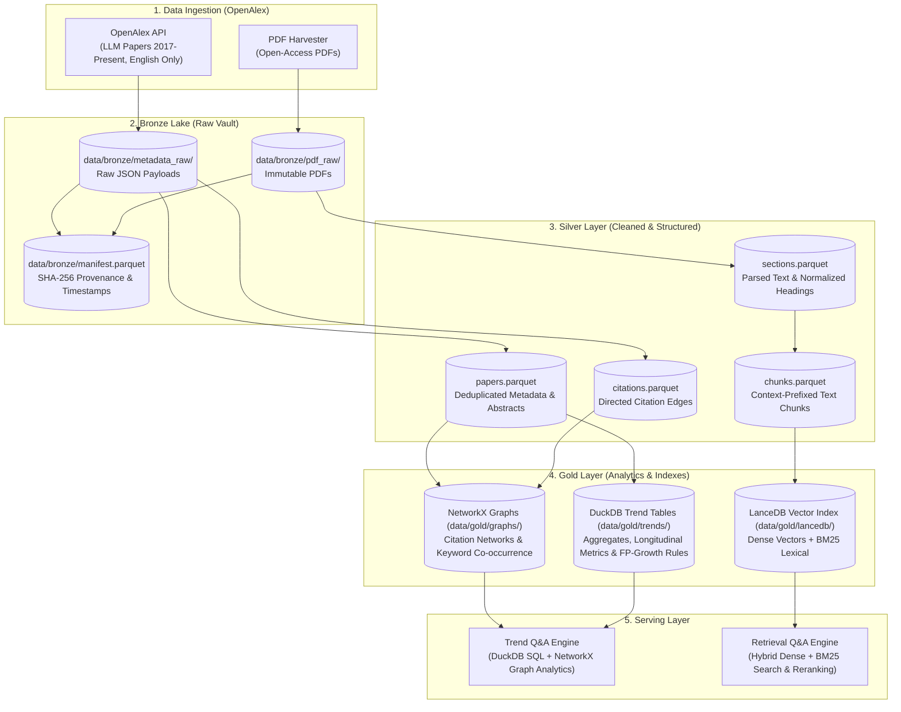

# UTH Data Mining: Graph-Based Trend Analysis of LLM Research Papers

> **Đề tài:** *Khai thác dữ liệu nghiên cứu khoa học thời gian thực hướng tới xây dựng hệ thống truy xuất tri thức nâng cao (RAG) cho miền AI/DS.*
> **Course:** Data Mining (Trường Đại học Giao thông Vận tải TP.HCM — UTH)
> **Advisor / Instructor:** TS. Trần Thế Vinh

- **Motivation/Background**: Academic publications in Large Language Models (LLMs) are accelerating exponentially across pre-training, fine-tuning, reasoning, and autonomous agents. This project implements an end-to-end data mining and retrieval system that harvests LLM research literature from OpenAlex, structures it into a Bronze/Silver/Gold Medallion architecture using Parquet and DuckDB, discovers macro research frontiers via citation networks, keyword co-occurrence, and FP-Growth association rules, and powers grounded hybrid retrieval via LanceDB.
- **Purpose**: Serve as the canonical repository entry point, data mining architecture specification, Medallion data layout reference, and operational manual.
- **Overview Pipeline**: OpenAlex API Harvesting → Bronze Lake (raw JSON + PDFs, SHA-256 manifests) → Silver Lakehouse (papers.parquet, citations.parquet, sections.parquet, chunks.parquet) → Gold Knowledge Mining (NetworkX citation & co-occurrence graphs, DuckDB trend tables, LanceDB vectors) → Dual-Path Serving (Trend Q&A via SQL/Graph + Hybrid RAG Retrieval).
- **Detailed Plan**: §1 Project Vision & Functional Pillars; §2 End-to-End System Architecture; §3 Repository & Medallion Data Layout; §4 Six-Phase Engineering Roadmap; §5 Installation & Setup; §6 Testing & Verification; §7 AI Governance & Workflow.
- **References**: [docs/references/ML_PIPELINE_REFERENCE_v4.md](docs/references/ML_PIPELINE_REFERENCE_v4.md), [DECISIONS.md](DECISIONS.md), [docs/research-paper-rag-plan.md](docs/research-paper-rag-plan.md).
- **Created**: 2026-07-25T00:00:00+07:00
- **Last Updated**: 2026-10-02T06:52:00+07:00

---

## 🎯 1. Project Topic & Scope: Graph-Based LLM Research Paper Mining

The primary objective is to automate the discovery, ingestion, graph mining, and contextual retrieval of cutting-edge Large Language Model research papers published between 2017 and the present:

```text
┌────────────────────────────────────────────────────────────────────────────────────────┐
│                        CORE END-TO-END PIPELINE PHASES                                │
│                                                                                        │
│   [1. OpenAlex Harvest]        ──►  [2. Bronze Lake]         ──►  [3. Silver Parquet]  │
│       LLM Papers (2017-Pres.)          Immutable JSON & PDFs          Clean Tables     │
│                                                                          │             │
│                                                                          ▼             │
│   [6. Dual Serving Engine]     ◄──  [5. Gold Knowledge Store]◄──  [4. Graph & Trends]  │
│       SQL/Graph + Hybrid RAG           NetworkX, DuckDB, LanceDB      PageRank, Rules  │
└────────────────────────────────────────────────────────────────────────────────────────┘
```

### Key Functional Pillars:

1. **OpenAlex Literature Ingestion:**

   - **Target Domain:** Scientific papers in Large Language Models (LLMs) from 2017 to the present, focusing on training, alignment (RLHF, DPO), reasoning (CoT, search), and autonomous agents (English papers only).
   - **Polite Harvesting:** Direct integration with the OpenAlex REST API utilizing the polite pool (`User-Agent: mailto:...`) and exponential backoff to handle rate limits gracefully.
   - **Immutable Bronze Vault (`data/bronze/`):** Original JSON responses and open-access PDFs are stored without modification, accompanied by a cryptographic SHA-256 provenance manifest (`manifest.parquet`).
   - **Pilot-First Rollout:** Ingestion is validated on a 200-paper pilot before scaling to the full 10,000-paper corpus.
2. **Graph-Based Trend Analysis (NetworkX):**

   - **Citation Networks:** Build directed citation graphs using NetworkX to calculate PageRank, in-degree centrality, citation velocity, and identify foundational seed literature.
   - **Keyword Co-occurrence Graphs:** Construct co-occurrence networks over extracted concepts and keywords to uncover thematic clusters and research paradigm shifts over time.
   - **Association Rule Mining:** Apply the FP-Growth algorithm (`mlxtend`) on co-occurring keywords/concepts to discover strong association rules between research methodologies and LLM subfields.
   - **Community Detection & Clustering:** Unsupervised partitioning of research frontiers without reliance on expensive LLM calls during core phases.
   - **Visualizations:** Interactive network graphs generated with PyVis, alongside static statistical charts with Matplotlib and Seaborn.
3. **Columnar Trend Aggregation (DuckDB + Parquet):**

   - **Cleaned Tabular Data (`data/silver/`):** Deduplicated metadata and parsed sections stored in high-performance columnar Parquet files (`papers.parquet`, `citations.parquet`).
   - **DuckDB SQL Engine:** Lightning-fast embedded analytical queries executed directly over local Parquet files without external database overhead.
   - **Longitudinal Trend Tables (`data/gold/trends/`):** Pre-aggregated tables (`year_x_concept`, `year_x_venue`, etc.) capturing adoption trajectories, topic volumes, and author/institutional networks.
4. **Advanced Hybrid RAG (LanceDB):**

   - **Embedded Vector Database:** High-performance vector storage and indexing using LanceDB, co-locating dense chunk vectors with full-text BM25 indexes.
   - **Hybrid Retrieval:** Multi-stage candidate retrieval combining dense semantic embeddings with sparse lexical search, fused using Reciprocal Rank Fusion (RRF).
   - **Dual-Path Serving:**
     - *Trend Q&A:* Serviced via DuckDB SQL aggregations and NetworkX graph metrics, providing corpus-wide empirical summaries with cited example papers.
     - *Retrieval Q&A:* Serviced via hybrid chunk search, context expansion (+/-1 neighboring chunks), and strict programmatic citation verification.

---

## 🏗️ 2. End-to-End System Architecture



### Architectural Guarantees:

- **No LLM Extraction in Core Phases:** Primary trend mining relies strictly on deterministic graph algorithms (PageRank, FP-Growth, community detection) and DuckDB SQL. LLM-based structured extraction is an optional Phase 5+ enhancement.
- **Strict Citation Verification:** Every claim generated in Retrieval Q&A must cite existing chunk and paper IDs verified against source text.
- **Pilot-to-Scale Discipline:** All data transformations, schemas, and graph algorithms are benchmarked on a 200-paper pilot before processing the 10,000-paper corpus.
- **Separation of Governance vs Memory:** Constitutional AI governance lives immutably in [`agents/`](agents/), while phase plans, specifications, and progress logs evolve in [`docs/`](docs/).

---

## 📁 3. Repository & Medallion Data Layout

The repository organizes code and data following the Medallion Data Architecture (Bronze → Silver → Gold) paired with modular pipeline packages in `src/`:

```text
Uth-Data-Mining/
├── agents/                    # Constitutional AI Governance (Immutable rules & templates)
│   ├── README.md              # Governance navigation guide
│   ├── rules/                 # Binding standards (AGENT_AI, MD_CONVENTION, etc.)
│   └── templates/             # Reusable skeletons (BUG, AUDIT, EXP, PHASE, PROGRESS)
│
├── docs/                      # Evolving Project Research & Documentation
│   ├── README.md              # Master research index
│   ├── PURPOSE.md             # Project brief & locked success criteria
│   ├── OVERVIEW.md            # Living roadmap indexing all phases
│   ├── research-paper-rag-plan.md # Architectural plan & reference blueprint
│   ├── phases/                # Pipeline phase technical specifications (00 to 05)
│   ├── progress/              # Live phase status tracking (*_STATUS.md)
│   ├── experiments/           # Experiment plans and comparative writeups
│   ├── bugs/                  # Resolved and active bug reports
│   └── references/            # Technical references & course slides
│
├── configs/                   # Configuration files (YAML)
│   ├── sources.yaml           # OpenAlex API query parameters & filters
│   └── config.yaml.example    # Configuration skeleton
│
├── data/                      # Medallion Lakehouse Storage (gitignored)
│   ├── bronze/                # Immutable raw API JSON responses and original PDFs
│   │   ├── metadata_raw/      # Raw OpenAlex responses per batch/page
│   │   ├── pdf_raw/           # Downloaded PDF papers ({paper_id}.pdf)
│   │   └── manifest.parquet   # SHA-256 provenance, URLs, timestamps
│   ├── silver/                # Cleaned, deduplicated tabular datasets & parsed chunks
│   │   ├── papers.parquet     # Canonical metadata (title, abstract, year, DOI, metrics)
│   │   ├── citations.parquet  # Directed citation edges (citing_id, cited_id)
│   │   ├── sections.parquet   # Parsed document sections with normalized headings
│   │   └── chunks.parquet     # Sliding-window chunks with contextual prefixes
│   └── gold/                  # Analytics-ready knowledge graphs, aggregates & vector index
│       ├── graphs/            # NetworkX graph exports (citation & co-occurrence graphs)
│       ├── trends/            # DuckDB-generated trend summary tables (year x concept)
│       └── lancedb/           # LanceDB dense vector index & full-text tables
│
├── src/                       # Production Python packages
│   ├── ingest/                # OpenAlex API harvesting & PDF downloading
│   ├── parse/                 # Section-aware document parsing & structure extraction
│   ├── chunk/                 # Contextual prefix chunking & text normalization
│   ├── graph/                 # NetworkX citation & co-occurrence graph construction
│   ├── trends/                # DuckDB SQL aggregation & FP-Growth association rules
│   ├── embed/                 # Embedding pipeline & LanceDB vector store management
│   ├── serve/                 # Dual-path serving (Trend SQL/Graph Q&A + Hybrid RAG)
│   ├── eval/                  # Benchmark questions & citation verification harness
│   └── utils/                 # Logging, telemetry, hashing, and I/O helpers
│
├── notebooks/                 # Exploratory analysis & demo notebooks (Matplotlib, PyVis)
├── experiments/               # Experiment runs and evaluation logs
├── requirements/              # Multi-tier dependency specifications
├── requirements.txt           # Unified dependency proxy
├── pyproject.toml             # Build system & package discovery config
└── tests/                     # Unit and integration test suite
```

---

## 🗺️ 4. Six-Phase Engineering Roadmap

| Phase             | Name                    | Focus & Key Deliverables                                                                                                                                                        | Deliverable Artifacts                                                | Status           |
| :---------------- | :---------------------- | :------------------------------------------------------------------------------------------------------------------------------------------------------------------------------ | :------------------------------------------------------------------- | :--------------- |
| **Phase 0** | Scope & Evaluation      | Formalize LLM scope (2017–present), define OpenAlex search filters, author 20–30 benchmark evaluation questions (retrieval & trend), establish`src/eval/` harness           | `docs/phases/00_SCOPE_AND_EVALUATION.md`, `eval/questions.jsonl` | **Active** |
| **Phase 1** | OpenAlex Collection     | Harvest OpenAlex metadata & citation edges; download PDFs; generate cryptographic`manifest.parquet`; validate 200-paper pilot before 10k scaling                              | `src/ingest/`, `data/bronze/manifest.parquet`                    | Planned          |
| **Phase 2** | Parsing & Chunking      | Section-aware PDF parsing; exclude references from text; generate structure-aware chunks with contextual prefixes (`[Title]... [Year]...`)                                    | `src/parse/`, `src/chunk/`, `data/silver/chunks.parquet`       | Planned          |
| **Phase 3** | Graph Analysis & Trends | Construct NetworkX citation and co-occurrence graphs; mine association rules via FP-Growth (`mlxtend`); generate PyVis and Matplotlib/Seaborn visual assets                   | `src/graph/`, `src/trends/`, `data/gold/graphs/`               | Planned          |
| **Phase 4** | Retrieval Baseline      | Index chunks in LanceDB; implement dense semantic + sparse BM25 hybrid search; evaluate recall@k and MRR against benchmark questions                                            | `src/embed/`, `data/gold/lancedb/`                               | Planned          |
| **Phase 5** | LLM Serving Layer       | Implement dual-path serving: DuckDB SQL/Graph narration for trend queries and hybrid search with citation verification for paper Q&A; optional LLM paper fingerprint extraction | `src/serve/`, verification engine                                  | Planned          |

---

## ⚙️ 5. Installation & Setup

### 1. Environment Creation

```bash
# Windows (PowerShell)
python -m venv .venv
.\.venv\Scripts\Activate.ps1

# Linux / macOS
python3 -m venv .venv
source .venv/bin/activate
```

### 2. Dependency Installation

```bash
# Upgrade pip
python -m pip install --upgrade pip

# Install project dependencies and local package in editable mode
pip install -r requirements.txt
pip install -e .
```

---

## 🧪 6. Testing & Verification

Run the test battery and code linter:

```bash
# Run unit and integration tests
pytest tests/ -v

# Run code style & lint check
ruff check src tests

# Verify package discovery
python -c "import src; print('Package import verified!')"
```

---

## 📜 7. AI Governance & Workflow

- AI agents adhere strictly to the 6-stage operational lifecycle: `AUDIT → PLAN → IMPLEMENT → VERIFY → COMMIT → MERGE` ([agents/rules/AGENT_AI.md](agents/rules/AGENT_AI.md)).
- Setup procedures are codified in [docs/shared/HOW_TO_SETUP_AI_AGENT.md](docs/shared/HOW_TO_SETUP_AI_AGENT.md).
- Inter-agent coordination and session transitions follow [docs/shared/HANDOFF_TEMPLATE.md](docs/shared/HANDOFF_TEMPLATE.md).
- All Markdown documentation complies with the 7-field header standard defined in [agents/rules/MD_CONVENTION.md](agents/rules/MD_CONVENTION.md).
