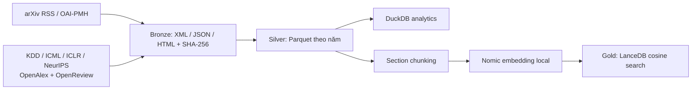

# UTH Scientific Data Mining & Lakehouse

- **Motivation/Background**: Thu thập và khai phá tài liệu khoa học AI, ML và Data Science cho học phần UTH Data Mining.
- **Purpose**: Hướng dẫn cấu hình, chạy và kiểm chứng pipeline hiện có.
- **Overview Pipeline**: arXiv → Bronze nguyên bản → Silver Parquet → DuckDB → chunking → Gold LanceDB.
- **Detailed Plan**: Cài đặt, chạy local, cấu hình R2/embedding và kiểm thử.
- **References**: [SETUP.md](SETUP.md), [kiến trúc nguồn](src/README.md), [trạng thái kiểm chứng](docs/progress/REFACTOR_STATUS.md).
- **Created**: 2026-07-25T00:00:00+07:00
- **Last Updated**: 2026-10-03T13:30:56+07:00

---

## Kiến trúc đang có



[Ingestion](src/ingestion/), [transformation](src/transformation/), [indexing](src/indexing/) và [storage](src/storage/) có implementation. [Quality](src/quality/), [mining](src/mining/) và [RAG](src/rag/) hiện là package khung; chưa có bộ audit 6 chiều, topic mining, hybrid retrieval, reranker hay LLM generation.

Bronze local lưu tại `data/local/bronze/`, manifest SHA-256 tại `data/local/_manifests/`; payload RSS/OAI gốc được lưu trước khi chuẩn hóa. Bronze local từ chối ghi đè nội dung khác. R2 lưu payload gốc ở các key theo hash và SHA-256 trong object metadata. `data/raw/` không bị sửa. Silver định tuyến paper ID hiện có vào partition cũ và upsert theo `paper_id`; paper mới phân vùng theo năm. Giữ các cột enrichment và full text khi cập nhật metadata-only. Gold upsert theo `chunk_id`.

**Phase 2 — Conference ingestion (KDD/ICML/ICLR/NeurIPS, 2020→)** lives at
`src/ingestion/conference_pipeline.py` with a 21-rule foundation layer under
`src/ingestion/common/`. Run with:

```bash
python -m src.pipelines.run_conference_ingest --venue KDD    --year-from 2020
python -m src.pipelines.run_conference_ingest --venue ICML   --year-from 2020
python -m src.pipelines.run_conference_ingest --venue ICLR   --year-from 2020
python -m src.pipelines.run_conference_ingest --venue NeurIPS --year-from 2020
python -m src.pipelines.run_conference_ingest --all         --year-from 2020   # 4 venues tuần tự
```

## Cài đặt

Python hỗ trợ: **3.10–3.12**. Python 3.12 dành cho môi trường mới; môi trường hiện có `venv` dùng Python 3.10.11 và đã được kiểm chứng cho pipeline này.

```bash
python3 -m venv .venv
source .venv/bin/activate
python -m pip install -e '.[dev,indexing]'
cp .env_example .env
python -m src.pipelines.doctor
```

Chỉ ingestion/transformation: `python -m pip install -e '.[dev]'`. Dependencies mining tùy chọn: `python -m pip install -e '.[mining]'`. Dependencies được khai báo tập trung tại [pyproject.toml](pyproject.toml); [requirements.txt](requirements.txt) cài core + dev. Khoảng phiên bản có giới hạn, chưa phải lockfile tái lập chính xác mọi dependency.

## Chạy local với dữ liệu thật

Nếu đang dùng môi trường có sẵn, chạy `source venv/bin/activate`.

```bash
python -m src.pipelines.run_ingest --local --metadata-only --category cs.AI --limit 1
python -m src.pipelines.run_transform --local
```

Bỏ `--metadata-only` để thử tải HTML. Bài chưa có HTML vẫn được lưu metadata. Silver chuẩn hóa ngày ISO và bỏ prefix thông báo trong abstract. Ngày trong RSS là ngày thông báo; phân tích thời gian xuất bản chính xác nên dùng metadata OAI `created`.

Chạy thử toàn bộ đường lưu/tìm kiếm mà không cần mạng, credentials hoặc model:

```bash
python -m src.pipelines.run_demo
```

Demo tạo hai bài tổng hợp, Parquet, chunks và LanceDB tại một thư mục mới trong `experiments/runs/`, kèm `report.json`. Vector demo là hash từ vựng để kiểm tra kỹ thuật; kết quả không đo chất lượng semantic search hay RAG.

## R2 và semantic indexing

Điền `R2_ACCESS_KEY_ID`, `R2_SECRET_ACCESS_KEY`, `R2_ENDPOINT_URL`, `R2_BUCKET_NAME` vào `.env` trên máy. Settings đọc `.env` rồi ưu tiên biến môi trường; không in secret và không sửa `.env` hiện có.

```bash
python -m src.pipelines.doctor --online
python -m src.pipelines.run_ingest --category cs.AI --limit 1
python -m src.pipelines.run_transform
```

`doctor --online` chỉ đọc: kiểm tra bucket và RSS. Khi đã tải đầy đủ mô hình Nomic vào thư mục `EMBEDDING_MODEL_PATH` (gồm tokenizer, weights và mã model cần thiết):

```bash
python -m src.pipelines.run_indexing --local
# Bỏ --local để đồng bộ Gold lên R2
```

Indexer đọc Silver local, dùng model local, rồi tìm kiếm cosine trong LanceDB. Mô hình Nomic có thể yêu cầu dependency riêng của mã model; chưa kiểm chứng semantic embedding nếu model chưa được cung cấp. Đồng bộ LanceDB lên R2 hiện là copy files; không có writer đồng thời hoặc cơ chế snapshot transaction cho object storage.

## Batch và resume

R2 đã được cấu hình và kiểm chứng read/write trong phiên setup; xem [R2_CRAWL_STATUS.md](docs/progress/R2_CRAWL_STATUS.md). Launcher dùng virtualenv của project, không cần activate thủ công:

```bash
./scripts/crawl_r2.sh --target 10000 --batch-size 100 --from-date 2024-01-01 --delay 10
```

Khi tiếp tục, giữ nguyên bucket, ngày và categories của checkpoint; giữ Silver local để hợp nhất với corpus cũ. Target tính số bản ghi xử lý của harvest, không phải số bài mới.

```bash
python -m src.pipelines.run_batch_ingest --local --target 100 --batch-size 20 --from-date 2026-10-01 --delay 10
```

`--target` là tổng tiến độ mong muốn của checkpoint, không phải số bài mới mỗi lần. `--batch-size` điều khiển flush Silver; server quyết định kích thước trang OAI. Bộ lọc giữ đúng `ARXIV_CATEGORIES`. `--from-date` là ngày cập nhật metadata theo OAI datestamp, không phải ngày xuất bản. Endpoint theo [arXiv OAI-PMH](https://info.arxiv.org/help/oa/index.html); RSS theo [arXiv RSS](https://info.arxiv.org/help/rss.html).

Checkpoint chỉ tiến sau khi lưu Bronze/Silver thành công. Trang đọc dở lưu offset và chữ ký nội dung; resume dừng rõ ràng nếu trang thay đổi. Checkpoint local và R2 tách riêng trong `MANIFEST_DIR`. Token OAI hết hạn hằng ngày; khi hết hạn cần chọn kế hoạch harvest lại và reset có chủ đích. Checkpoint cũ không có offset bị từ chối để tránh mất dữ liệu. Pipeline hỗ trợ một writer tại một thời điểm.

## Kiểm chứng

```bash
python -m pytest tests -q
python -m ruff check src tests
python -m pip check
python -c 'import src'
```

Unit suite dùng fixture, chạy không cần mạng/R2/model. Có LanceDB thì chạy thêm demo integration local; thiếu optional dependency này thì test tương ứng skip. Kiểm tra dịch vụ thật bật riêng:

```bash
RUN_INTEGRATION_TESTS=1 python -m pytest tests/test_connection.py -v
```

Kết quả thực thi và phần chưa kiểm chứng nằm trong [REFACTOR_STATUS.md](docs/progress/REFACTOR_STATUS.md).
