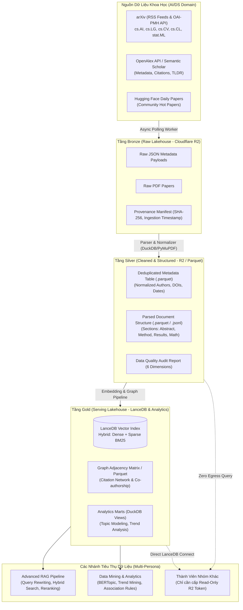
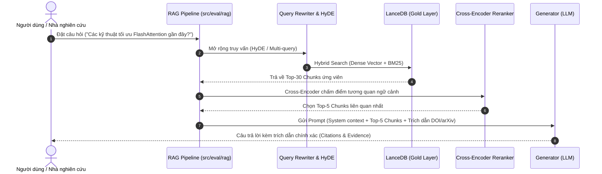

# Kế Hoạch Triển Khai Hệ Thống Khai Thác Dữ Liệu Khoa Học Thời Gian Thực Hướng Tới Advanced RAG Cho Miền AI/DS

- **Motivation/Background**: Xây dựng nền tảng khai thác dữ liệu bài báo khoa học thời gian thực (arXiv, OpenAlex, Semantic Scholar) phục vụ bài toán RAG nâng cao và khai phá dữ liệu học thuật cho sinh viên/nhóm nghiên cứu UTH.
- **Purpose**: Bản kế hoạch kỹ thuật chi tiết từng bước (Step-by-Step Implementation Plan) theo mô hình ELT kết hợp Data Lakehouse (Cloudflare R2, DuckDB + Parquet, LanceDB).
- **Overview Pipeline**: Extract (đa nguồn API/RSS) -> Load Bronze (Immutable Raw Vault trên R2) -> Transform Silver (Clean Parquet & Parsed Markdown) -> Transform Gold (LanceDB Vector Index & Graph Mining) -> Serving đa tác vụ (RAG, BI, Trend Mining).
- **Detailed Plan**: §1 Kiến trúc Tổng quan (Architecture & Paradigms); §2 Phân rã từng bước triển khai (Phase 0 đến Phase 5); §3 Thiết kế Data Lakehouse trên Cloudflare R2; §4 Cơ chế chia sẻ dữ liệu đa vai trò (Multi-Persona Handover); §5 Kế hoạch kiểm thử & Tiêu chí hoàn thành (DoD).
- **References**: [docs/PURPOSE.md](PURPOSE.md), [docs/references/ML_PIPELINE_REFERENCE_v4.md](references/ML_PIPELINE_REFERENCE_v4.md), [agents/rules/MD_CONVENTION.md](../agents/rules/MD_CONVENTION.md), [agents/rules/LOGGING_CHECKPOINT_RULES.md](../agents/rules/LOGGING_CHECKPOINT_RULES.md).
- **Created**: 2026-10-01T21:55:00+07:00
- **Last Updated**: 2026-10-01T21:55:00+07:00

---

## Table of Contents

- [1. Kiến trúc Tổng quan (Architecture & ELT Paradigm)](#1-kiến-trúc-tổng-quan-architecture--elt-paradigm)
  - [1.1 Triết lý ELT & Tách rời Lưu trữ - Tính toán](#11-triết-lý-elt--tách-rời-lưu-trữ---tính-toán)
  - [1.2 Sơ đồ Luồng Dữ liệu Toàn cảnh](#12-sơ-đồ-luồng-dữ-liệu-toàn-cảnh)
- [2. Chi tiết Từng Bước Triển Khai (Phase-by-Phase Roadmap)](#2-chi-tiết-từng-bước-triển-khai-phase-by-phase-roadmap)
  - [Bước 0: Thiết kế Schema & Cấu trúc Lakehouse trên R2](#bước-0-thiết-kế-schema--cấu-trúc-lakehouse-trên-r2)
  - [Bước 1: Ingestion Engine — Thu thập Thời gian thực vào Tầng Bronze](#bước-1-ingestion-engine--thu-thập-thời-gian-thực-vào-tầng-bronze)
  - [Bước 2: Transformation Engine — Làm sạch & Chuẩn hóa Tầng Silver](#bước-2-transformation-engine--làm-sạch--chuẩn-hóa-tầng-silver)
  - [Bước 3: Indexing Engine — Xây dựng Tầng Gold cho Advanced RAG](#bước-3-indexing-engine--xây-dựng-tầng-gold-cho-advanced-rag)
  - [Bước 4: Retrieval & Advanced RAG Serving Engine](#bước-4-retrieval--advanced-rag-serving-engine)
  - [Bước 5: Orchestration & Tự động hóa Vận hành](#bước-5-orchestration--tự-động-hóa-vận-hành)
- [3. Cơ Chế Chia Sẻ Dữ Liệu Đa Mục Đích (Multi-Persona Handover)](#3-cơ-chế-chia-sẻ-dữ-liệu-đa-mục-đích-multi-persona-handover)
- [4. Tech Stack Tinh Gọn](#4-tech-stack-tinh-gọn)
- [5. Tiêu Chí Hoàn Thành (Definition of Done - DoD)](#5-tiêu-chí-hoàn-thành-definition-of-done---dod)

---

## 1. Kiến trúc Tổng quan (Architecture & ELT Paradigm)

### 1.1 Triết lý ELT & Tách rời Lưu trữ - Tính toán
Hệ thống tuân thủ nghiêm ngặt mô hình **ELT (Extract - Load - Transform)** kết hợp kiến trúc **Medallion Data Lakehouse**:
- **Extract & Load Trước (Bronze Vault):** Dữ liệu thu thập từ các nguồn học thuật (arXiv, Semantic Scholar, OpenAlex) được lưu trữ ngay lập tức dưới dạng nguyên bản vào Cloudflare R2 với chữ ký SHA-256. Không gọt giũa sớm để đảm bảo không mất mát dữ liệu gốc (*Immutable Raw Invariant*).
- **Transform Sau (Silver & Gold):** Các tác vụ xử lý bóc tách PDF, làm sạch, deduplicate, chunking và embedding được thực hiện độc lập. Có thể tái chạy (re-compute) bất cứ khi nào đổi mô hình Embedding/LLM mà không cần cào lại từ đầu.
- **Tách rời Storage và Compute:** Cloudflare R2 đóng vai trò **Single Source of Truth**. Tính toán (DuckDB, LanceDB, PyTorch) có thể chạy trên máy local, Google Colab, hay Cloud GPU mà không phát sinh phí tải dữ liệu (Zero Egress Fee).

### 1.2 Sơ đồ Luồng Dữ liệu Toàn cảnh



---

## 2. Chi tiết Từng Bước Triển Khai (Phase-by-Phase Roadmap)

### Bước 0: Thiết kế Schema & Cấu trúc Lakehouse trên R2
**Mục tiêu:** Cố định cấu trúc lưu trữ và hợp đồng dữ liệu (Data Contract) trước khi viết dòng code cào đầu tiên.

1. **Khởi tạo Bucket trên Cloudflare R2:**
   - Đặt tên bucket: `uth-scientific-lakehouse`
   - Phân cấp folder:
     ```text
     uth-scientific-lakehouse/
     ├── bronze/                      # Dữ liệu thô nguyên bản (Immutable)
     │   ├── arxiv/raw_metadata/YYYY/MM/DD/
     │   └── arxiv/raw_pdfs/YYYY/MM/
     ├── silver/                      # Dữ liệu đã làm sạch & parse cấu trúc
     │   ├── metadata_v1/             # Parquet partitioned by category / year
     │   └── parsed_papers_v1/        # Structured Markdown / Chunks
     └── gold/                        # Dữ liệu phục vụ truy xuất & phân tích
         ├── lancedb/                 # Lance dataset (Vector table + BM25)
         └── citation_graph/          # Graph edges/nodes (Parquet)
     ```
2. **Xác định Unified Metadata Schema:**
   - `paper_id` (STRING): Unique key (ví dụ: `arxiv:2401.12345v1`).
   - `doi` (STRING, NULLABLE): Digital Object Identifier.
   - `title` (STRING): Tiêu đề bài báo đã chuẩn hóa khoảng trắng.
   - `abstract` (STRING): Tóm tắt nội dung.
   - `authors` (LIST[STRING]): Danh sách tác giả chuẩn hóa.
   - `categories` (LIST[STRING]): Danh mục (ví dụ: `["cs.AI", "stat.ML"]`).
   - `published_date` (TIMESTAMP_TZ): Ngày xuất bản đầu tiên.
   - `updated_date` (TIMESTAMP_TZ): Ngày cập nhật phiên bản.
   - `pdf_url` (STRING): Đường link tải PDF gốc.
   - `raw_s3_uri` (STRING): URI trỏ tới file raw trong Bronze layer.
   - `sha256_hash` (STRING): Mã băm xác thực tính toàn vẹn.

---

### Bước 1: Ingestion Engine — Thu thập Thời gian thực vào Tầng Bronze
**Mục tiêu:** Tự động hóa việc theo dõi và tải các bài báo mới nhất thuộc lĩnh vực AI/DS vào kho Bronze mà không bị chặn IP.

1. **Thu thập Near Real-Time qua arXiv RSS / Atom Feeds:**
   - arXiv cập nhật các bài báo mới vào các ngày trong tuần (~00:00 UTC).
   - Thiết lập crawler đọc RSS các kênh trọng điểm:
     - `http://export.arxiv.org/rss/cs.AI` (Artificial Intelligence)
     - `http://export.arxiv.org/rss/cs.LG` (Machine Learning)
     - `http://export.arxiv.org/rss/cs.CL` (Computation and Language - NLP/LLM)
     - `http://export.arxiv.org/rss/cs.CV` (Computer Vision)
     - `http://export.arxiv.org/rss/stat.ML` (Machine Learning Statistics)
2. **Thu thập Lịch sử & Backfill qua OAI-PMH / arXiv API:**
   - Dùng giao thức `OAI-PMH` hoặc arXiv REST API với chunk size 100 bài/request.
   - Cơ chế rate limit lịch sự: tối thiểu 3 giây nghỉ giữa mỗi request.
3. **Cơ chế Ingestion an toàn (Resilient Ingestion):**
   - Triển khai Exponential Backoff và Retry logic trong [`src/data/`](../src/data/).
   - Tính toán mã hash SHA-256 cho từng file.
   - Ghi thẳng payload JSON và file PDF vào R2 Bronze. Tạo file manifest nhật ký `manifest_ingestion_<date>.jsonl`.

---

### Bước 2: Transformation Engine — Làm sạch & Chuẩn hóa Tầng Silver
**Mục tiêu:** Chuyển đổi dữ liệu thô thành dữ liệu dạng bảng phân tích (Parquet) và bóc tách cấu trúc nội dung bài báo khoa học.

1. **Deduplication & Entity Resolution:**
   - Loại bỏ các bản ghi trùng lặp (ví dụ: một bài báo vừa xuất hiện ở RSS vừa lấy từ API, hoặc nhiều versions `v1`, `v2`).
   - Giữ lại version mới nhất hoặc theo dõi lịch sử cập nhật.
2. **Academic Document Parsing (Bóc tách cấu trúc PDF):**
   - Tài liệu khoa học có đặc thù: chia cột (two-column layout), chứa công thức toán LaTeX, hình ảnh, bảng số liệu và danh mục tài liệu tham khảo (References).
   - Sử dụng thư viện chuyên dụng:
     - *Tùy chọn nhẹ/nhanh:* `PyMuPDF` (Fitz) kết hợp heuristics nhận diện tiêu đề section.
     - *Tùy chọn chất lượng cao:* `Grobid` (chuyên trích xuất TEI-XML bài báo khoa học) hoặc `Marker` / `Nougat` để chuyển PDF thành Markdown sạch chuẩn công thức toán.
   - Lưu trữ văn bản có cấu trúc: chia theo từng phần rõ ràng (`Abstract`, `Introduction`, `Methodology`, `Experiments`, `Conclusion`).
3. **Data Quality Audit (Kiểm định 6 chiều theo chuẩn dự án):**
   - Viết test kiểm tra: Completeness (không thiếu Abstract/Title), Uniqueness (không trùng Paper ID), Timeliness (timestamp hợp lệ), Consistency (định dạng category chuẩn).
4. **Lưu trữ Tầng Silver bằng Parquet:**
   - Dùng **DuckDB** hoặc **PyArrow** để ghi dữ liệu bảng ra định dạng Parquet nén `zstd`, phân vùng theo `year/month` hoặc `primary_category`.

---

### Bước 3: Indexing Engine — Xây dựng Tầng Gold cho Advanced RAG
**Mục tiêu:** Tạo chỉ mục vector và từ khóa chất lượng cao để phục vụ truy xuất chính xác ngữ cảnh khoa học.

1. **Chiến lược Chunking chuyên biệt cho Paper (Domain-Aware Chunking):**
   - *Không dùng Fixed-size Chunking mù quáng (ví dụ cắt ngang chừng 512 ký tự).*
   - **Section-Aware Chunking:** Cắt theo từng mục (Section/Subsection). Giữ nguyên vẹn một phương pháp hoặc một thuật toán.
   - **Contextual Enrichment:** Mỗi chunk tự động gắn thêm prefix metadata:
     `[Paper: Title] [Section: Methodology] [Authors: ...] <Nội dung chunk>`
2. **Hybrid Indexing (Kết hợp Dense + Sparse):**
   - **Dense Embeddings:** Dùng mô hình đa ngữ hoặc chuyên biệt cho học thuật:
     - `BAAI/bge-m3` (Hỗ trợ đa ngôn ngữ, độ dài context 8192, xuất sắc cho retrieval).
     - Hoặc `text-embedding-3-small` (OpenAI API).
   - **Sparse Embeddings / BM25:** Phục vụ tìm kiếm chính xác các từ khóa kỹ thuật hiếm (ví dụ tên mô hình `RoBERTa`, tên dataset `ImageNet-1k`, tên thuật toán `AdamW`).
3. **Lưu trữ vào Vector Lakehouse với LanceDB:**
   - LanceDB lưu trữ dữ liệu dạng cột (`.lance`) trực tiếp trên Cloudflare R2 hoặc mount qua bộ nhớ đệm máy chủ.
   - Tạo chỉ mục IVF-PQ (Inverted File with Product Quantization) hoặc HNSW để tìm kiếm lân cận gần đúng (ANN) dưới 10ms.

---

### Bước 4: Retrieval & Advanced RAG Serving Engine
**Mục tiêu:** Xây dựng luồng truy xuất và trả lời câu hỏi nâng cao vượt trội hơn Vanilla RAG.



1. **Query Pre-retrieval (Tiền truy xuất):**
   - **Query Expansion & HyDE (Hypothetical Document Embeddings):** Tạo đoạn giả định abstract để tăng độ tương đồng vector.
   - **Metadata Filtering:** Lọc theo năm xuất bản (`year >= 2025`) hoặc chuyên ngành (`cs.AI`) trước khi search vector.
2. **Post-retrieval & Reranking (Hậu truy xuất):**
   - Sử dụng Cross-Encoder (như `bge-reranker-large`) để chấm điểm lại mức độ phù hợp giữa câu hỏi và từng đoạn văn bản.
3. **Generation & Trích dẫn nghiêm ngặt (Strict Grounding):**
   - Prompt ràng buộc LLM: Mọi khẳng định phải đi kèm link dẫn chứng `[arXiv:ID]`. Nếu ngữ cảnh không có, LLM từ chối trả lời để tránh ảo giác (hallucination).

---

### Bước 5: Orchestration & Tự động hóa Vận hành
**Mục tiêu:** Hệ thống tự động vận hành mỗi ngày mà không cần thao tác thủ công.

1. **Lên lịch Pipeline (Scheduled Runner):**
   - Sử dụng GitHub Actions (Cron trigger) hoặc worker script chạy ngầm mỗi ngày lúc 01:00 UTC (sau khi arXiv cập nhật).
2. **Theo dõi & Ghi nhật ký (Observability & Governance):**
   - Ghi log chi tiết theo chuẩn [`agents/rules/LOGGING_CHECKPOINT_RULES.md`](../agents/rules/LOGGING_CHECKPOINT_RULES.md).
   - Kiểm tra số lượng bài tải mới, số bài xử lý thành công, tỷ lệ lỗi parse PDF.

---

## 3. Cơ Chế Chia Sẻ Dữ Liệu Đa Mục Đích (Multi-Persona Handover)

Nhờ kiến trúc Data Lakehouse trên Cloudflare R2, bạn chỉ cần một nguồn lưu trữ trung tâm duy nhất để phân phát công việc cho toàn bộ đội ngũ:

| Vai trò thành viên | Công cụ sử dụng | Cách kết nối vào R2 | Tác vụ thực hiện |
| :--- | :--- | :--- | :--- |
| **RAG / AI Engineer** | Python, `lancedb`, LangChain | Kết nối thẳng URI `s3://.../gold/lancedb/` | Xây dựng chatbot, test prompt, đánh giá RAG (Ragas metrics). |
| **Data Analyst / BI** | `DuckDB`, SQL, DBeaver | Query trực tiếp `s3://.../silver/metadata/*.parquet` | Vẽ biểu đồ xu hướng số lượng bài báo AI theo tháng, thống kê tác giả nổi bật. |
| **ML / Topic Modeling** | `scikit-learn`, `BERTopic` | Đọc cột `abstract` từ Silver Parquet | Phân cụm bài báo theo chủ đề mới nổi (Unsupervised Topic Discovery). |
| **Graph Mining Engineer** | `NetworkX`, `PyG` | Đọc dữ liệu `gold/citation_graph/` | Xây dựng đồ thị trích dẫn, tìm PageRank của các bài báo ảnh hưởng nhất. |

> [!IMPORTANT]
> **Cơ chế bảo mật:** Tạo **Cloudflare R2 API Token với quyền `Object Read Only`** cấp cho các thành viên. Họ có thể kéo dữ liệu, query tính toán thỏa thích mà **không bao giờ sợ bị sửa hoặc xóa nhầm dữ liệu gốc**, đồng thời **chi phí băng thông tải ra luôn là $0.00**.

---

## 4. Tech Stack Tinh Gọn

| Thành phần | Công nghệ lựa chọn | Vai trò trong hệ thống |
| :--- | :--- | :--- |
| **Object Storage** | **Cloudflare R2** | Lưu trữ bất biến tầng Bronze, Silver, Gold; $0 Egress Fee. |
| **Lakehouse Query Engine** | **DuckDB** + **Apache Parquet** | Đọc/ghi và xử lý dữ liệu dạng bảng cực nhanh, không cần cluster. |
| **Vector Lakehouse** | **LanceDB** | Lưu trữ và tìm kiếm vector trên định dạng cột Lance/Arrow. |
| **Document Parser** | **PyMuPDF / Marker** | Bóc tách PDF học thuật thành Markdown có cấu trúc. |
| **Embedding & Reranker** | **BGE-M3** & **BGE-Reranker** | Tìm kiếm ngữ nghĩa lai (Hybrid Search) và xếp hạng lại. |
| **Pipeline Core** | **Python (AsyncIO, Boto3, httpx)** | Module chuẩn đặt tại [`src/data/`](../src/data/). |

---

## 5. Tiêu Chí Hoàn Thành (Definition of Done - DoD)

1. [ ] Cấu hình thành công bucket Cloudflare R2 với các thư mục `bronze/`, `silver/`, `gold/`.
2. [ ] Hoàn thành module thu thập arXiv RSS & API trong [`src/data/`](../src/data/), tự động đẩy raw JSON và PDF lên R2 Bronze kèm SHA-256.
3. [ ] Hoàn thành pipeline chuẩn hóa và bóc tách PDF sang file Parquet ở tầng Silver, có thể query bằng DuckDB.
4. [ ] Xây dựng thành công LanceDB table chứa Vector Embeddings ở tầng Gold.
5. [ ] Triển khai script đánh giá Advanced RAG (Hybrid Search + Reranking) cho ra kết quả trả lời kèm trích dẫn chính xác.
6. [ ] Cung cấp tài liệu hướng dẫn thành viên khác kết nối vào R2 bằng Read-Only Token.
