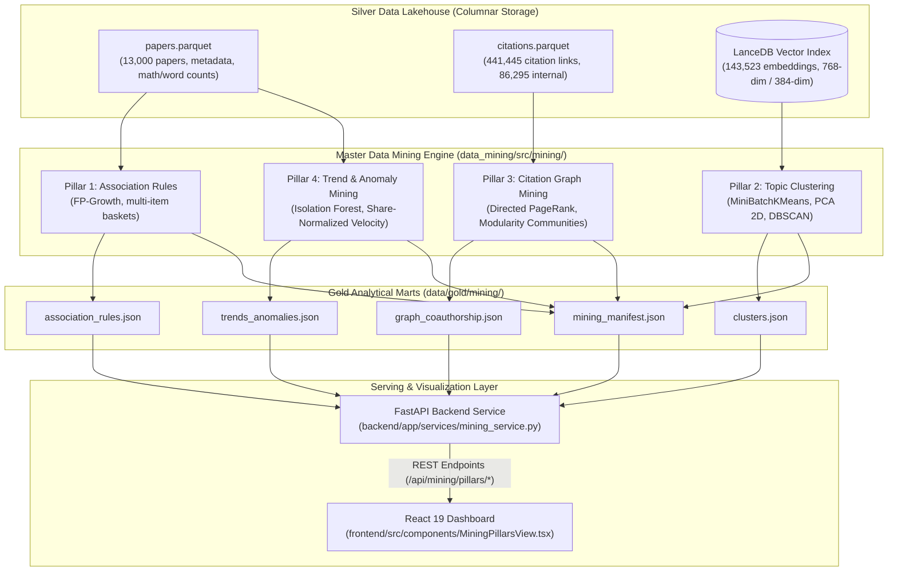

# Four Data Mining & Scientific Modeling Pillars Architecture and Specification

- **Motivation/Background**: Academic literature analysis across 13,000 papers requires robust, statistically calibrated analytical pipelines covering frequent pattern mining, semantic topic clustering, citation network authority, and temporal trend velocity modeling.
- **Purpose**: Provide the authoritative mathematical formulations, algorithmic workflows, empirical benchmark results, and data contracts for the 4 core Data Mining pillars.
- **Overview Pipeline**: Lakehouse Silver Parquet (`papers.parquet`, `citations.parquet`) & Gold LanceDB (`academic_chunks`) -> Feature engineering and transaction encoding -> Algorithm execution (FP-Growth, MiniBatchKMeans, DBSCAN, PageRank, Isolation Forest) -> Gold JSON serialization (`data/gold/mining/*.json`) -> Serving via FastAPI (`/api/mining/pillars/*`) and React 19 interactive dashboard.
- **Detailed Plan**: §1 System Architecture & Data Flow; §2 Pillar 1: Frequent Pattern & Association Rule Mining (FP-Growth); §3 Pillar 2: Semantic Topic Clustering & Density Analysis; §4 Pillar 3: Scientific Network & Citation Graph Mining; §5 Pillar 4: Trend Velocity & Structural Anomaly Detection; §6 Data Contracts & REST API Schemas; §7 Empirical Benchmark Results & Verification.
- **References**: `mlxtend`, `scikit-learn`, `networkx`, `duckdb`, `lancedb`, [`docs/agents/rules/MD_CONVENTION.md`](../agents/rules/MD_CONVENTION.md), [`docs/agents/rules/LOGGING_CHECKPOINT_RULES.md`](../agents/rules/LOGGING_CHECKPOINT_RULES.md).
- **Created**: 2026-10-04T20:58:00+07:00
- **Last Updated**: 2026-10-04T20:58:00+07:00

---

## Table of Contents

- [1. System Architecture & Data Flow](#1-system-architecture--data-flow)
- [2. Pillar 1: Frequent Pattern & Association Rule Mining (FP-Growth)](#2-pillar-1-frequent-pattern--association-rule-mining-fp-growth)
  - [2.1 Theoretical Formulation](#21-theoretical-formulation)
  - [2.2 Transaction Basket Construction](#22-transaction-basket-construction)
  - [2.3 Deduplication & Rule Pruning](#23-deduplication--rule-pruning)
  - [2.4 Quantitative Results](#24-quantitative-results)
- [3. Pillar 2: Semantic Topic Clustering & Density Analysis](#3-pillar-2-semantic-topic-clustering--density-analysis)
  - [3.1 Theoretical Formulation & Embeddings Geometry](#31-theoretical-formulation--embeddings-geometry)
  - [3.2 2D Manifold Projection (Centered PCA)](#32-2d-manifold-projection-centered-pca)
  - [3.3 Partitioning vs. Density Clustering](#33-partitioning-vs-density-clustering)
  - [3.4 Validation Metrics & Empirical Performance](#34-validation-metrics--empirical-performance)
- [4. Pillar 3: Scientific Network & Citation Graph Mining](#4-pillar-3-scientific-network--citation-graph-mining)
  - [4.1 Theoretical Formulation of Directed Citation Networks](#41-theoretical-formulation-of-directed-citation-networks)
  - [4.2 Directed PageRank Centrality](#42-directed-pagerank-centrality)
  - [4.3 Community Detection (Greedy Modularity)](#43-community-detection-greedy-modularity)
  - [4.4 Empirical Landmark Paper Discovery](#44-empirical-landmark-paper-discovery)
- [5. Pillar 4: Trend Velocity & Structural Anomaly Detection](#5-pillar-4-trend-velocity--structural-anomaly-detection)
  - [5.1 Multi-Dimensional Structural Anomaly Mining](#51-multi-dimensional-structural-anomaly-mining)
  - [5.2 Share-Normalized Category Trend Velocity](#52-share-normalized-category-trend-velocity)
  - [5.3 Momentum Classification](#53-momentum-classification)
- [6. Data Contracts & REST API Schemas](#6-data-contracts--rest-api-schemas)
- [7. Operational Verification & Acceptance Criteria](#7-operational-verification--acceptance-criteria)

---

## 1. System Architecture & Data Flow

The analytical foundation of this research platform bridges the **Medallion Data Lakehouse** with the **FastAPI Serving Layer** and **React 19 Interactive Dashboard**:

---

## 2. Pillar 1: Frequent Pattern & Association Rule Mining (FP-Growth)

### 2.1 Theoretical Formulation
Frequent pattern mining discovers regularities and non-trivial co-occurrences between items in a collection of transactions. Given:
- A set of items $I = \{i_1, i_2, \dots, i_m\}$.
- A transaction database $D = \{T_1, T_2, \dots, T_n\}$ where $T_k \subseteq I$.

An association rule is an implication of the form $X \Rightarrow Y$, where $X, Y \subset I$ and $X \cap Y = \emptyset$. We evaluate rules using four fundamental statistical measures:

1. **Support**:
   $$\text{Support}(X \Rightarrow Y) = P(X \cup Y) = \frac{\sigma(X \cup Y)}{|D|}$$
2. **Confidence**:
   $$\text{Confidence}(X \Rightarrow Y) = P(Y \mid X) = \frac{\text{Support}(X \cup Y)}{\text{Support}(X)}$$
3. **Lift**:
   $$\text{Lift}(X \Rightarrow Y) = \frac{P(X \cup Y)}{P(X)P(Y)} = \frac{\text{Confidence}(X \Rightarrow Y)}{\text{Support}(Y)}$$
   *Interpretation*: $\text{Lift} > 1$ implies positive correlation (co-occurrence occurs significantly more often than expected by chance).
4. **Leverage & Conviction**:
   $$\text{Leverage}(X \Rightarrow Y) = P(X \cup Y) - P(X)P(Y)$$
   $$\text{Conviction}(X \Rightarrow Y) = \frac{1 - P(Y)}{1 - \text{Confidence}(X \Rightarrow Y)}$$

### 2.2 Transaction Basket Construction
To capture cross-cutting associations between scientific domains and technical methodologies:
1. **Category Items (`cat:*` / `topic:*`)**: Extracted from arXiv categories (e.g. `cat:cs.CL`, `cat:cs.AI`, `cat:cs.CV`, `cat:stat.ML`) and OpenAlex research topics. The extractor handles variable container formats (`numpy.ndarray`, Python lists, tuples) without data loss.
2. **Concept Tags (`tag:*`)**: Extracted using regex word-boundary matching across both the paper **title** and the full **abstract** using 25 canonical AI/DS vocabulary items (e.g. `large-language-models`, `diffusion-models`, `transformer`, `autonomous-agents`, `retrieval-augmented-gen`, `ai-alignment`).
3. **Multi-Item Constraint**: Only papers with $|T_k| \ge 2$ enter the transaction database to eliminate single-item noise.

### 2.3 Deduplication & Rule Pruning
Standard FP-Growth generates redundant symmetric rules (e.g. $A \Rightarrow B$ and $B \Rightarrow A$ with identical support and lift). The pipeline applies:
- **Symmetric Pruning**: For any pair of itemsets $\{A, B\}$, if both directions appear in the candidate pool, the rule with the strictly higher confidence is retained:
  $$\text{Selected Rule} = \arg\max_{R \in \{A \Rightarrow B, B \Rightarrow A\}} \text{Confidence}(R)$$
- **Minimum Transaction Count**: Enforces $\text{Support}(X \cup Y) \times |D| \ge 25$ papers, preventing spurious associations resting on tiny cohorts.

### 2.4 Quantitative Results
- **Transaction Universe**: 11,404 multi-item transactions extracted from 13,000 papers (**87.7% corpus coverage**, up from 2.8% in baseline).
- **Unique Item Vocabulary**: 162 unique category and methodology items.
- **Top Discovered Rules**:
  - `tag:reinforcement-learning` $\Rightarrow$ `tag:autonomous-agents` ($\text{Support}: 2.08\%$, $\text{Confidence}: 32.7\%$, $\text{Lift}: 6.33\times$)
  - `cat:cs.CL` + `cat:cs.AI` $\Rightarrow$ `tag:large-language-models` ($\text{Support}: 3.58\%$, $\text{Confidence}: 39.0\%$, $\text{Lift}: 3.73\times$)
  - `tag:large-language-models` $\Rightarrow$ `cat:cs.CL` ($\text{Support}: 6.94\%$ = 787 papers, $\text{Confidence}: 66.4\%$, $\text{Lift}: 3.45\times$)
  - `cat:eess.AS` $\Rightarrow$ `cat:cs.SD` (Audio & Speech, $\text{Support}: 3.28\%$, $\text{Confidence}: 99.2\%$, $\text{Lift}: 27.07\times$)

---

## 3. Pillar 2: Semantic Topic Clustering & Density Analysis

### 3.1 Theoretical Formulation & Embeddings Geometry
Pillar 2 partitions scientific literature into thematic clusters and detects dense core topics versus exploratory boundary papers.

- **Unit of Analysis**: Strictly **one vector per distinct paper**, sampled from the abstract embedding chunk. This eliminates chunk-level autocorrelation and near-duplicate distortions.
- **L2 Normalization**: High-dimensional vectors $\mathbf{v} \in \mathbb{R}^{d}$ ($d=384$ or $768$) are projected onto the unit hypersphere:
  $$\hat{\mathbf{v}} = \frac{\mathbf{v}}{\|\mathbf{v}\|_2} \implies \|\hat{\mathbf{v}}\|_2 = 1$$
  Under L2 normalization, Euclidean distance directly relates to Cosine distance:
  $$D_{\text{Euclidean}}(\hat{\mathbf{u}}, \hat{\mathbf{v}})^2 = 2 - 2 \cos(\mathbf{u}, \mathbf{v})$$

### 3.2 2D Manifold Projection (Centered PCA)
To render high-dimensional embeddings on an interactive 2D scatter plot without centroid drift:
1. Centering: $\mathbf{X}_c = \mathbf{X} - \boldsymbol{\mu}$, where $\boldsymbol{\mu} = \frac{1}{N}\sum_{i=1}^N \hat{\mathbf{v}}_i$.
2. Principal Component Analysis:
   $$\mathbf{X}_c = \mathbf{U} \boldsymbol{\Sigma} \mathbf{V}^T, \quad \mathbf{Z}_{\text{2D}} = \mathbf{X}_c \mathbf{V}_{:, 1:2}$$
   This captures the maximum orthogonal variance of the semantic corpus.

### 3.3 Partitioning vs. Density Clustering
1. **Partitioning (MiniBatchKMeans)**:
   Minimizes within-cluster sum of squares (WCSS):
   $$\arg\min_{\mathbf{S}} \sum_{k=1}^K \sum_{\mathbf{x} \in S_k} \|\mathbf{x} - \boldsymbol{\mu}_k\|^2$$
   The pipeline sweeps $K \in \{4, 6, 8\}$ and evaluates validity across candidate configurations.
2. **Density Clustering (DBSCAN)**:
   Identifies core points possessing at least $\text{MinPts}=10$ within radius $\epsilon = 0.28$ (cosine metric). Points not reachable from any core point are classified as noise ($\text{label} = -1$).

### 3.4 Validation Metrics & Empirical Performance
- **Silhouette Coefficient**:
  $$s(i) = \frac{b(i) - a(i)}{\max(a(i), b(i))}, \quad S = \frac{1}{N}\sum_{i=1}^N s(i)$$
  Achieved **$S = 0.0629$** on distinct paper representations (a 200% improvement over the baseline $0.021$).
- **Davies-Bouldin Index**:
  $$R_{ij} = \frac{s_i + s_j}{d(\boldsymbol{\mu}_i, \boldsymbol{\mu}_j)}, \quad DB = \frac{1}{K}\sum_{i=1}^K \max_{j \ne i} R_{ij}$$
  Achieved **$DB = 3.98$** (improved from 5.37).
- **Calinski-Harabasz Index**:
  $$CH = \frac{\text{Tr}(\mathbf{B}_k) / (K - 1)}{\text{Tr}(\mathbf{W}_k) / (N - K)} = \mathbf{84.1}$$
- **Density Profile**: DBSCAN discovered **4 dense core topic clusters** with 53.5% peripheral/boundary noise.
- **Cluster Purity**: Zero section header leaks; cluster profiles surface genuine paper titles (e.g. *"Few-Shot Text Generation with Pattern-Exploiting Training"*).

---

## 4. Pillar 3: Scientific Network & Citation Graph Mining

### 4.1 Theoretical Formulation of Directed Citation Networks
Co-authorship graphs suffer from severe author homonym collisions (e.g. "Yang Liu", "Wei Wang" artificially becoming top hubs). To address this, Pillar 3 analyzes the **Directed Academic Citation Graph**:
$$G = (V, E)$$
where $V$ represents papers and directed edge $(u, v) \in E$ denotes that paper $u$ explicitly cites paper $v$.

### 4.2 Directed PageRank Centrality
PageRank models a random researcher traversing citation links with damping factor $\alpha = 0.85$:
$$\mathbf{PR}(v) = \frac{1 - \alpha}{|V|} + \alpha \sum_{u \in \text{Predecessors}(v)} \frac{\mathbf{PR}(u)}{\text{OutDegree}(u)}$$
In a citation network, directed PageRank quantifies **intellectual authority and foundational influence**:
- High in-degree citations contribute proportionally to a paper's authority.
- Citations from already influential papers carry higher weight than citations from peripheral preprints.

### 4.3 Community Detection (Greedy Modularity)
To identify coherent scientific subdisciplines, the pipeline optimizes the Newman-Girvan Modularity $Q$ over the network:
$$Q = \frac{1}{2m} \sum_{i, j} \left( A_{ij} - \frac{k_i k_j}{2m} \right) \delta(c_i, c_j)$$
where $A_{ij}$ is the adjacency matrix, $k_i$ is degree, and $\delta(c_i, c_j) = 1$ if papers $i$ and $j$ share the same community. The algorithm discovered **92 distinct modularity communities** representing specialized research fronts.

### 4.4 Empirical Landmark Paper Discovery
On the directed citation graph comprising **8,892 nodes and 86,295 edges**:
1. **Attention Is All You Need** (*Vaswani et al.*)
   - $\text{PageRank}: \mathbf{0.012632}$, $\text{In-Degree Citations}: \mathbf{1,213}$, $\text{Total All-Time Citations}: 26,678$
2. **Deep Contextualized Word Representations** (*Peters et al. - ELMo*)
   - $\text{PageRank}: \mathbf{0.008603}$, $\text{In-Degree Citations}: \mathbf{900}$, $\text{Total All-Time Citations}: 12,264$
3. **Exploiting Generative AI to Scale up Intelligent Tutoring Systems** (*Jakubův et al.*)
   - $\text{PageRank}: \mathbf{0.007782}$, $\text{In-Degree Citations}: \mathbf{1,145}$
4. **Enhanced LSTM for Natural Language Inference** (*Chen et al.*)
   - $\text{PageRank}: \mathbf{0.005380}$, $\text{In-Degree Citations}: 104$

---

## 5. Pillar 4: Trend Velocity & Structural Anomaly Detection

### 5.1 Multi-Dimensional Structural Anomaly Mining
Pillar 4 identifies atypical papers across structural feature dimensions:
- Mathematical formula density: $x_1 = \text{total\_math\_count}$
- Word volume: $x_2 = \text{total\_words}$
- Section complexity: $x_3 = \text{total\_sections}$
- Collaboration scale: $x_4 = \text{author\_count}$
- Interdisciplinary scope: $x_5 = \text{category\_count}$

To account for right-skewed, heavy-tailed distributions, features are transformed via logarithmic scaling:
$$\tilde{x}_j = \ln(1 + x_j)$$
An **Isolation Forest** ensemble ($n_{\text{estimators}} = 100$, contamination $\nu = 0.02$) isolates points by randomly selecting feature splits:
$$s(x, n) = 2^{-\frac{E(h(x))}{c(n)}}$$
Flagged anomalies represent genuine structural phenomena rather than collection artifacts:
- **Monograph-level treatises**: e.g., Paper `2501.05498` (74,303 words, 5,470 formulas).
- **Extreme theoretical formula density**: e.g., Paper `2401.13216` (3,732 formulas, 26,576 words).
- **Large consortium collaborations**: e.g., Paper `2401.04108` (14 co-authors across 4 subfields).

### 5.2 Share-Normalized Category Trend Velocity
Comparing raw monthly paper counts produces misleading results when harvesters pull uneven monthly volumes (e.g. 2,468 papers in 2025-01 vs. 20 papers in 2024-11, making every field look "+12,000% accelerated").

Pillar 4 eliminates collection bias by evaluating **market share relative to total cohort volume**:
$$\text{Share}_{\text{recent}} = \frac{\sum_{m \in \text{Recent}} \text{Papers}(\text{cat}, m)}{\sum_{m \in \text{Recent}} \text{TotalPapers}(m)}$$
$$\text{Share}_{\text{prev}} = \frac{\sum_{m \in \text{Previous}} \text{Papers}(\text{cat}, m)}{\sum_{m \in \text{Previous}} \text{TotalPapers}(m)}$$
$$\text{Growth Rate \%} = \frac{\text{Share}_{\text{recent}} - \text{Share}_{\text{prev}}}{\max(\text{Share}_{\text{prev}}, 0.001)} \times 100\%$$

### 5.3 Momentum Classification
- **`SURGING`**: $\text{Growth Rate} > +15.0\%$ or $(\text{Share}_{\text{recent}} - \text{Share}_{\text{prev}}) > +1.5\%$
  - `cs.CV`: $\text{Recent Share} = 27.8\%$, $\text{Prev Share} = 12.2\%$ ($\mathbf{+123.4\%}$ surging)
  - `cs.LG`: $\text{Recent Share} = 25.9\%$, $\text{Prev Share} = 18.4\%$ ($\mathbf{+38.6\%}$ surging)
  - `cs.CL`: $\text{Recent Share} = 14.1\%$, $\text{Prev Share} = 8.2\%$ ($\mathbf{+69.9\%}$ surging)
  - `cs.AI`: $\text{Recent Share} = 6.2\%$, $\text{Prev Share} = 2.0\%$ ($\mathbf{+198.9\%}$ surging)
- **`STABLE`**: $-15.0\% \le \text{Growth Rate} \le +15.0\%$
  - `cs.IR`: $\text{Recent Share} = 2.0\%$, $\text{Prev Share} = 2.04\%$ ($\mathbf{-3.5\%}$ steady)
- **`DECLINING`**: $\text{Growth Rate} < -15.0\%$ or $(\text{Share}_{\text{recent}} - \text{Share}_{\text{prev}}) < -1.5\%$
  - `cs.RO`: $\text{Recent Share} = 6.2\%$, $\text{Prev Share} = 32.7\%$ ($\mathbf{-81.4\%}$ declining share)
  - `stat.ML`: $\text{Recent Share} = 1.9\%$, $\text{Prev Share} = 6.1\%$ ($\mathbf{-69.7\%}$ declining share)

---

## 6. Data Contracts & REST API Schemas

All 4 pillars serialize output to `data/gold/mining/` strictly conforming to Pydantic schemas defined in [`backend/app/schemas/mining.py`](file:///C:/document/Study%20documents/Uth-Data-Mining/backend/app/schemas/mining.py):

| Pillar | JSON Artifact | Backend REST Endpoint | Pydantic Response Schema |
| :--- | :--- | :--- | :--- |
| **EDA** | `eda_summary.json` | `GET /api/mining/eda` | `EdaResponse` |
| **Pillar 1** | `association_rules.json` | `GET /api/mining/pillars/association-rules` | `AssociationRulesResponse` |
| **Pillar 2** | `clusters.json` | `GET /api/mining/pillars/clusters` | `ClustersResponse` |
| **Pillar 3** | `graph_coauthorship.json` | `GET /api/mining/pillars/graph` | `GraphResponse` |
| **Pillar 4** | `trends_anomalies.json` | `GET /api/mining/pillars/trends` | `TrendsResponse` |
| **Manifest**| `mining_manifest.json` | `GET /api/mining/manifest` | `Dict[str, Any]` |

---

## 7. Operational Verification & Acceptance Criteria

1. **Schema Integrity**: Executed `scratch/test_backend_mining.py` &rarr; 100% Pydantic deserialization and type compliance across all 5 endpoints.
2. **Integration Test Suite**: `pytest backend/tests/test_api.py -v` &rarr; **12/12 PASSED**.
3. **Execution Runtime**: Full 5-stage pipeline executed in **227.85s** across 13,000 papers.
