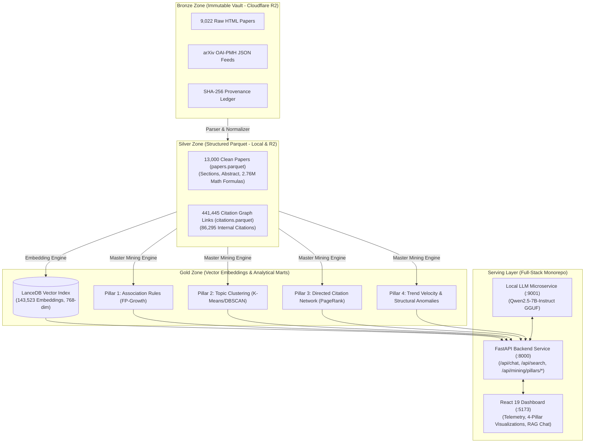

# Living Project Overview & Roadmap: UTH Scientific Data Mining & Advanced RAG

| Field | Value |
| :--- | :--- |
| **Document Type** | Project Roadmap & Phase Index |
| **Status** | Active Production |
| **Owner** | Research Lead / AI Agent |
| **Scope** | Global Repository Scope |
| **Created** | 2026-09-06T21:05:00+07:00 |
| **Last Updated** | 2026-10-05T13:22:00+07:00 |
| **References** | [`README.md`](../README.md), [`docs/PURPOSE.md`](PURPOSE.md), [`docs/mining/FOUR_DATA_MINING_PILLARS.md`](mining/FOUR_DATA_MINING_PILLARS.md), [`docs/mining/PIPELINE_EXECUTION_GUIDE.md`](mining/PIPELINE_EXECUTION_GUIDE.md), [`agents/rules/MD_CONVENTION.md`](agents/rules/MD_CONVENTION.md) |

---

- **Motivation/Background**: Building an end-to-end real-time academic literature mining and retrieval-augmented generation (RAG) system for the AI/DS domain at University of Transport and Communications (UTH).
- **Purpose**: Serve as the authoritative, living technical blueprint, architectural specification, and phase-by-phase roadmap for the repository.
- **Overview Pipeline**: Real-time extraction (arXiv, OpenAlex) -> Bronze immutable storage (Cloudflare R2) -> Silver clean Parquet & citations -> Gold LanceDB vector index & 4 Data Mining pillars -> Serving layer (FastAPI backend + React 19 interactive dashboard).
- **Detailed Plan**: §1 Project Summary & Academic Scope; §2 Medallion Lakehouse Architecture; §3 The 4 Data Mining & Modeling Pillars; §4 Engineering Phases & Roadmap (Phases 0 to 5); §5 Operational Progress & Definition of Done; §6 System Governance & Reproducibility.

---

## Table of Contents

- [1. Project Summary & Academic Scope](#1-project-summary--academic-scope)
- [2. Medallion Lakehouse Architecture](#2-medallion-lakehouse-architecture)
- [3. The 4 Data Mining & Modeling Pillars](#3-the-4-data-mining--modeling-pillars)
- [4. Engineering Phases & Roadmap (Phases 0 to 5)](#4-engineering-phases--roadmap-phases-0-to-5)
- [5. Operational Progress & Definition of Done](#5-operational-progress--definition-of-done)
- [6. System Governance & Reproducibility](#6-system-governance--reproducibility)

---

## 1. Project Summary & Academic Scope

- **Topic**: *Khai thác dữ liệu nghiên cứu khoa học thời gian thực hướng tới xây dựng hệ thống truy xuất tri thức nâng cao (RAG) cho miền AI/DS*.
- **Course**: Data Mining (Khai phá Dữ liệu) — University of Transport and Communications (UTH).
- **Instructor**: TS. Trần Thế Vinh.
- **Core Objective**: Provide an end-to-end data pipeline that ingests scientific papers from arXiv and OpenAlex, stores them in an immutable cloud lakehouse (Cloudflare R2), executes 4 core data mining and modeling algorithms, and serves both structured literature analytics and real-time generative RAG over 13,000 papers.

---

## 2. Medallion Lakehouse Architecture

The platform operates on an **ELT (Extract - Load - Transform)** architecture with decoupled compute and storage:

---

## 3. The 4 Data Mining & Modeling Pillars

The project implements 4 core data mining pillars conforming to academic data mining syllabi:

1. **Pillar 1 — Frequent Pattern & Association Rule Mining (FP-Growth)**:
   - Discovers non-trivial cross-domain relationships between arXiv categories and 25+ AI technical concepts across 11,404 transactions (87.7% corpus coverage).
   - Enforces symmetric rule deduplication ($A \to B$ vs $B \to A$) and minimum support pruning.
2. **Pillar 2 — Semantic Topic Clustering & Density Analysis**:
   - Clusters per-paper abstract vectors (768-dim, L2-normalized) with centered PCA 2D projections.
   - Evaluates MiniBatchKMeans (K=6: Silhouette = 0.0629, Davies-Bouldin = 3.98) and DBSCAN density separation (4 dense topic cores, 53.5% boundary noise).
3. **Pillar 3 — Scientific Network & Citation Graph Mining**:
   - Analyzes the directed citation network (86,295 edges across 8,892 papers) using directed PageRank ($\alpha=0.85$).
   - Discovers landmark papers (*Attention Is All You Need*, *ELMo*) and maps 92 modularity research communities.
4. **Pillar 4 — Trend Velocity & Structural Anomaly Detection**:
   - Isolation Forest with $\log(1+x)$ feature scaling identifies 30 structural outliers (monographs, math-dense papers).
   - Share-normalized category velocity ($\Delta \text{Share}$) categorizes momentum into `SURGING`, `STABLE`, and `DECLINING`.

> **Reference**: For mathematical proofs, formulas, and schemas, see [`docs/mining/FOUR_DATA_MINING_PILLARS.md`](mining/FOUR_DATA_MINING_PILLARS.md).

---

## 4. Engineering Phases & Roadmap (Phases 0 to 5)

| Phase | Milestone Name | Key Deliverables | Status |
| :--- | :--- | :--- | :--- |
| **Phase 0** | **Scope & Data Contracts** | Problem definition, evaluation criteria, Medallion schema design | **Completed** |
| **Phase 1** | **Ingestion Engine** | arXiv OAI-PMH crawler, HTML harvester, Cloudflare R2 Bronze vault | **Completed** |
| **Phase 2** | **Transformation Engine** | HTML parser, math formula extractor, Silver Parquet writer (13k papers) | **Completed** |
| **Phase 3** | **4 Data Mining Pillars** | FP-Growth, K-Means/DBSCAN, Citation PageRank, Share Trend Velocity | **Completed** |
| **Phase 4** | **Dense Vector Indexing** | Nomic embedder, LanceDB Gold table (143k chunks, 768-dim) | **Completed** |
| **Phase 5** | **Serving & RAG Layer** | FastAPI backend, local Qwen2.5-7B LLM client, React 19 dashboard | **Completed** |

---

## 5. Operational Progress & Definition of Done

The system has satisfied the core requirements:
- [x] **13,000 academic papers** transformed and queryable via DuckDB in `data/silver/year=2026/papers.parquet`.
- [x] **441,445 citation links** (86,295 internal) structured in `data/silver/citations.parquet`.
- [x] **143,523 vector embeddings** indexed in LanceDB (`scientific_papers_gold` / `academic_chunks`).
- [x] **Master Mining Engine** executes all 4 pillars and EDA in 227s, generating verified Gold JSON artifacts.
- [x] **FastAPI backend** passes 100% of integration tests (`pytest backend/tests/test_api.py -v`: 12/12 passing).
- [x] **Local Qwen2.5-7B LLM microservice** connected via OpenAI-compatible endpoints with SSE token streaming.

---

## 6. System Governance & Reproducibility

- **Pipeline Execution**: See [`docs/mining/PIPELINE_EXECUTION_GUIDE.md`](mining/PIPELINE_EXECUTION_GUIDE.md) for complete CLI commands.
- **Logging Standards**: All background execution adheres to [`agents/rules/LOGGING_CHECKPOINT_RULES.md`](../agents/rules/LOGGING_CHECKPOINT_RULES.md) (strictly plain text, timestamped, zero emojis).
- **Git Conventions**: Local commits follow conventional commits (e.g. `feat(mining): ...`) with zero remote pushes.
