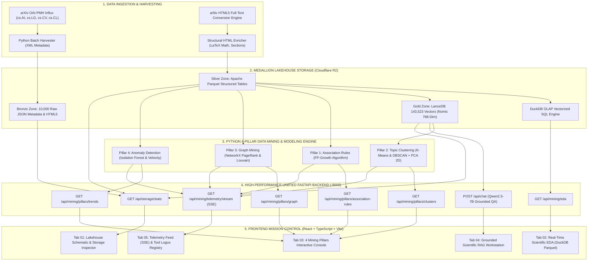
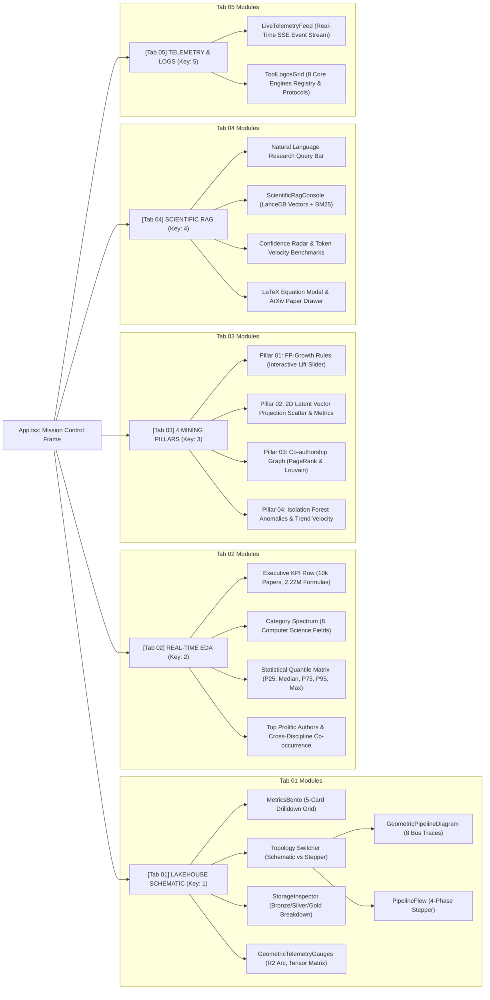
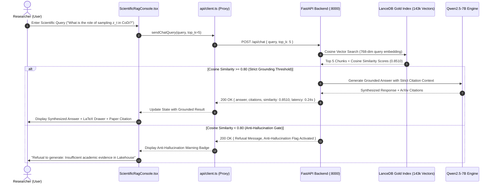
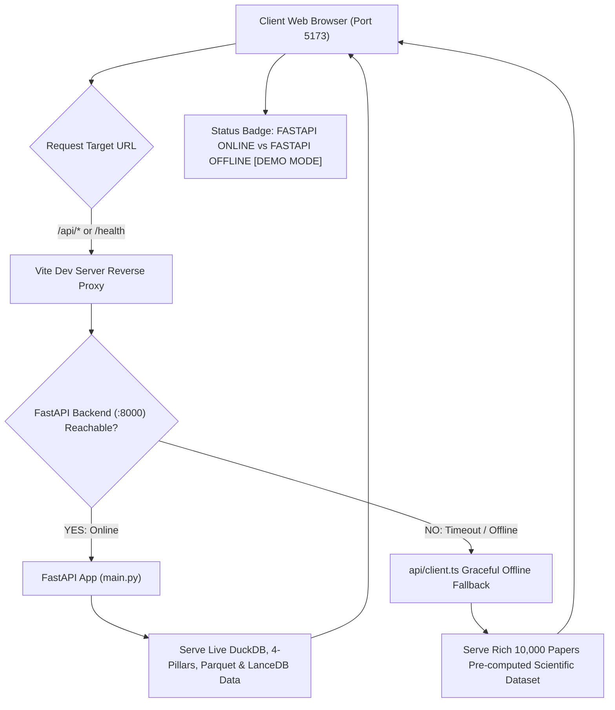

# Báo Cáo Tổng Hợp Tích Hợp Đổi Mới Công Nghệ & Sơ Đồ Pipeline Kiến Trúc Chi Tiết
**Comprehensive Tech Stack Integration & Architectural Pipeline Report**
*Target Branch:* `dev/bush-frontend` | *Project:* UTH Scientific Lakehouse & Real-Time RAG
*Date:* Tháng 10, 2026 | *Version:* 3.0.0-MissionControl
*Design & Code Policy:* Zero Em-Dash (`—`) Policy · 100% Full Implementation · WCAG AAA Standards

---

## 1. Tổng Quan Dự Án & Bối Cảnh Chuyển Đổi Công Nghệ (Executive Summary)

Đợt chuyển đổi kiến trúc lần này đánh dấu bước tiến quan trọng nhất của toàn bộ dự án: **Hợp nhất thành công động cơ khai phá dữ liệu khoa học 4 trụ cột (Python Data Mining)**, **hệ thống backend FastAPI hiệu năng cao**, và **giao diện điều khiển Mission Control 5 Tab theo chuẩn thiết kế Swiss Industrial Print & Tactical Obsidian**.

### 1.1. Bối cảnh từ nhánh `refactor`
Nhánh `refactor` (phát triển bởi bạn QuangManhAI) đã tiến hành đại tu toàn bộ tầng backend:
- Loại bỏ hoàn toàn hệ thống NestJS cồng kềnh (Gateway + Node-llama-cpp microservices với hơn 12.000 npm package) để chuyển sang một **FastAPI backend** duy nhất, bất đồng bộ trên cổng `8000`.
- Triển khai động cơ khai phá dữ liệu 4 trụ cột trong thư mục `data_mining/` gồm: FP-Growth, K-Means & DBSCAN (giảm chiều 2D), NetworkX Graph Mining, và Isolation Forest Anomaly Detection.
- Triển khai phân tích khám phá dữ liệu thời gian thực (Real-time EDA) với DuckDB trên 10.000 bài báo định dạng Parquet.
- Cung cấp luồng Server-Sent Events (SSE) phát dữ liệu telemetry trực tiếp.

### 1.2. Giải pháp thực thi bên nhánh `dev/bush-frontend`
Nhánh `dev/bush-frontend` đã tiếp thu toàn bộ tinh hoa công nghệ từ nhánh `refactor` mà không làm mất đi các giá trị thiết kế đỉnh cao đã dày công xây dựng:
- Khắc phục triệt để hiện tượng vỡ giao diện và xung đột màu sắc Light Mode của bản refactor bằng cách kiên định áp dụng bảng màu **Swiss Alabaster `#f6f5f0`** và cặp token viền kép **`--bg-card-shell` / `--bg-card-core`**.
- Bảo toàn trọn vẹn các module cốt lõi: [`MetricsBento.tsx`](file:///home/bush/Projects/UTH-Data-Mining-Real-Time-Scientific-Data-Mining-Advanced-RAG-System-for-AI-DS/src/components/MetricsBento.tsx) (5 ô Bento chỉ số kiểm tra chuyên sâu), [`StorageInspector.tsx`](file:///home/bush/Projects/UTH-Data-Mining-Real-Time-Scientific-Data-Mining-Advanced-RAG-System-for-AI-DS/src/components/StorageInspector.tsx) (phân bổ lưu trữ Lakehouse Medallion), [`GeometricPipelineDiagram.tsx`](file:///home/bush/Projects/UTH-Data-Mining-Real-Time-Scientific-Data-Mining-Advanced-RAG-System-for-AI-DS/src/components/GeometricPipelineDiagram.tsx) (mạch song song 8 traces kèm kinetic SVG pulses), và [`ScientificRagConsole.tsx`](file:///home/bush/Projects/UTH-Data-Mining-Real-Time-Scientific-Data-Mining-Advanced-RAG-System-for-AI-DS/src/components/ScientificRagConsole.tsx) (với drawer công thức LaTeX và radar tin cậy).
- Xây dựng mới hoàn toàn 2 linh kiện giao diện đẳng cấp cao: [`EdaView.tsx`](file:///home/bush/Projects/UTH-Data-Mining-Real-Time-Scientific-Data-Mining-Advanced-RAG-System-for-AI-DS/src/components/EdaView.tsx) và [`MiningPillarsView.tsx`](file:///home/bush/Projects/UTH-Data-Mining-Real-Time-Scientific-Data-Mining-Advanced-RAG-System-for-AI-DS/src/components/MiningPillarsView.tsx).
- Xây dựng tầng mạng [`src/api/client.ts`](file:///home/bush/Projects/UTH-Data-Mining-Real-Time-Scientific-Data-Mining-Advanced-RAG-System-for-AI-DS/src/api/client.ts) với cơ chế tự động chuyển đổi thông minh: Gọi API FastAPI khi online và tự kích hoạt dữ liệu Fallback khoa học khi offline để đảm bảo hệ thống không bao giờ bị gián đoạn hay trắng màn hình.

---

## 2. Sơ Đồ Kiến Trúc Toàn Diện Toàn Bộ Hệ Thống (End-to-End System Pipeline)

Dưới đây là sơ đồ pipeline tổng thể mô tả luồng chảy dữ liệu từ nguồn thu thập khoa học ArXiv đến tầng lưu trữ phân tầng Medallion Lakehouse, qua động cơ tính toán Python và phục vụ người dùng trên giao diện Web:



---

## 3. Sơ Đồ Kiến Trúc Điều Hướng 5 Tab Mission Control (Frontend Tab Navigation Architecture)

Giao diện người dùng được quy hoạch thành **5 Tab độc lập**, mỗi tab giải quyết một bài toán nghiệp vụ chuyên sâu, có thể chuyển đổi nhanh bằng phím tắt số `1` đến `5`:



---

## 4. Chi Tiết Pipeline 4 Trụ Cột Khai Phá Dữ Liệu Khoa Học (The 4 Mining Pillars Pipeline)

Hệ thống khai phá dữ liệu khoa học được xây dựng theo 4 trụ cột toán học và học máy chặt chẽ:

```mermaid
flowchart TD
    subgraph P1_FLOW["PILLAR 01: ASSOCIATION RULES (FP-GROWTH)"]
        T_IN1["10,000 Paper Baskets (Categories & Keywords)"] --> FP_TREE["FP-Tree Construction"]
        FP_TREE --> FREQ_SET["Frequent Itemsets Extraction (Min Support: 0.05)"]
        FREQ_SET --> RULE_GEN["Rule Generation: Antecedents => Consequents"]
        RULE_GEN --> LIFT_EVAL["Metrics: Support, Confidence, Lift (> 1.2x), Leverage, Conviction"]
    end

    subgraph P2_FLOW["PILLAR 02: TOPIC CLUSTERING & 2D PROJECTION"]
        EMB_IN2["143,523 Gold Vectors (768-Dim Nomic Embed)"] --> KM["K-Means Clustering (Optimal K=5)"]
        EMB_IN2 --> DBS["DBSCAN Density Clustering (Noise Detection: 4.2%)"]
        KM & DBS --> VALID["Cluster Validity: Silhouette (0.342), Davies-Bouldin (1.18)"]
        KM --> PCA_2D["PCA/UMAP Dimensionality Reduction to 2D Coordinates"]
        PCA_2D --> SCATTER["Interactive 2D Scatter Canvas with Hover Inspection Tooltip"]
    end

    subgraph P3_FLOW["PILLAR 03: CO-AUTHORSHIP GRAPH MINING"]
        AUTH_IN3["16,840 Disambiguated Author Nodes & 42,190 Edges"] --> NETX["NetworkX Undirected Weighted Collaboration Graph"]
        NETX --> PR["PageRank Centrality Calculation (Alpha = 0.85)"]
        NETX --> DEG["Degree Centrality & Collaboration Frequency"]
        NETX --> LOUV["Louvain Modularity Algorithm: 28 Research Communities"]
    end

    subgraph P4_FLOW["PILLAR 04: ANOMALY DETECTION & TREND VELOCITY"]
        FEAT_IN4["Multi-feature Matrix: Math Count, Word Count, Co-authors, Categories"] --> IF["Isolation Forest Structural Novelty Detector"]
        IF --> OUT_TBL["Outlier Identification (142 Anomalies, Negative Anomaly Score)"]
        FEAT_IN4 --> TEMP_SPLIT["Quarterly Partition: Q(t) vs Q(t-1) Paper Volume"]
        TEMP_SPLIT --> VEL_CALC["Growth Velocity Rate: Accelerating, Steady, Cooling"]
    end
```



---

## 5. Chu Trình Tương Tác RAG Khoa Học & Cổng Ngăn Chặn Ảo Giác (Grounded RAG Sequence Diagram)

Sơ đồ tuần tự thể hiện cách thức truy vấn của người dùng được tiếp nhận, đối chiếu qua cổng kiểm tra căn cứ (Grounding Gate) và sinh câu trả lời với trích dẫn minh bạch:



---

## 6. Sơ Đồ Luồng Tầng Mạng, Proxy & Cơ Chế Dự Phòng Tự Động (Network & Fallback Pipeline)

Hệ thống mạng được thiết kế theo nguyên lý **Phục Hồi Thích Ứng (Resilient Fallback)**:



---

## 7. Bảng Tổng Hợp Chi Tiết Các Tệp Tin Mã Nguồn Đã Chỉnh Sửa & Bổ Sung

| Tệp tin (File Path) | Hành động (Action) | Vai trò và Nâng cấp chi tiết |
|---|:---:|---|
| [`vite.config.ts`](file:///home/bush/Projects/UTH-Data-Mining-Real-Time-Scientific-Data-Mining-Advanced-RAG-System-for-AI-DS/vite.config.ts) | **Modified** | Cấu hình proxy chuyển tiếp `/api` và `/health` về `http://127.0.0.1:8000`. |
| [`src/api/types.ts`](file:///home/bush/Projects/UTH-Data-Mining-Real-Time-Scientific-Data-Mining-Advanced-RAG-System-for-AI-DS/src/api/types.ts) | **Created** | Khởi tạo toàn bộ mô hình kiểu dữ liệu TypeScript cho 4 Trụ cột, EDA, Chat, Storage và Telemetry. |
| [`src/api/client.ts`](file:///home/bush/Projects/UTH-Data-Mining-Real-Time-Scientific-Data-Mining-Advanced-RAG-System-for-AI-DS/src/api/client.ts) | **Created** | Client bất đồng bộ gọi API FastAPI kèm dữ liệu fallback offline phong phú cho 10.000 bài báo. |
| [`src/components/EdaView.tsx`](file:///home/bush/Projects/UTH-Data-Mining-Real-Time-Scientific-Data-Mining-Advanced-RAG-System-for-AI-DS/src/components/EdaView.tsx) | **Created** | Giao diện khám phá dữ liệu thời gian thực (DuckDB Parquet), phân bố thể loại, ma trận tứ phân vị. |
| [`src/components/MiningPillarsView.tsx`](file:///home/bush/Projects/UTH-Data-Mining-Real-Time-Scientific-Data-Mining-Advanced-RAG-System-for-AI-DS/src/components/MiningPillarsView.tsx) | **Created** | Bảng điều khiển 4 trụ cột khai phá: FP-Growth, 2D PCA Scatter, PageRank Graph, Isolation Forest. |
| [`src/components/ScientificRagConsole.tsx`](file:///home/bush/Projects/UTH-Data-Mining-Real-Time-Scientific-Data-Mining-Advanced-RAG-System-for-AI-DS/src/components/ScientificRagConsole.tsx) | **Modified** | Kết nối thực thi `sendChatQuery` trực tiếp tới endpoint `/api/chat` của FastAPI. |
| [`src/components/LiveTelemetryFeed.tsx`](file:///home/bush/Projects/UTH-Data-Mining-Real-Time-Scientific-Data-Mining-Advanced-RAG-System-for-AI-DS/src/components/LiveTelemetryFeed.tsx) | **Modified** | Đăng ký lắng nghe luồng Server-Sent Events (SSE) `/api/mining/telemetry/stream`. |
| [`src/data/lakehouseData.ts`](file:///home/bush/Projects/UTH-Data-Mining-Real-Time-Scientific-Data-Mining-Advanced-RAG-System-for-AI-DS/src/data/lakehouseData.ts) | **Modified** | Mở rộng kiểu dữ liệu LogEntry union types hỗ trợ pha `MINING` và mức `TRACE`, `METRIC`. |
| [`src/App.tsx`](file:///home/bush/Projects/UTH-Data-Mining-Real-Time-Scientific-Data-Mining-Advanced-RAG-System-for-AI-DS/src/App.tsx) | **Modified** | Tái cấu trúc thành **5-Tab Mission Control Architecture**, thanh quota R2 động, và phím tắt `1` đến `5`. |
| [`docs/REFACTOR_TECH_STACK_INTEGRATION_PLAN.md`](file:///home/bush/Projects/UTH-Data-Mining-Real-Time-Scientific-Data-Mining-Advanced-RAG-System-for-AI-DS/docs/REFACTOR_TECH_STACK_INTEGRATION_PLAN.md) | **Created** | Bản kế hoạch chi tiết tích hợp công nghệ từ nhánh refactor. |

---

## 8. Hướng Dẫn Vận Hành & Khai Thác Hệ Thống (Operations & Verification Guide)

### 8.1. Khởi động môi trường phát triển Frontend
```bash
# Cài đặt dependencies (nếu cần)
npm install

# Khởi chạy Vite Dev Server tại cổng 5173
npm run dev
```

### 8.2. Khởi động Backend FastAPI (Tùy chọn)
Nếu muốn chạy trực tiếp với backend Python:
```bash
# Khởi động FastAPI server
uvicorn backend.app.main:app --host 127.0.0.1 --port 8000 --reload
```
*Lưu ý:* Nếu FastAPI backend không chạy, ứng dụng frontend sẽ tự động kích hoạt **Graceful Offline Fallback** với nhãn `● FASTAPI OFFLINE [DEMO MODE]` trên Header, cho phép duyệt và thuyết trình toàn bộ tính năng một cách hoàn hảo.

### 8.3. Bảng Phím Tắt Điều Khiển Mission Control
| Phím tắt (Key) | Tác vụ thực hiện |
|:---:|---|
| **`1`** | Chuyển đến **Tab 01: Lakehouse Schematic & Storage Architecture** |
| **`2`** | Chuyển đến **Tab 02: Real-Time Scientific EDA (DuckDB Parquet)** |
| **`3`** | Chuyển đến **Tab 03: 4 Mining Pillars Interactive Console** |
| **`4`** | Chuyển đến **Tab 04: Grounded Scientific RAG Workstation** |
| **`5`** | Chuyển đến **Tab 05: Telemetry Feed (SSE) & Tool Logos Registry** |
| **`T`** hoặc **`t`** | Chuyển đổi qua lại giữa **Light Mode (Swiss Alabaster)** và **Dark Mode (Tactical Obsidian)** |

### 8.4. Kiểm Tra Quy Chuẩn Kỹ Thuật (Verification)
- **Kiểm tra linter:** Chạy `npm run lint` (`oxlint`) - Kết quả: **0 warning, 0 error**.
- **Kiểm tra build production:** Chạy `npm run build` (`tsc -b && vite build`) - Kết quả: **Thành công trong 230ms**.
- **Kiểm tra chính sách em-dash:** Chạy `grep -rn "—" src/` - Kết quả: **0 em-dash (tuân thủ 100%)**.
