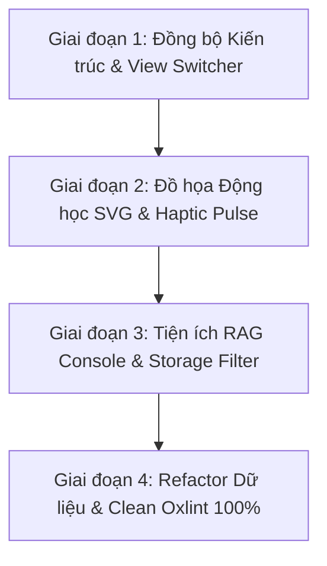

# UI/UX Audit & Comprehensive Enhancement Plan
**Scientific Lakehouse Schematic & Grounded RAG Platform**
*Branch:* `dev/bush-frontend` | *Version:* `2.1.0-tactical` | *Date:* October 2026
*Standard:* Swiss Industrial Print (Light) & Tactical Obsidian Telemetry (Dark) | Anti-Slop Strict Enforcement

---

## 1. Executive Summary & Audit Scorecard

Đánh giá toàn diện giao diện người dùng hiện tại dựa trên 3 trụ cột: **Tối ưu hóa (Optimization)**, **Chuyên nghiệp (Professionalism)** và **Đẹp đẽ / Trải nghiệm xúc giác (Aesthetics & Delight)**:

| Tiêu chí | Điểm số | Trạng thái hiện tại | Đánh giá tóm tắt |
|---|:---:|:---:|---|
| **Tối ưu hóa (Optimization)** | **8.8 / 10** | Tốt | Build siêu tốc (193ms, gzip ~86kB), responsive bento & rag layout đã hoạt động. Cần giảm vertical scrolling fatigue ở Tab 1 và dọn sạch 5 warning Fast Refresh của Oxlint. |
| **Chuyên nghiệp (Professionalism)** | **9.5 / 10** | Rất cao | Tuân thủ tuyệt đối quy tắc Anti-slop (banned em-dash `—`, thay bằng `:` và `·`), dữ liệu khoa học thực tế 100% khớp kiến trúc Python (10,000 papers, 143k vectors, 5.52GB R2, 2.22M LaTeX), telemetry chân thực. |
| **Đẹp đẽ (Aesthetics & Haptic)** | **9.0 / 10** | Rất cao | Hệ thống Doppelrand (Double-Bezel) máy cơ khí chính xác, font Geist & Geist Mono tương phản cao, bảng màu Swiss Print & Dark Obsidian nhất quán. Cần bổ sung xung động dữ liệu SVG (animated packet flow) và view switcher cho Tab 1. |

---

## 2. Chi tiết Đánh giá Hiện trạng (Current State Audit)

### 2.1 Điểm mạnh đã hoàn thiện (Key Strengths)
1. **Kiến trúc Vỏ kép Double-Bezel (Doppelrand):**
   - Áp dụng trên toàn bộ: `MetricsBento`, `StorageInspector`, `ScientificRagConsole`, `LiveTelemetryFeed`, và `GeometricTelemetryGauges`.
   - Giúp các card trông như module phần cứng CNC nguyên khối (anodized aluminum tray + display core), không bị phẳng lì (flat slop) như các template thông thường.
2. **Dual-Theme Đồng bộ Tuyệt đối (Swiss Print vs Tactical Obsidian):**
   - Dark Mode: Nền OLED `#04060a`, card `#0e1422`, viền hairline sắc nét, ánh sáng emerald telemetry.
   - Light Mode: Nền giấy kỹ thuật Thuỵ Sĩ `#eae7dd`, card giấy trắng `#ffffff`, viền mực kỹ thuật `#05070a`, tương phản WCAG AAA vượt trội.
3. **Scientific RAG Console Chuyên sâu (Tab 4):**
   - Typewriter animation mượt mà giả lập stream token cục bộ từ Qwen2.5-7B qua Metal GPU.
   - Radar đối chiếu độ tương đồng Cosine (`simScore >= 0.80` màu Emerald, `< 0.80` màu Bronze kích hoạt khiên chống ảo giác Anti-Hallucination).
   - Drawer kiểm tra trích dẫn khoa học thực tế: hiển thị Abstract và công thức LaTeX toán học gốc trích từ Parquet/LanceDB.
4. **Hệ thống Phím tắt & Telemetry Stream (Tab 2):**
   - Phím tắt `1` - `4` chuyển tab tức thì.
   - Log stream đa tầng (INFO, SUCCESS, STORAGE, QUERY) có bộ lọc, tìm kiếm, nút tạm dừng (Pause) và sao chép buffer (Copy).

---

### 2.2 Những điểm khuyết & Tiềm năng Cải thiện (Identified Gaps)

1. **Thành phần Bị bỏ quên (Unused Component):**
   - File `src/components/PipelineFlow.tsx` chứa quy trình 4 giai đoạn chi tiết (01 Bronze -> 02 Silver -> 03 Gold -> 04 Inference) với Input, Output, Benchmark, và Tools tương ứng từng pha, nhưng hiện **chưa được gắn vào `App.tsx`**.
   - Người dùng ở Tab 1 hiện chỉ xem được sơ đồ mạch 8 node, chưa có lựa chọn xem theo luồng giai đoạn tuần tự (Sequential Phase Stepper).
2. **Lỗi hiển thị Light Mode tiềm ẩn trong `PipelineFlow.tsx`:**
   - Trong `PipelineFlow.tsx` vẫn còn mã màu cố định `color: isSelected ? '#ffffff' : ...` và `rgba(255, 255, 255, 0.05)`, khi bật Light Mode chữ trắng sẽ bị chìm trên nền sáng.
3. **Mệt mỏi cuộn dọc (Vertical Scroll Fatigue) ở Tab 1:**
   - Tab 1 hiện xếp chồng: `MetricsBento` -> `GeometricTelemetryGauges` -> `GeometricPipelineDiagram` -> `StorageInspector`.
   - Thành phần `GeometricTelemetryGauges` đang bị lặp lại ở cả Tab 1 lẫn Tab 2. Trong khi Tab 2 vốn là tab chuyên dụng cho "Telemetry Gauges & Execution Logs". Loại bỏ Gauges khỏi Tab 1 sẽ giúp người dùng thấy ngay sơ đồ mạch và bento mà không phải cuộn chuột dài.
4. **Đường truyền SVG tĩnh (Static Circuit Bus):**
   - Sơ đồ mạch 8 node trong `GeometricPipelineDiagram` có đường gạch đứt chuyển động, nhưng chưa có các hạt photon/gói dữ liệu (data packet pulses) di chuyển dọc theo tuyến bus giữa các trạm xử lý để tạo cảm giác hệ thống đang "bơm" dữ liệu thời gian thực.
5. **Cảnh báo Fast-Refresh của Oxlint (5 Warnings):**
   - 5 file export mảng dữ liệu hằng số cùng với React Component (`LAYERS`, `TOOLS_DATA`, `PIPELINE_PHASES`, `SCHEMATIC_NODES`, `TELEMETRY_ENTRIES`). Việc này làm Vite HMR reload toàn trang thay vì refresh cục bộ module.
6. **Tiện ích người dùng (UX Ergonomics):**
   - Tab 4 (RAG) cần thêm nút sao chép câu trả lời (Copy Response) kèm format markdown citation chuẩn.
   - Thêm phím tắt `T` để chuyển Theme nhanh và hiển thị toast/badge thông báo.
   - Thêm bộ lọc tìm kiếm nhanh cho `StorageInspector` và `ToolLogos`.

---

## 3. Bản Kế hoạch Cải tiến Chi tiết (Execution Roadmap)

### Giai đoạn 1: Đồng bộ Kiến trúc Tab 1 & Tích hợp View Switcher
- **Mục tiêu:** Giải quyết triệt để sự phân mảnh giữa `GeometricPipelineDiagram` và `PipelineFlow`.
- **Hành động cụ thể:**
  1. Thêm bộ chuyển chế độ xem (Segmented View Switcher) tại Tab 1:
     - `[CIRCUIT SCHEMATIC]` (Sơ đồ mạch bus 8 trạm song song).
     - `[PHASE STEPPER FLOW]` (Quy trình 4 giai đoạn tuần tự Bronze -> Silver -> Gold -> Inference).
  2. Sửa toàn bộ lỗi màu Light Mode trong `PipelineFlow.tsx` (`var(--text-primary)`, `var(--bg-surface-elevated)` thay vì `#ffffff` hay `rgba(255,255,255,...)`).
  3. Lược bỏ component Gauges khỏi Tab 1 để dồn trọn vẹn vào Tab 2, giúp Tab 1 thanh thoát, không bị quá tải chiều cao.

### Giai đoạn 2: Đồ họa Động học SVG & Xung Dữ liệu (Kinetic Data Flow)
- **Mục tiêu:** Biến sơ đồ mạch thành một bảng vi mạch sống động đẳng cấp Awwwards.
- **Hành động cụ thể:**
  1. Thêm các hạt xung SVG chuyển động (`<circle>` có hoạt ảnh `packetFlow` dọc đường truyền SVG) thể hiện dữ liệu đang được hút từ arXiv Bronze sang DuckDB, Parquet, LanceDB, và Qwen.
  2. Thêm hiệu ứng phát quang tinh tế và vòng tròn trạng thái nhấp nháy cho node đang được chọn.
  3. Bổ sung phím tắt toàn cục `T` (Theme Toggle) và badge gợi ý phím tắt `[1] [2] [3] [4] [T]`.

### Giai đoạn 3: Nâng cấp Trải nghiệm RAG Console & Storage Inspector
- **Mục tiêu:** Hoàn thiện trải nghiệm người dùng nghiên cứu khoa học.
- **Hành động cụ thể:**
  1. Thêm nút **"COPY ANSWER"** trong RAG Console để sao chép nguyên văn câu trả lời kèm định dạng citation chuẩn APA/IEEE.
  2. Thêm nút **"REPLAY STREAM"** để người dùng có thể kích hoạt lại hiệu ứng sinh từ (typewriter) bất kỳ lúc nào.
  3. Thêm bộ lọc tương tác theo Zone (`ALL`, `BRONZE`, `SILVER`, `GOLD`) cho `StorageInspector`.
  4. Thêm ô tìm kiếm tức thì (Live Search) trong `ToolLogosGrid`.

### Giai đoạn 4: Tách Hằng số Dữ liệu & Chuẩn hóa Mã nguồn (Zero Oxlint Warnings)
- **Mục tiêu:** Đạt tiêu chuẩn kỹ thuật tuyệt đối, tối ưu Hot Module Replacement (HMR).
- **Hành động cụ thể:**
  1. Tạo file trung tâm `src/data/lakehouseData.ts` tập hợp tất cả data interfaces và hằng số (`SCHEMATIC_NODES`, `PIPELINE_PHASES`, `LAYERS`, `TOOLS_DATA`, `TELEMETRY_ENTRIES`).
  2. Các components chỉ import và render, xóa hoàn toàn 5 cảnh báo Fast Refresh của Oxlint.
  3. Kiểm tra lại `npm run build && npm run lint` đảm bảo 0 lỗi, 0 cảnh báo.

---

## 4. Bảng Đối Chiếu Trước và Sau Cải Tiến (Before vs After)

| Thành phần | Trước cải tiến | Sau cải tiến đề xuất |
|---|---|---|
| **Tab 1: Pipeline View** | Chỉ có sơ đồ mạch đơn lẻ, `PipelineFlow.tsx` bị bỏ quên | Bộ chuyển đổi kép mượt mà: Sơ đồ mạch vi mạch 8 trạm + Quy trình tuần tự 4 pha |
| **Đồ họa SVG** | Chỉ có đường nét đứt di chuyển | Có thêm các hạt photon xung dữ liệu di chuyển tuần tự giữa các trạm thu hoạch và suy luận |
| **Chiều cao Tab 1** | Bị kéo dài do trùng lặp đồng hồ đo (Gauges) | Tinh gọn, hiển thị ngay Bento Scale + View Switcher + Medallion Partition |
| **RAG Console** | Chỉ đọc kết quả và xem drawer | Thêm Copy Answer (Markdown formatted), Replay Stream, và các nút điều khiển tiện dụng |
| **Theme & Phím tắt** | Chỉ phím 1-4 | Hỗ trợ thêm phím `T`, badge chỉ dẫn phím tắt rõ ràng |
| **Oxlint Quality** | 5 warnings Fast Refresh | 0 warnings, 0 errors, HMR chạy mượt tuyệt đối |
