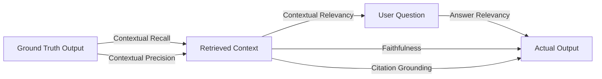

# DeepEval Benchmarking Guide for UTH Scientific RAG

This guide details how to execute, configure, and interpret automated evaluations of the UTH Scientific RAG system using [DeepEval](https://github.com/confident-ai/deepeval).

---

## 1. Quick Start

### Prerequisites
Make sure dependencies are installed and the local LLM microservice or Ollama is running:

```bash
# Check local LLM endpoint on port 9001 (or Ollama on 11434)
curl http://localhost:9001/v1/models
```

### Run Benchmark via Pytest / DeepEval CLI
To run automated test-driven evaluations with pass/fail gates:

```bash
# Using pytest
.\.venv\Scripts\pytest.exe benchmarks/test_rag_pipeline.py -v

# Using DeepEval CLI (with rich console visualizer)
.\.venv\Scripts\deepeval.exe test run benchmarks/test_rag_pipeline.py
```

### Run Benchmark via Standalone CLI Runner
To evaluate multiple test cases and generate timestamped Markdown & JSON reports:

```bash
# Quick dry run on 2 goldens using local Qwen2.5-7B judge
.\.venv\Scripts\python.exe -m benchmarks.run_benchmark --limit 2 --judge local

# Full evaluation with top-k=5
.\.venv\Scripts\python.exe -m benchmarks.run_benchmark --top-k 5 --judge local

# Hyperparameter sweep comparing top-k in (3, 5, 8)
.\.venv\Scripts\python.exe -m benchmarks.run_benchmark --sweep --judge local
```

All evaluation reports and traces are automatically saved to `logs/benchmarks/`:
- `logs/benchmarks/benchmark_report_k5_local_<timestamp>.md`
- `logs/benchmarks/benchmark_trace_k5_local_<timestamp>.json`

---

## 2. LLM-as-a-Judge Configuration

The framework supports switching between local evaluation and external providers via environment variables or CLI flags (`--judge <mode>`):

| Judge Mode | Description | Configuration Required | Cost |
| :--- | :--- | :--- | :--- |
| **`local`** *(Default)* | Uses local Qwen2.5-7B on `http://localhost:9001/v1` | None (reads `DEEPEVAL_LOCAL_URL`) | **Free (Offline)** |
| **`deepseek`** | Uses DeepSeek API (`deepseek-chat` / `deepseek-reasoner`) | `DEEPSEEK_API_KEY=sk-...` | Ultra-low ($0.14/1M tokens) |
| **`groq`** | High-speed inference using LLaMA-3.3-70B | `GROQ_API_KEY=gsk_...` | Free tier / Pay-per-token |
| **`openai`** | OpenAI `gpt-4o-mini` | `OPENAI_API_KEY=sk-...` | Standard OpenAI API pricing |

### Switching to DeepSeek Judge
Add your key to `.env` or pass it in your session:
```bash
$env:DEEPEVAL_JUDGE_MODEL = "deepseek"
$env:DEEPSEEK_API_KEY = "sk-your-deepseek-api-key"

.\.venv\Scripts\python.exe -m benchmarks.run_benchmark --top-k 5 --judge deepseek
```

---

## 3. Evaluation Metrics Explained

Our benchmark suite evaluates RAG quality across 6 key metrics:



1. **Faithfulness (`FaithfulnessMetric`, threshold: $\ge 0.70$)**:
   - Measures whether claims made in the generated answer are strictly grounded in and faithful to the retrieved literature excerpts.
   - Catches factual hallucinations.

2. **Answer Relevancy (`AnswerRelevancyMetric`, threshold: $\ge 0.75$)**:
   - Assesses whether the generated response directly answers the user's prompt without tangents or fluff.

3. **Contextual Precision (`ContextualPrecisionMetric`, threshold: $\ge 0.70$)**:
   - Determines whether the most relevant paper chunks in the LanceDB retrieval results are ranked higher than irrelevant ones.

4. **Contextual Recall (`ContextualRecallMetric`, threshold: $\ge 0.70$)**:
   - Evaluates whether all key factual points from the reference answer (`expected_output`) were retrieved in the context.

5. **Contextual Relevancy (`ContextualRelevancyMetric`, threshold: $\ge 0.60$)**:
   - Computes the signal-to-noise ratio in retrieved context, penalizing irrelevant chunks that dilute LLM attention.

6. **Academic Citation Grounding (`GEval`, threshold: $\ge 0.70$)**:
   - Custom metric assessing whether paper references (`[Paper: <id>]`) accurately correspond to the claims and excerpts from the retrieval context.

---

## 4. Expanding the Benchmark Dataset

Benchmark test cases live in `benchmarks/datasets/rag_goldens.json`. To add a new question, append an entry following this format:

```json
{
  "id": "gold-011",
  "category": "cs.CL",
  "query": "How does speculative decoding accelerate autoregressive generation?",
  "expected_output": "Speculative decoding uses a smaller, faster draft model to propose multiple candidate tokens in parallel, which are then verified simultaneously by the larger target model in a single forward pass.",
  "expected_context_keywords": ["speculative decoding", "draft model", "target model", "verification", "latency"]
}
```
