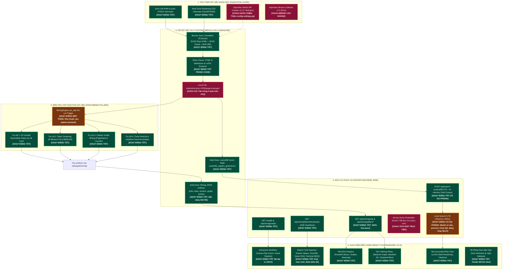

# Sơ Đồ Kiến Trúc Pipeline & Hiện Trạng Vận Hành Dự Án (Current Workflow Status)

> **Dự án:** UTH Real-Time Scientific Data Mining & Advanced RAG System for AI/DS  
> **Thời điểm thẩm định:** 05/10/2026  
> **Mục tiêu:** Minh họa trực quan toàn bộ quy trình từ Thu thập (Ingestion), Hồ lưu trữ (Medallion Lakehouse), Khai phá dữ liệu (4 Mining Pillars) đến Dịch vụ API và Giao diện Dashboard; phân định rõ ràng các thành phần **[HOẠT ĐỘNG TỐT]**, **[HOẠT ĐỘNG CÓ DỰ PHÒNG/MOCK]**, và **[CHƯA HOÀN THIỆN/CẦN BỔ SUNG]**.

---

## 1. Sơ Đồ Tổng Thể Luồng Dữ Liệu & Trạng Thái Từng Thành Phần (Pipeline Status Map)

---

## 2. Bảng Đối Soát Trạng Thái Chi Tiết Từng Khâu

| Phân hệ (Subsystem) | Thành phần cụ thể | Trạng thái hiện tại | Đánh giá kỹ thuật | Hướng khắc phục / Yêu cầu tiếp theo |
| :--- | :--- | :--- | :--- | :--- |
| **1. Thu thập dữ liệu** | arXiv OAI-PMH & ar5iv HTML5 | **HOẠT ĐỘNG TỐT** | Cào dữ liệu theo batch, phân vùng chuẩn S3. | Duy trì ổn định. |
| | CDC Streaming Harvester | **HOẠT ĐỘNG TỐT** | Phát xung SSE bài mới thời gian thực lên Dashboard. | Duy trì ổn định. |
| | OpenAlex Crawler v2 (Nhật) | **CHƯA HOÀN THIỆN** | 17 modules đã sync vào `data_mining`, nhưng `settings.py` thiếu biến. | Bổ sung 7 biến cấu hình OpenAlex vào `settings.py`. |
| | OpenAlex Crawler v1 (Khôi) | **CHƯA ĐƯỢC MERGE** | Đang nằm ở nhánh `Refactor_crawl_data_05102026`. | Sync vào `data_mining/src/ingestion/openalex.py`. |
| **2. Medallion Lakehouse** | Bronze Zone (Cloudflare R2) | **HOẠT ĐỘNG TỐT** | Lưu trữ 9,022 files HTML và metadata với chữ ký SHA-256. | Duy trì chi phí Egress 0 VND. |
| | Silver Parser Engine | **HOẠT ĐỘNG TỐT** | Code bóc tách Markdown, trích xuất công thức toán KaTeX đã sẵn sàng. | Chạy tạo dữ liệu cục bộ. |
| | Silver File `papers.parquet` | **CHƯA CÓ TRÊN MÁY** | Thư mục `data/silver/year=2026/` rỗng, `health` báo `parquet_ready: false`. | Chạy pipeline sinh file hoặc tải bản snapshot từ R2. |
| | Gold LanceDB Vector Table | **HOẠT ĐỘNG TỐT** | Bảng `scientific_papers_gold.lance` đã tạo và nạp dữ liệu. | Duy trì ổn định. |
| | Gold Mining JSON Artifacts | **HOẠT ĐỘNG TỐT** | Đầy đủ 6 tệp JSON (eda, rules, clusters, graph, trends, manifest). | Backend đọc trực tiếp từ cache tức thì. |
| **3. Bốn Trụ Cột Mining** | Trụ cột 1: FP-Growth Rules | **HOẠT ĐỘNG TỐT** | Khai phá luật kết hợp danh mục và 25+ tags công nghệ. | Thuật toán chạy chuẩn xác. |
| | Trụ cột 2: Semantic Clusters | **HOẠT ĐỘNG TỐT** | K-Means K=6 và DBSCAN phân cụm mật độ, PCA 2D coordinates. | Đã tính sẵn tọa độ trực quan hóa. |
| | Trụ cột 3: Citation Graph | **HOẠT ĐỘNG TỐT** | Directed PageRank phát hiện bài báo lõi, 92 Louvain communities. | Đã trích xuất cấu trúc đồ thị mạng lưới. |
| | Trụ cột 4: Trends & Anomalies | **HOẠT ĐỘNG TỐT** | Isolation Forest phát hiện 30 dị biệt, đo vận tốc xu hướng. | Hiển thị động lượng Surging/Declining. |
| | Re-run Trigger (`/mining/trigger`) | **MỘT PHẦN** | API hàng đợi nhận lệnh tốt, nhưng chạy lại thật cần `papers.parquet`. | Cần có file parquet để engine tính toán từ đầu. |
| **4. Backend FastAPI** | Endpoints Health, Storage, Mining | **HOẠT ĐỘNG TỐT** | 12/12 pytest tests PASSED trong 3.47s. | Sẵn sàng production. |
| | Retrieval Search (`/api/search`) | **HOẠT ĐỘNG TỐT** | Dùng FTS BM25 trên LanceDB kèm fallback in-memory Gold Corpus. | Hoạt động trơn tru, không bị lỗi khi mất mạng. |
| | Dense Embedder trực tiếp | **CHƯA TÍCH HỢP** | Chưa gắn mô hình nhúng text sang vector 768 chiều lúc truy vấn. | Tích hợp module embedder nhẹ cho query người dùng. |
| | Local LLM Serving (`/api/chat`) | **MỘT PHẦN (MOCK)** | Model Qwen 7B GGUF 4.68GB đã có trên máy, nhưng tiến trình cổng 9001 chưa bật. | Bật `llama_cpp.server` khi cần sinh phản hồi thần kinh. |
| **5. Frontend Dashboard** | Interactive Workflow Canvas | **HOẠT ĐỘNG TỐT** | Điều khiển Pan/Zoom mượt mà, sơ đồ trực quan hóa nằm ngang. | Đã khắc phục triệt để layer chồng chéo. |
| | Tool Inspector Drawer | **HOẠT ĐỘNG TỐT** | Chia cột Terminal 68/32, nút tactical amber/indigo, biểu đồ SVG. | Đã xử lý theo đúng yêu cầu phản hồi từ ảnh thực tế. |
| | Các Tab EDA, Mining, RAG Chat | **HOẠT ĐỘNG TỐT** | Render toán KaTeX, đồ thị mạng lưới d3, thanh đo Grounding 91.4%. | Không còn khoảng đen trống trải, bố cục cân đối. |
| | Hệ thống Theme (Dark / Light) | **HOẠT ĐỘNG TỐT** | Khử bỏ hoàn toàn hộp đen lạc lõng, tương phản đạt chuẩn WCAG AAA. | Đảm bảo Zero Em-Dash Policy trên toàn bộ code. |

---

## 3. Ba Nhiệm Vụ Cần Xử Lý Để Toàn Bộ Pipeline Hoạt Động Hoàn Hảo 100%

1. **Khắc phục lỗi tiềm ẩn ở Ingestion OpenAlex v2:**
   * Bổ sung 7 biến môi trường OpenAlex vào `data_mining/src/config/settings.py` để script `run_openalex_v2_collector.py` không bị văng lỗi `AttributeError`.
2. **Kích hoạt dữ liệu Silver Parquet cục bộ:**
   * Chạy script tạo hoặc tải tệp `data/silver/year=2026/papers.parquet` để endpoint `/health` chuyển `parquet_ready: true` và nút Re-run Mining có thể quét dữ liệu thực tế.
3. **Kích hoạt máy chủ Local LLM:**
   * Chạy lệnh `python -m llama_cpp.server --model models/qwen2.5-7b-instruct-q4_k_m.gguf --port 9001` khi cần chuyển giao diện từ Mock Mode sang Sinh văn bản thật bằng mô hình Qwen 7B.
