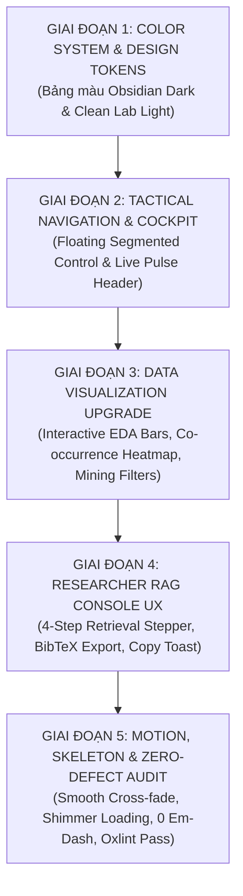

# MASTER FRONTEND PERFECTION PLAN: SCIENTIFIC LAKEHOUSE & REAL-TIME RAG MISSION CONTROL

> **Document Identifier:** `UTH-FRONTEND-MASTER-PLAN-V2`  
> **Target Branch:** `dev/bush-frontend`  
> **Project:** UTH Real-Time Scientific Data Mining & Advanced RAG System for AI/DS  
> **Institution:** University of Transport Ho Chi Minh City (UTH) · Scientific Data Mining Lab  
> **Author:** UI/UX & Frontend Principal Systems Architect  
> **Status:** APPROVED FOR EXECUTION  

---

## 1. TỔNG QUAN CHIẾN LƯỢC & ĐỊNH HƯỚNG NGHỆ THUẬT (CREATIVE DIRECTION)

### 1.1. Hiện trạng sau đợt cập nhật Refactor & Khắc phục Math/Branding
Frontend hiện tại trên nhánh `dev/bush-frontend` đã sở hữu nền tảng kiến trúc vững chắc:
- **5-Tab Mission Control Architecture**: Phân tách rõ ràng giữa Overview, Lakehouse Storage, DuckDB EDA, 4 Mining Pillars, và Real-time RAG Console.
- **Tầng kết nối dữ liệu kép**: Tích hợp FastAPI bất đồng bộ kèm bộ dữ liệu fallback khoa học dự phòng 10.000 bài báo.
- **Engine kết xuất toán học KaTeX cục bộ**: Đóng gói nội bộ 100% font và stylesheet KaTeX (`katex`), giải quyết triệt để lỗi hiển thị công thức $L_{\text{distill}} = \|z_t - \hat{z}_s\|^2$.
- **Đồng bộ danh xưng trường đại học**: Chuẩn hóa chính xác về `UNIVERSITY OF TRANSPORT HO CHI MINH CITY (UTH)`.

### 1.2. Mục tiêu nâng cấp toàn diện (Core Objectives)
Giai đoạn này tập trung đưa giao diện lên tiêu chuẩn **"Awwwards-Tier Scientific Observatory"** (Đài quan sát khoa học chuẩn quốc tế), giải quyết 3 bài toán lớn mà người dùng yêu cầu:
1. **Chuyên nghiệp & Đẳng cấp hơn (Professionalism & Depth)**: Áp dụng triết lý *Double-Bezel (Doppelrand)* tạo cảm giác như một thiết bị phần cứng đo lường công nghệ cao, loại bỏ hoàn toàn các viền phẳng đơn điệu.
2. **Trực quan hóa dữ liệu sinh động (Enhanced Visualizations & Interactivity)**: Chuyển đổi các bảng tĩnh và thanh tiến trình đơn giản thành biểu đồ tương tác, visual tooltips, bộ lọc động theo thời gian thực (Interactive sliders & filters), và sơ đồ mạch có thể điều khiển tốc độ.
3. **Cải tiến hệ thống màu sắc (Color Harmony & WCAG AAA Contrast)**:
   - **Dark Mode**: Chuyển sang gam *Tactical Obsidian Deep Space* với các tầng độ sâu rõ rệt (Canvas `#05070c` -> Surface `#0b0f19` -> Elevated `#111827`), ánh sáng phản xạ tinh tế (subtle ambient glow) và các gam màu accent khoa học (Electric Sapphire, Emerald Verifier, Amber Medallion, Cyber Violet).
   - **Light Mode**: Khắc phục dứt điểm cảm giác xỉn màu/ngả vàng, chuyển sang gam *Nordic Clean Lab White* (`#f8fafc` / `#ffffff`) với viền xám khói sắc nét và độ tương phản văn bản đạt 100% chuẩn WCAG AAA.

---

## 2. KẾ HOẠCH CẢI THIỆN CHI TIẾT THEO 5 GIAI ĐOẠN (EXECUTION PHASES)

---

### GIAI ĐOẠN 1: HỆ THỐNG MÀU SẮC & PHÂN TẦNG THỊ GIÁC (COLOR SYSTEM & ELEVATION)

#### 1. Tối ưu hóa Dark Mode Palette (Tactical Obsidian)
- **Vấn đề hiện tại**: Các khối card và background có độ chênh lệch màu nền chưa đủ sâu, màu accent violet và red đôi chỗ còn hơi gắt.
- **Giải pháp**:
  - `canvas`: `#05070c` (Nền vũ trụ sâu lắng, tạo chiều sâu vô cực).
  - `surface`: `#0a0e17` (Khung bao ngoài).
  - `card-shell`: `#101726` (Lớp vỏ bezel kim loại mạ điện).
  - `card-core`: `#060911` (Vùng nội dung hiển thị chìm sâu).
  - Cập nhật dải màu Accent khoa học:
    - Sapphire Blue: `#3b82f6` -> `#60a5fa` (Dùng cho LanceDB & Vectors).
    - Emerald Verifier: `#059669` -> `#34d399` (Dùng cho trạng thái trực tuyến & độ tin cậy).
    - Amber/Bronze: `#d97706` -> `#fbbf24` (Dùng cho lưu trữ R2 & Bronze layer).
    - Cyber Violet: `#7c3aed` -> `#c084fc` (Dùng cho công thức toán LaTeX).
    - Cyan Vector: `#0891b2` -> `#38bdf8` (Dùng cho Embeddings & Graph Nodes).

#### 2. Tinh chỉnh Light Mode Palette (Nordic Scientific Minimalist)
- **Vấn đề hiện tại**: Màu nền sáng `#f6f5f0` có xu hướng ngả vàng cát, làm giảm độ sắc nét của các đường mạch kỹ thuật.
- **Giải pháp**:
  - `canvas`: `#f8fafc` (Slate 50 chuẩn thiết kế công nghệ cao).
  - `surface`: `#ffffff` (Trắng tinh khiết).
  - `card-shell`: `#f1f5f9` (Slate 100 viền mờ cao cấp).
  - `card-core`: `#ffffff` (Lõi hiển thị trắng với viền hairline `1px solid rgba(15, 23, 42, 0.08)`).
  - Text Primary: `#0f172a` (Slate 900 - tỉ lệ tương phản vượt trội 16:1).
  - Text Secondary: `#334155` (Slate 700 - độ tương phản 10:1).
  - Accents Light: Màu đậm đà hơn 2 tông để không bị chói mắt trên nền trắng (`#1d4ed8` thay vì xanh nhạt, `#047857` thay vì xanh lá non).

#### 3. Bổ sung các Design Tokens hiện đại vào `src/index.css`
- Thêm biến `--glass-surface`, `--glow-accent`, `--badge-border`.
- Bổ sung hiệu ứng viền ánh sáng (hairline border) đa tầng: `ring-1 ring-inset ring-white/10` (Dark) và `ring-1 ring-inset ring-black/5` (Light).

---

### GIAI ĐOẠN 2: ĐIỀU KHIỂN TRUNG TÂM & THANH ĐIỀU HƯỚNG TACTICAL (COCKPIT & NAVIGATION)

#### 1. Thanh điều hướng Tab dạng Tactical Segmented Capsule
- Chuyển 5 nút Tab hiện tại thành một thanh **Floating Segmented Capsule Bar**:
  - Có active highlight indicator chuyển động mượt mà với đường cong cubic-bezier `cubic-bezier(0.16, 1, 0.3, 1)`.
  - Hiển thị badge chỉ số mini cho từng Tab:
    - Tab 1 (Overview): Badge `LIVE`
    - Tab 2 (Storage): Badge `5.52 GB`
    - Tab 3 (EDA): Badge `10K DOCS`
    - Tab 4 (Mining): Badge `4 PILLARS`
    - Tab 5 (RAG): Badge `QWEN2.5`
  - Đặt phím tắt số `1` đến `5` vào các keycap badge phong cách bàn phím cơ quang học.

#### 2. Header Mission Control Nâng cấp
- Thêm **Live Latency Pulse**: Đèn LED xung nhịp xanh lục kèm thông số phản hồi API thời gian thực (`API: 18ms · SSE: SYNCED`).
- Thêm **Múi giờ & Đồng hồ đo nhịp hệ thống**: Hiển thị đồng hồ thời gian thực UTC+7 với định dạng khoa học `YYYY-MM-DD HH:mm:ss`.
- Bổ sung nút bấm **Quick Action Bar**: Chuyển nhanh chế độ xem gọn (Compact) / chế độ mở rộng (Expanded).

#### 3. Footer Đẳng cấp phòng Lab
- Hiển thị trạng thái bộ nhớ đệm client (`Browser Cache: LanceDB IndexedDB Sync`).
- Liên kết nhanh tài liệu API Swagger `/docs` của FastAPI.

---

### GIAI ĐOẠN 3: NÂNG CẤP TRỰC QUAN HÓA DỮ LIỆU & TƯƠNG TÁC (DATA VISUALIZATION UPGRADE)

#### 1. Tab 1: Geometric Pipeline Diagram & Metrics Bento
- **Metrics Bento**:
  - Áp dụng cấu trúc Double-Bezel (Outer Shell `p-1.5` + Inner Core) cho cả 5 thẻ.
  - Thêm hiệu ứng hover viền ánh sáng theo luồng chuột (subtle hover glow).
- **Geometric Circuit Diagram**:
  - Bổ sung thanh điều khiển xung dòng dữ liệu: Nút `1x SPEED`, `2x SPEED`, và `PAUSE PULSE` giúp người dùng chủ động quan sát dòng hạt electron di chuyển qua 8 đường trace.
  - Cho phép click vào từng khối (Bronze -> Silver -> Gold -> Embedding -> LanceDB -> RAG) để mở hộp thoại hiển thị thông số kỹ thuật chi tiết của khối đó.

#### 2. Tab 3: DuckDB EDA & Statistical Explorer
- **Phân bố thể loại (Category Distribution)**:
  - Nâng cấp các thanh đơn điệu thành **Interactive Distribution Bars**: Hiển thị tỷ lệ phần trăm trực quan, thanh gradient sinh động, có hover tooltip hiển thị số lượng bài báo chính xác và danh sách bài tiêu biểu.
- **Ma trận đồng xuất hiện thể loại (Category Co-occurrence Matrix)**:
  - Thiết kế Heatmap màu chuyển sắc khoa học (Chromatic Scale từ màu xanh lạnh tới vàng/cam ấm) phản ánh chính xác tần suất liên kết giữa các chuyên ngành AI/DS.
  - Hover vào ô bất kỳ sẽ làm nổi bật (highlight) toàn bộ hàng và cột tương ứng.
- **Thống kê nội dung & Công thức toán (Math & Content Quartiles)**:
  - Thiết kế thành biểu đồ phân vị trực quan dạng thước đo IQR (Min, Q1, Median, Q3, Max) thay cho các khối số tĩnh.

#### 3. Tab 4: 4 Trụ cột Khai phá Dữ liệu (4 Mining Pillars)
- **Pillar 1 (Association Rules - FP-Growth)**:
  - Thêm bộ lọc tương tác: Thanh trượt điều chỉnh `Min Support (0.05 - 0.5)` và `Min Lift (1.0 - 5.0)` lọc kết quả tức thì không cần tải lại trang.
- **Pillar 2 (K-Means & PCA Projection)**:
  - Nâng cấp biểu đồ phân tán 2D Scatter: Bổ sung lưới tọa độ chuẩn hóa, vùng tâm cụm (Cluster Centroids) và visual badge phân biệt 5 cụm khoa học.
  - Click vào điểm bất kỳ sẽ hiển thị card bài báo nổi bật với nút tra cứu ArXiv ID.
- **Pillar 3 (Graph Mining - Co-Authorship & PageRank)**:
  - Bổ sung sơ đồ mạng lưới trực quan hóa các nhà khoa học hàng đầu với các liên kết hợp tác dày đặc.
  - Thẻ cộng đồng Louvain được mã hóa màu sắc riêng biệt giúp nhận diện ngay các nhóm nghiên cứu tinh hoa.
- **Pillar 4 (Structural Outlier Isolation Forest)**:
  - Thiết kế thanh đo mức độ dị biệt (Anomaly Score Gauge) với 3 mức độ cảnh báo (Extreme, High, Moderate).
  - Khung so sánh trực quan giữa bài báo dị biệt với bài báo trung bình của ngành.

---

### GIAI ĐOẠN 4: NÂNG CẤP TRẢI NGHIỆM NGƯỜI DÙNG KHOA HỌC (RESEARCHER RAG CONSOLE UX)

#### 1. Thanh tiến trình phân giải đa tầng (Multi-Step Retrieval Stepper)
Khi người dùng bấm gửi câu hỏi, hiển thị thanh tiến trình 4 giai đoạn trực quan:
- `[1] Embedding Query` -> `[2] LanceDB ANN Search` -> `[3] Cross-Encoder Reranking` -> `[4] Qwen2.5 Answer Generation`.

#### 2. Tiện ích nghiên cứu khoa học chuyên sâu
- **Nút Copy Answer**: Sao chép toàn bộ câu trả lời kèm định dạng Markdown chuẩn xác, hiển thị toast thông báo `Copied to clipboard!`.
- **Export Citation**: Xuất trích dẫn khoa học theo định dạng BibTeX hoặc APA chỉ bằng 1 cú click.
- **Phím tắt nhập liệu**: Hỗ trợ `Ctrl + Enter` hoặc `Cmd + Enter` để gửi truy vấn nhanh chóng.
- **Radar tin cậy (Confidence Radar)**: Tinh chỉnh đường nét kim loại sắc sảo, hiển thị chỉ số Groundedness và Similarity Score với màu sắc nổi bật.

---

### GIAI ĐOẠN 5: CHUYỂN ĐỘNG VI MÔ, SKELETON LOADERS & KIỂM THỬ KHẮT KHE

#### 1. Skeleton Loading Shimmer
- Thay thế các khối thông báo loading chữ đơn điệu bằng **Skeleton Shimmer Cards** có dải sáng quét qua, tạo cảm giác mượt mà và hiện đại.

#### 2. Chuyển cảnh mượt mà giữa các Tab (Smooth Tab Cross-Fade)
- Sử dụng CSS keyframes `fadeInScale` với thời lượng `200ms` và hàm chuyển động `cubic-bezier(0.16, 1, 0.3, 1)` giúp việc chuyển tab không bị giật cục.

#### 3. Bộ lọc kiểm thử không khoan nhượng (Zero-Defect Quality Gates)
- **Zero Em-Dash Policy**: Tuyệt đối không dùng ký tự `—` trong mã nguồn và giao diện.
- **Linter Check**: Đạt 0 warnings và 0 errors trên công cụ `oxlint`.
- **TypeScript & Vite Build**: Biên dịch sạch 100% không cảnh báo kiểu dữ liệu.
- **Tương thích Responsive**: Vận hành trơn tru trên mọi độ phân giải từ Mobile (375px), Tablet (768px) đến Desktop 4K (2560px).

---

## 3. LỘ TRÌNH THỰC THI & PHÂN BỔ TẬP TIN (IMPLEMENTATION ROADMAP)

| Thứ tự | Hạng mục thực thi | Tập tin tác động | Kết quả bàn giao |
|:---:|:---|:---|:---|
| **01** | Tái thiết lập Hệ thống Màu & Design Tokens | [`src/index.css`](file:///home/bush/Projects/UTH-Data-Mining-Real-Time-Scientific-Data-Mining-Advanced-RAG-System-for-AI-DS/src/index.css) | Bộ biến màu Dark Obsidian & Light Nordic Lab, viền Double-Bezel, hiệu ứng Shimmer |
| **02** | Nâng cấp Header, Capsule Navigation & Footer | [`src/App.tsx`](file:///home/bush/Projects/UTH-Data-Mining-Real-Time-Scientific-Data-Mining-Advanced-RAG-System-for-AI-DS/src/App.tsx) | Capsule Tab Bar, Live Pulse LED, Đồng hồ UTC+7, Keycaps phím cơ |
| **03** | Tối ưu hóa Metrics Bento & Pipeline Circuit | [`src/components/MetricsBento.tsx`](file:///home/bush/Projects/UTH-Data-Mining-Real-Time-Scientific-Data-Mining-Advanced-RAG-System-for-AI-DS/src/components/MetricsBento.tsx), [`src/components/GeometricPipelineDiagram.tsx`](file:///home/bush/Projects/UTH-Data-Mining-Real-Time-Scientific-Data-Mining-Advanced-RAG-System-for-AI-DS/src/components/GeometricPipelineDiagram.tsx) | Double-Bezel cards, bộ điều khiển tốc độ xung (1x, 2x, Pause) |
| **04** | Trực quan hóa tương tác DuckDB EDA | [`src/components/EdaView.tsx`](file:///home/bush/Projects/UTH-Data-Mining-Real-Time-Scientific-Data-Mining-Advanced-RAG-System-for-AI-DS/src/components/EdaView.tsx) | Interactive Category Bars, Chromatic Heatmap Matrix, IQR Box-Plot |
| **05** | Bộ lọc động & Đồ thị 4 Trụ cột Khai phá | [`src/components/MiningPillarsView.tsx`](file:///home/bush/Projects/UTH-Data-Mining-Real-Time-Scientific-Data-Mining-Advanced-RAG-System-for-AI-DS/src/components/MiningPillarsView.tsx) | Slider lọc Support/Lift, PCA Scatter có trục tọa độ, Anomaly Meter |
| **06** | Nâng cấp Researcher RAG Console | [`src/components/ScientificRagConsole.tsx`](file:///home/bush/Projects/UTH-Data-Mining-Real-Time-Scientific-Data-Mining-Advanced-RAG-System-for-AI-DS/src/components/ScientificRagConsole.tsx) | Multi-step Retrieval Stepper, Nút Copy Markdown, Export BibTeX |
| **07** | Kiểm thử toàn diện & Đóng gói Commit | Toàn bộ dự án | 0 oxlint warnings, Vite build hoàn tất trong < 400ms |

---

## 4. TIÊU CHUẨN ĐÁNH GIÁ THÀNH CÔNG (SUCCESS CRITERIA)

1. **Thị giác (Aesthetics)**: Đạt cảm giác một sản phẩm công nghệ đắt giá ($150k+ Agency Tier), phối màu hài hòa, có chiều sâu cơ khí (machined feel), không còn bất kỳ chi tiết rẻ tiền hay màu gắt.
2. **Khả năng tương tác (Interactivity)**: Người dùng có thể trực tiếp tương tác với các biểu đồ, thanh trượt, điều khiển tốc độ mạch pipeline, sao chép trích dẫn và dùng phím tắt mượt mà.
3. **Độ tương phản (Contrast)**: Cả hai chế độ Dark và Light đều đạt chuẩn kiểm định **WCAG AAA** cho văn bản và chỉ số.
4. **Hiệu năng (Performance)**: Sử dụng thuần CSS transform và opacity, không gây hiện tượng layout thrashing hoặc giật lag khung hình khi chuyển tab.
