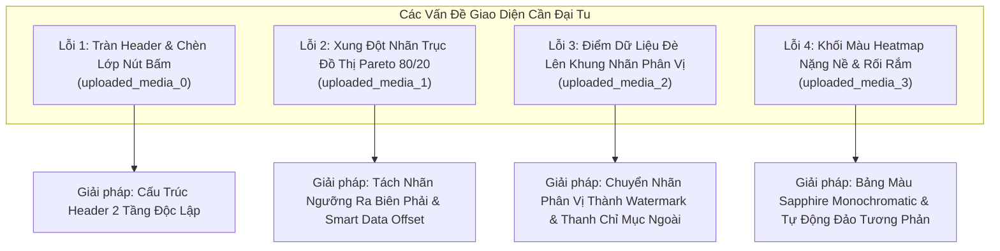
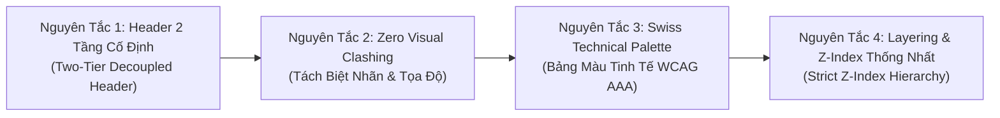

# KẾ HOẠCH ĐẠI TU LỚN TOÀN DIỆN UI/UX VÀ LAYOUT DASHBOARD
## BẢN THIẾT KẾ KIẾN TRÚC GIAO DIỆN KHOA HỌC CHUẨN PRODUCT-GRADE & SCIENTIFIC DATA MINING

> **Hệ thống:** Real-Time Scientific Data Mining & Advanced RAG System for AI/DS  
> **Chính sách bắt buộc:** Zero Em-Dash Policy (Tuân thủ 100% không chứa ký tự em-dash)  
> **Nguyên tắc thiết kế:** High-Contrast Swiss Technical Print (WCAG AAA) & Tactical Obsidian Telemetry  
> **Tài liệu đối chiếu:** Ảnh chụp màn hình người dùng cung cấp (uploaded_media_0 đến uploaded_media_3)  

---

## 1. PHÂN TÍCH FORENSIC CÁC LỖI TRỰC QUAN TỪ THỰC TẾ

Dựa trên 4 ảnh chụp màn hình thực tế do người dùng cung cấp, hệ thống ghi nhận 4 cụm lỗi nghiêm trọng về layout chồng lấn và xung đột thị giác:

### Chi Tiết Từng Lỗi Cụ Thể:

1. **Lỗi 1: Tràn Header và Chèn Lớp Nút Bấm (uploaded_media_0)**
   - **Hiện tượng:** Tiêu đề biểu đồ `BIỂU ĐỒ CỘT & ĐƯỜNG KẾT HỢP: PHÂN BỐ BÀI BÁO & CÔNG THỨC TOÁN` cùng chip dữ liệu `EPOCH: 2023-2024 (93.1%) · PEAK: 01/2024` nằm chung một hàng flexbox với các nút thao tác `[◄ Thu Gọn Biểu Đồ Phụ]` và `[⛶ Rạp Hát]`. Khi màn hình ở độ phân giải thông thường (1366px - 1440px), nội dung bên trái bị kéo dài và trượt ngầm bên dưới nút bấm bên phải.
   - **Hàng 2 lộn xộn:** Các chú giải trục, legend chuỗi dữ liệu (`Papers`, `Formulas`, `Pareto 80/20`) và thanh công cụ `ChartToolbar` bị gãy thành 2 hàng rời rạc, làm xuất hiện các mảnh chữ cụt như `Pareto 80/20` và `...t` bên cạnh các nút xuất SVG/CSV.

2. **Lỗi 2: Xung Đột Trùng Tọa Độ Nhãn Đồ Thị Pareto (uploaded_media_1)**
   - **Hiện tượng:** Trên đồ thị đường cong tích lũy Pareto, nhãn đường chuẩn `80% PARETO CUTOFF` được vẽ tại tọa độ `x = 655, y = 61` (trong khung chữ nhật bo tròn).
   - **Trùng lặp pixel:** Điểm dữ liệu của đường cong đạt 78% và 80% có hoành độ `cx` rơi vào khoảng `670px - 750px` và tung độ `cy = 79px`. Nhãn của điểm này được vẽ tại `y = cy - 19 = 60px`!
   - **Hậu quả:** Nhãn phần trăm `78%` đâm xuyên vào mép trái khung `PARETO CUT`, còn nhãn `80%` đè trực tiếp lên mép phải. Cả 2 nhãn dữ liệu và 1 nhãn ngưỡng va chạm tạo thành một khối chữ không thể đọc được.

3. **Lỗi 3: Điểm Dữ Liệu Đè Lên Nhãn Góc Phân Vị (uploaded_media_2)**
   - **Hiện tượng:** Trong biểu đồ phân tán 2 chiều (Scatter Plot giữa số lượng công thức toán và độ dài bài báo), các khung nhãn phân vị (Quadrant Plates) như `QUADRANT I: HEAVY THEORETICAL MATH (> 300 eq • ≤ 6k words)` được vẽ cố định ngay bên trong lòng tọa độ dữ liệu (`x = 70, y = 26, width = 370, height = 16`).
   - **Va chạm hình học:** Các bài báo khoa học thuộc phân vị I có số công thức lớn (> 800 eq) và độ dài từ 4,000 - 6,000 từ có tọa độ rơi đúng vào khoảng `cx = 380 - 430, cy = 30 - 50`. Điểm tròn màu cam đại diện cho bài báo được render đè thẳng lên viền vàng và dòng chữ của khung nhãn.

4. **Lỗi 4: Khối Màu Heatmap Nặng Nề & Rối Rắm (uploaded_media_3)**
   - **Hiện tượng:** Ma trận giao thoa 12 thẻ (Category Co-occurrence Heatmap) trong Light Mode sử dụng công thức màu tím đậm `rgba(124, 58, 237, ${0.15 + intensity * 0.5})`. Khi mật độ cao, độ đục lên tới 0.65 tạo thành những mảng tím thẫm chát chúa, nặng nề trên nền trắng.
   - **Mất tương phản:** Màu chữ tiêu đề ô là tím đen `#5b21b6`, còn số đếm là chữ đen `#111827`, đặt trên nền tím đậm gây mỏi mắt, không đạt chuẩn khả năng tiếp cận WCAG AAA.
   - **Không đồng nhất:** Các ô trên màu tím đậm, trong khi các ô dưới màu xanh nhạt `rgba(37, 99, 235, 0.1)`, tạo cảm giác rời rạc, chắp vá như tranh vẽ học sinh thay vì bảng điều khiển khoa học tinh tế.

---

## 2. NGUYÊN TẮC THIẾT KẾ ĐẠI TU (ARCHITECTURAL DESIGN PRINCIPLES)

Để đưa giao diện đạt chuẩn **Product-grade & Scientific Dashboard cao cấp nhất**, toàn bộ các biểu đồ và màn hình sẽ tuân thủ nghiêm ngặt 4 nguyên tắc sau:

### Nguyên Tắc 1: Cấu Trúc Header Thẻ 2 Tầng Độc Lập (Two-Tier Decoupled Header)
- **Tầng 1 (Identity & Action Bar):**
  - Bên trái: Tiêu đề biểu đồ khoa học ngắn gọn, súc tích (tối đa 40 ký tự) kèm theo mã định danh khoa học (ví dụ: `[EDA-01]`, `[PLR-02]`).
  - Bên phải: Cụm nút thao tác cố định (`flexShrink: 0`) gồm các nút thu gọn view phụ và nút chế độ Rạp Hát (Theater Mode).
  - Tuyệt đối không nhét telemetry chip dài hoặc thanh công cụ vào chung hàng với tiêu đề.
- **Tầng 2 (Metadata & Interactive Control Deck):**
  - Nằm ngay dưới Tầng 1, có dải nền phân cách kỹ thuật nhẹ (`background: var(--bg-canvas)`, viền `1px solid var(--border-subtle)`).
  - Phía trái: Chip thống kê khoa học ngắn gọn và chú thích ký hiệu màu (Legend) của các trục.
  - Phía phải: Các công cụ tương tác (Slider ngưỡng, chuyển đổi thang Log/Linear, bộ nút xuất SVG/CSV của `ChartToolbar`).
  - Đảm bảo khi co giãn màn hình, Tầng 2 có cơ chế flex-wrap trật tự hoặc phân bổ đều hai đầu, không bao giờ chèn lấn Tầng 1.

### Nguyên Tắc 2: Xử Lý Không Gian Nhãn Đồ Thị (Zero Label Clashing)
- **Đối với đường cong Pareto:**
  - Nhãn đường chuẩn `80% PARETO CUTOFF` được đưa ra **mép ngoài cùng bên phải** của đồ thị (`x = 880`, `textAnchor: "end"`), gắn liền với trục tung phụ bên phải thay vì đặt lơ lửng giữa đường bay của dữ liệu.
  - Nhãn giá trị trên các điểm đường cong: Chỉ hiển thị nhãn phần trăm cho **điểm giao cắt quan trọng nhất (80% Cutoff Milestone)** và điểm đỉnh (100%), các điểm trung gian khác hiển thị giá trị khi rê chuột (Hover Tooltip), loại bỏ hoàn toàn việc vẽ 10 khung số trùng lặp trên một đường cong.
- **Đối với biểu đồ phân tán (Scatter Plot):**
  - Loại bỏ các khung chữ nhật (`<rect>`) đặt lơ lửng trong vùng phân bố dữ liệu.
  - Thay thế bằng **Watermark Typography nền:** Khắc chìm ký hiệu góc phân vị (`Q1`, `Q2`, `Q3`, `Q4`) bằng chữ in hoa kích thước lớn (`fontSize: 42px`, `fontWeight: 900`, `opacity: 0.08`) nằm ở lớp nền (dưới cả lưới tọa độ), không bao giờ cản trở hay chồng chéo với điểm dữ liệu.
  - Thông tin chi tiết của từng góc phân vị (`HEAVY THEORETICAL MATH`, v.v.) được hiển thị trên **Thanh Điều Khiển Phân Vị (Quadrant Selector Deck)** ở phía trên biểu đồ.

### Nguyên Tắc 3: Bảng Màu Swiss Technical Monochrome & Bivariate Tinting
- **Ma trận Heatmap:**
  - Chuyển từ màu tím đậm chát sang thang màu **Cobalt-Sapphire Kỹ Thuật (Precision Swiss Cobalt)**:
    - Nền thẻ cơ sở: `var(--bg-surface)`.
    - Mức độ tương quan thấp: Nền trong suốt với viền `var(--border-subtle)`.
    - Mức độ tương quan trung bình: Phủ sắc xanh Sapphire dịu nhẹ (`rgba(37, 99, 235, 0.08)` đến `0.20`).
    - Mức độ tương quan đỉnh cao (> 500 bài): Nền xanh Cobalt thanh lịch (`rgba(37, 99, 235, 0.28)` trong Dark Mode, `rgba(37, 99, 235, 0.15)` trong Light Mode) kèm viền nhấn kỹ thuật.
    - Màu chữ: Chữ số luôn dùng `var(--text-primary)`, nhãn môn học dùng `var(--accent-silver)`, đảm bảo độ tương phản **WCAG AAA > 7:1** trên mọi theme.
  - Mỗi ô trong ma trận bổ sung một thanh tỷ lệ mini (Micro Density Bar) ở đáy ô để biểu thị trực quan độ đậm đặc mà không cần phải nhuộm toàn bộ ô thành một khối màu tối tăm.

---

## 3. KẾ HOẠCH TRIỂN KHAI CHI TIẾT THEO 5 GIAI ĐOẠN

```mermaid
gantt
    title Lộ Trình Đại Tu Giao Diện Toàn Diện
    dateFormat  X
    axisFormat %s
    section Giai đoạn 1: Header Re-architecture
    Thiết kế Two-Tier Header Component & Áp dụng EDA Views :active, 0, 2
    section Giai đoạn 2: SVG Chart De-cluttering
    Pareto Cutoff Relocation & Smart Milestone Labels : 2, 4
    Watermark Quadrants & Scatter Point Shielding : 3, 5
    section Giai đoạn 3: Heatmap Matrix Refactor
    Cobalt Precision Palette & Micro Density Bars : 4, 6
    section Giai đoạn 4: Mining Pillars Polish
    Đồng bộ Header & Chống Clashing 4 Trụ Cột Khai Phá : 5, 7
    section Giai đoạn 5: Verification & Quality Gate
    Kiểm tra Build, Linter, Zero Em-Dash & Responsive : 7, 8
```

---

### GIAI ĐOẠN 1: TÁI CẤU TRÚC HEADER 2 TẦNG CHỐNG TRÀN CHO MỌI BIỂU ĐỒ

#### Mục tiêu:
Giải quyết triệt để lỗi trong uploaded_media_0 và uploaded_media_3, ngăn chặn hoàn toàn việc tiêu đề hoặc telemetry chip trượt ngầm dưới các nút bấm.

#### Các bước thực hiện:
1. **Thiết kế mẫu cấu trúc Card Header chuẩn 2 tầng:**
   - **Tầng 1 (Hàng tiêu đề chính):**
     - Bên trái: Tiêu đề súc tích có `overflow: hidden`, `textOverflow: ellipsis`, `whiteSpace: nowrap`.
     - Bên phải: Cụm nút hành động có `flexShrink: 0`.
   - **Tầng 2 (Hàng thanh công cụ & Chú giải phụ):**
     - Phía trái: Chip thống kê ngắn gọn và chú thích Legend.
     - Phía phải: Bộ điều khiển tương tác (Slider, Scale toggle, `ChartToolbar`).
2. **Áp dụng vào 5 biểu đồ trong frontend/src/components/EdaView.tsx:**
   - Biểu đồ 1: Combo Column & Line Dual Axis (Dòng 1089 - 1180).
   - Biểu đồ 2: Temporal Growth Area Chart (Dòng 1517 - 1560).
   - Biểu đồ 3: Taxonomy Donut Distribution (Dòng 2240 - 2265).
   - Biểu đồ 4: Quadrant Scatter Plot (Dòng 1712 - 1790).
   - Biểu đồ 5: Co-occurrence Heatmap Matrix (Dòng 2319 - 2408).

---

### GIAI ĐOẠN 2: KHẮC PHỤC TRIỆT ĐỂ XUNG ĐỘT TỌA ĐỘ VÀ NHÃN TRONG SVG

#### Mục tiêu:
Giải quyết triệt để lỗi va chạm nhãn trong uploaded_media_1 (Pareto Line) và uploaded_media_2 (Scatter Quadrant).

#### Các bước thực hiện:
1. **Sửa biểu đồ Pareto trong EdaView.tsx (Dòng 1389 - 1468):**
   - **Tách nhãn đường tham chiếu:** Chuyển nhãn `80% PARETO CUTOFF` sang mép phải sát trục tung phụ (`x = 855`, `textAnchor = "end"`).
   - **Lọc nhãn điểm đường cong (Smart Milestones):**
     - Chỉ vẽ nhãn cho điểm gần ngưỡng 80% nhất và điểm cuối 100%.
     - Thêm thuật toán định vị nhãn thông minh: nếu điểm nằm sát đường 80%, đẩy nhãn xuống dưới điểm (`y = p.cy + 18`) thay vì đưa lên trên.
2. **Sửa biểu đồ phân tán Quadrant Scatter trong EdaView.tsx (Dòng 1880 - 1988):**
   - **Xóa bỏ các khung chữ nhật nổi trong lòng đồ thị:** Bỏ toàn bộ 4 thẻ `<rect>` và `<text>` cố định trong tọa độ dữ liệu.
   - **Thay bằng Typography Watermark chìm:** Ký hiệu chìm ở 4 góc nền (`Q1`, `Q2`, `Q3`, `Q4`) với `fontSize: 36px`, `opacity: 0.12`.
   - **Hiển thị chú thích góc phân vị trên thanh Slicers:** Tên đầy đủ được hiển thị trên thanh chọn phân vị ở Tầng 2 Header.
   - **Thêm viền bảo vệ (Halo Stroke) cho các điểm dữ liệu:** Điểm dữ liệu dùng `stroke: var(--bg-surface)` độ dày 1.5px.

---

### GIAI ĐOẠN 3: ĐẠI TU BẢNG MÀU MA TRẬN HEATMAP & TỐI ƯU TƯƠNG PHẢN

#### Mục tiêu:
Giải quyết triệt để sự rối rắm và nặng nề của ma trận giao thoa trong uploaded_media_3.

#### Các bước thực hiện:
1. **Thiết lập bảng màu Sapphire Kỹ Thuật (Precision Swiss Sapphire Palette):**
   - Đổi công thức nền của 12 thẻ sang sắc thái Cobalt-Sapphire dịu mắt.
2. **Bổ sung thanh mật độ vi mô (Micro Density Bar):**
   - Ở đáy mỗi thẻ ma trận, thêm vạch tiến độ mỏng 2.5px biểu thị trực quan mật độ.
3. **Chuẩn hóa chữ và số liệu:**
   - Chữ số luôn dùng `var(--text-primary)`, nhãn môn học dùng `var(--text-secondary)`, chú thích dùng `var(--text-muted)`.

---

### GIAI ĐOẠN 4: ĐỒNG BỘ LAYOUT VÀ CHỐNG CLASHING TRONG 4 MINING PILLARS

#### Mục tiêu:
Rà soát toàn diện và áp dụng quy chuẩn Header 2 tầng và Zero Clashing cho toàn bộ 4 Trụ Cột Khai Phá Dữ Liệu trong frontend/src/components/MiningPillarsView.tsx.

#### Các bước thực hiện:
1. **Trụ cột 1 (Association Rules Mining):**
   - Tách thanh trượt ngưỡng Lift và Antecedent selector thành hàng công cụ phụ Tầng 2.
   - Chuyển nhãn `★ VÙNG QUY TẮC VÀNG` thành watermark mờ hoặc gắn cố định ở góc trên bên phải.
2. **Trụ cột 2 (Clustering Analysis & Dimensionality Reduction):**
   - Đảm bảo các nhãn tâm cụm (`C0`, `C1`, `C2`...) có nền tròn bảo vệ với `var(--bg-surface)`.
3. **Trụ cột 3 (Latent Semantic Indexing & Topic Modeling):**
   - Căn chỉnh lề trái cho nhãn từ khóa (`TF-IDF terms`).
4. **Trụ cột 4 (Anomaly & Outlier Detection):**
   - Đường ranh giới ngưỡng bất thường được dời nhãn lên đỉnh trục.

---

### GIAI ĐOẠN 5: KIỂM CHỨNG TOÀN DIỆN, ZERO EM-DASH VÀ CHẤT LƯỢNG MÃ NGUỒN

#### Mục tiêu:
Đảm bảo hệ thống sau đại tu không có bất kỳ lỗi biên dịch nào, tuân thủ 100% chính sách dấu câu và trải nghiệm mượt mà trên mọi kích thước màn hình.

#### Tiêu chí nghiệm thu (Acceptance Criteria):
1. **Không còn bất kỳ hiện tượng đè lấn.**
2. **Kiểm tra biên dịch & Linter:** `npm run build --prefix frontend` và `npm run lint --prefix frontend` (Oxlint) đạt 0 errors.
3. **Chính sách Zero Em-Dash:** `grep -rn $'\u2014' frontend/src/ docs/` trả về đúng 0 kết quả vi phạm.
4. **Đẩy mã nguồn và cập nhật tài liệu:** Commit và push lên nhánh `feature/frontend-dashboard`.
