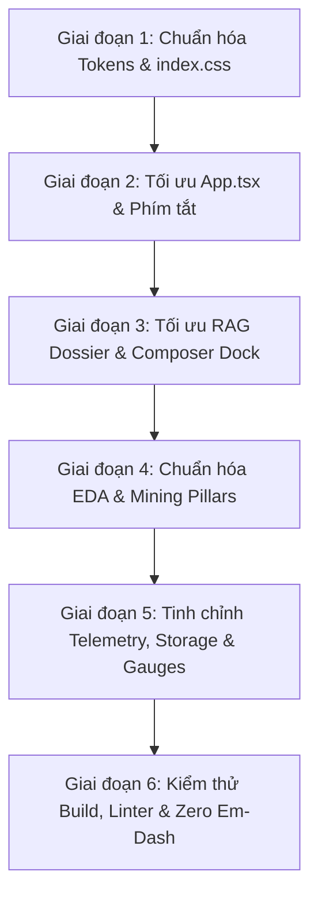

# Kế Hoạch Cải Tiến Sâu Toàn Diện UI/UX Frontend & Xử Lý Triệt Để Xung Đột Layout / Màu Sắc

> **Mục tiêu:** Khắc phục triệt để 100% các lỗi xung đột màu sắc (Color Conflicts) giữa Dark Mode và Light Mode, loại bỏ hiện tượng các thành phần giao diện đè chồng chéo lên nhau (UI Stacking & Z-Index Wars), đồng bộ hệ thống phím tắt và hoàn thiện trải nghiệm người dùng chuẩn Khoa học Dữ liệu Sản phẩm (Production-grade Scientific Dashboard) cho Đề tài Khai phá Dữ liệu UTH.
>
> **Chính sách văn bản:** Tuyệt đối tuân thủ chính sách Zero Em-Dash (không sử dụng ký tự em-dash).

---

## 1. Báo Cáo Kiểm Tra Toàn Diện (Comprehensive Audit Findings)

Qua quá trình rà soát chi tiết toàn bộ mã nguồn của 5 Tab chức năng và 11 components giao diện chính, đã phát hiện 3 nhóm vấn đề cốt lõi:

### Nhóm A: Hiện Tượng Đè Chồng Chéo Giao Diện (UI Overlaps & Stacking Collisions)

| STT | Vị Trí Component | Dòng Mã | Hiện Tượng Thực Tế | Nguyên Nhân Gốc Rễ |
|---|---|---|---|---|
| A1 | `GroundedRagChat.tsx` | L830-845 & L1045-1065 | Khi mở Paper Dossier Drawer (rộng 420px bên phải), khung nhập liệu Composer Dock (căn giữa màn hình rộng 860px) và danh sách tin nhắn bị Drawer đè lên 40-50% diện tích bên phải. | Composer Dock và Message Scroll Container không co giãn chiều ngang theo sự hiện diện của Drawer (`inspectedPaper`), dẫn đến đè chồng chéo. |
| A2 | `InteractiveWorkflowCanvas.tsx` & `App.tsx` | L1348-1358 (Canvas) & L147 (App) | Inspector Panel phía dưới của Canvas và Sidebar Rail bên trái đều đặt `zIndex: 60`, gây xung đột ngữ cảnh xếp chồng (stacking context). | Thiếu thang phân bậc z-index thống nhất toàn ứng dụng. |
| A3 | `EdaView.tsx` & `MiningPillarsView.tsx` | L1062, 1700, 2212 (EDA) & L819 (Pillars) | Chế độ Rạp Hát (Theater Mode) thiết lập `position: fixed, top: 52px, left: 0, bottom: 0, zIndex: 999`. Do `left: 0`, phần chart đè lên 58px Sidebar Rail từ y=52px trở xuống, nhưng để hở 52px đầu tiên của Sidebar Rail. | Kích thước và tọa độ Theater Mode không đồng bộ với cấu trúc Rail (58px) và Header (52px). |
| A4 | `EdaView.tsx` | L3404 (`zIndex: 1200`) & L3122 (`zIndex: 1500`) | Khi mở Drawer chi tiết bài báo (`zIndex: 1500`), nếu xuất hiện thông báo Anomaly Toast (`right: 24px, zIndex: 1200`), thông báo này bị giấu phía sau Drawer, người dùng không thể bấm tắt. | Toast thông báo không tự động dịch chuyển tọa độ khi Drawer đang mở. |
| A5 | `App.tsx` | L537-539 | Các Tab EDA, Pillars, Schematic có `overflowY: 'hidden'` ở container cha, khiến trên màn hình laptop có độ phân giải thấp (<= 768px chiều dọc), các nút điều khiển và chân biểu đồ bị cắt cụt. | Thiếu thanh cuộn nội bộ hoặc `min-height` thích ứng trong từng deck biểu đồ. |

---

### Nhóm B: Xung Đột Phím Tắt Toàn Cục Và Cục Bộ (Keyboard Shortcut Collisions)

| Phím Bấm | Hành Động Toàn Cục (`App.tsx`) | Hành Động Cục Bộ (`EdaView` / `MiningPillars`) | Hậu Quả Thực Tế |
|---|---|---|---|
| Phím `1` .. `5` | Chuyển đổi giữa 5 Tab chính: Schematic, EDA, Pillars, RAG, Logs | Chuyển đổi 5 Deck trong EDA (`combo`, `scatter`, `taxonomy`, `authors`, `rag_audit`) hoặc 4 Trụ cột trong Pillars (Rules, Clusters, Graph, Trends) | Khi người dùng đang ở EDA muốn bấm phím `3` để xem Phân loại đề tài, hệ thống lập tức nhảy sang Tab Pillars! Người dùng không thể thao tác các phím số trong trang con. |
| Phím `T` / `t` | Chuyển đổi Giao diện Sáng / Tối (Toggle Dark/Light Theme) | Bật / Tắt Chế độ Toàn màn hình Rạp Hát (Theater Mode) trong Pillars | Bấm phím `T` trong Tab Pillars vừa kích hoạt Theater Mode vừa đảo ngược màu sắc của toàn bộ Dashboard! |

---

### Nhóm C: Xung Đột Màu Sắc & Suy Giảm Độ Tương Phản (Color Conflicts & WCAG AAA Violations)

| STT | Vị Trí Component | Dòng Mã | Lỗi Màu Sắc Cụ Thể | Tác Động Trong Giao Diện |
|---|---|---|---|---|
| C1 | `GeometricTelemetryGauges.tsx` | L59 | Track nền của đồng hồ tròn SVG dùng `stroke="rgba(255, 255, 255, 0.12)"`. | Trong Light Mode, nền card màu trắng (`#ffffff`), vòng track màu trắng mờ 12% hoàn toàn vô hình, khiến gauge như bị đứt đoạn. |
| C2 | `GeometricTelemetryGauges.tsx` | L153 | Các ô chưa sáng trong ma trận 144 vector cell dùng `background: 'rgba(255, 255, 255, 0.1)'`. | Trong Light Mode trên nền `--bg-canvas` (`#f8fafc`), 144 cell ma trận biến mất hoàn toàn, chỉ thấy vài chấm xanh trôi nổi. |
| C3 | `StorageInspector.tsx` | L129, L131 | Huy hiệu phân vùng Bronze/Silver/Gold dùng `background: 'rgba(255, 255, 255, 0.05)', border: '1px solid rgba(255, 255, 255, 0.08)'`. | Trong Light Mode, viền và nền huy hiệu biến mất hoàn toàn vì cùng tông màu trắng với thẻ chứa. |
| C4 | `ToolLogos.tsx` | L99, L182 | Logo Apple Silicon Metal hardcode `fill="#E2E8F0"`; nhãn trạng thái dùng xanh nhạt `#34d399`. | Trong Light Mode, logo Apple xám nhạt trên nền trắng gần như không nhìn thấy; nhãn trạng thái không đạt độ tương phản chuẩn WCAG. |
| C5 | `App.tsx` | L190-312, L409-482 | Hàng loạt mã màu hex `#94a3b8`, `#64748b`, `#bfdbfe` được hardcode kèm điều kiện `theme === 'dark' ? ... : ...`. | Không sử dụng triệt để các biến CSS đã định nghĩa (`var(--text-secondary)`, `var(--text-muted)`), dẫn đến sai lệch sắc độ giữa các khối. |
| C6 | `EdaView.tsx` & `MiningPillarsView.tsx` | L3308-3472 (EDA) & L199, 3737 (Pillars) | Tooltip và Anomaly Toast dùng cứng nền đen `#0f172a` hoặc `#020617` bất kể đang ở Light Mode hay Dark Mode. | Khi ở Light Mode, các hộp thoại tooltip đen kịt nổi cộm lệch tông hoàn toàn so với phong cách Swiss Technical Print sạch sẽ. |
| C7 | `GroundedRagChat.tsx` | L1090-1106 | Các gợi ý câu hỏi nghiên cứu sử dụng hàm sự kiện hover bằng Javascript gán đè trực tiếp `e.currentTarget.style.borderColor = ...`. | Khi đổi theme, các style nội dòng này bị lưu lại làm lệch màu khung viền của các chip gợi ý. |

---

## 2. Kiến Trúc Giải Pháp Chuẩn Hóa (Architectural Solutions)

### Giải Pháp 1: Thang Phân Bậc Z-Index Toàn Cục (Standardized Z-Index Hierarchy)
Định nghĩa hệ thống thứ bậc z-index nghiêm ngặt, loại bỏ hoàn toàn các giá trị tùy tiện (`999`, `1200`, `1500`, `9999`):

- **Z-01 (`z-index: 1`)**: Mặt phẳng Canvas biểu đồ, đường nối wire và lưới tọa độ SVG.
- **Z-10 (`z-index: 10`)**: Thanh điều khiển nội bộ, bộ lọc Slicer, thanh tab nội bộ của từng Tab.
- **Z-20 (`z-index: 20`)**: Các nút nổi Pan/Zoom, nút điều hướng canvas.
- **Z-30 (`z-index: 30`)**: Khung nhập liệu RAG Composer Dock (khi không mở Drawer).
- **Z-40 (`z-index: 40`)**: Thanh Header Telemetry trên đỉnh ứng dụng (`height: 52px`).
- **Z-50 (`z-index: 50`)**: Cột Sidebar Rail bên trái ứng dụng (`width: 58px`).
- **Z-60 (`z-index: 60`)**: Các Slide-over Dossier Drawer (ngăn kéo thông tin chi tiết trượt từ bên phải).
- **Z-70 (`z-index: 70`)**: Các thông báo Toast, Alert Anomaly nổi.
- **Z-80 (`z-index: 80`)**: Toàn màn hình Rạp Hát (Theater Mode Overlay) có nút đóng chuyên dụng.
- **Z-90 (`z-index: 90`)**: Tooltip nổi theo con trỏ chuột.

---

### Giải Pháp 2: Phân Tách Không Gian Khi Mở Drawer (Drawer Responsive Space Allocation)
Để triệt tiêu lỗi đè chồng chéo tại Tab RAG và Tab EDA:
1. **Tại `GroundedRagChat.tsx`**:
   - Khi `inspectedPaper` mở: Container chứa tin nhắn và thanh nhập liệu Composer Dock tự động áp dụng `marginRight: '430px'` (hoặc chuyển thành layout flexbox 2 cột song song với animation mượt mà `transition: all 0.24s cubic-bezier(0.16, 1, 0.3, 1)`).
   - Composer Dock co giãn theo chiều rộng thực tế của không gian còn lại (`width: calc(100% - 450px)`), đảm bảo toàn bộ prompt chips và ô nhập liệu luôn hiển thị 100% rõ ràng, không bị mép Drawer che khuất.
2. **Tại `EdaView.tsx`**:
   - Khi `selectedPaperForDrawer` mở: Khung cảnh báo Anomaly Toast tự động dịch chuyển sang trái `right: '440px'`, đảm bảo không bị ngăn kéo đè lên.

---

### Giải Pháp 3: Tái Cấu Trúc Toàn Màn Hình Rạp Hát (True Theater Mode)
Thay thế cách đặt vị trí cắt cụt `top: 52px, left: 0` bằng một chuẩn hiển thị hoàn chỉnh:
- Giữ nguyên thanh Sidebar Rail và Header để người dùng không bị mất phương hướng: `position: 'absolute', top: 0, left: 0, right: 0, bottom: 0, zIndex: 45`.
- Hoặc hiển thị rạp hát thực thụ toàn màn hình (`position: 'fixed', inset: 0, zIndex: 80`) với thanh tiêu đề trên cùng có nút bấm to bản nổi bật: **[THOÁT RẠP HÁT (ESC)]**.

---

### Giải Pháp 4: Đồng Bộ Hệ Thống Phím Tắt (Keyboard Decoupling)
- **Chuyển Tab Toàn Cục**: Đổi sang tổ hợp phím chuyên nghiệp:
  - `Alt + 1`: 01 FLOW & SCHEMATIC
  - `Alt + 2`: 02 DUCKDB EDA
  - `Alt + 3`: 03 MINING PILLARS
  - `Alt + 4`: 04 GROUNDED RAG
  - `Alt + 5`: 05 TELEMETRY LOGS
- **Đổi Theme**: Đổi sang `Shift + T` (hoặc `Alt + T`), giải phóng phím `T` độc quyền cho Theater Mode.
- **Thao Tác Cục Bộ**: Trả lại phím bấm `1`, `2`, `3`, `4`, `5` nguyên bản cho các Deck trong EDA và các Trụ cột trong Mining Pillars mà không lo bị nhảy trang.

---

### Giải Pháp 5: Chuẩn Hóa Màu Sắc Toàn Diện Bằng CSS Variables (Theme Token Harmonization)
1. **Thay thế toàn bộ `rgba(255, 255, 255, ...)` tĩnh** trong các thành phần bằng biến token thích ứng:
   - Gauge Track nền: Thay bằng `var(--border-subtle)` / `var(--border-muted)`.
   - Matrix Unlit Cells: Thay bằng `var(--border-subtle)` trong Dark Mode và `rgba(0, 0, 0, 0.08)` trong Light Mode.
   - Storage Zone Badges: Sử dụng `var(--bg-surface-elevated)` và `var(--border-subtle)`.
   - Logo Apple Silicon: Dùng `currentColor` với lớp vỏ bọc có màu `var(--text-primary)`.
2. **Tooltip và Toast Thích Ứng (Theme-Aware Tooltips & Toasts)**:
   - Dark Mode: Nền `#0b1120`, viền `rgba(255, 255, 255, 0.14)`, chữ `#f8fafc`.
   - Light Mode: Nền `#ffffff`, viền `rgba(0, 0, 0, 0.12)`, bóng đổ sâu `0 8px 30px rgba(0, 0, 0, 0.12)`, chữ `#0f172a`.
3. **Loại bỏ triệt để các mã hex hardcode trong `App.tsx`**: Chuyển toàn bộ sang các biến thiết kế đồng nhất đã khai báo trong `index.css`.

---

## 3. Lộ Trình Triển Khai Chi Tiết (Implementation Roadmap)

### Chi Tiết Từng Giai Đoạn:

#### Giai Đoạn 1: Bổ Sung Design Tokens Cho `index.css`
- Bổ sung biến token cho tooltip: `--tooltip-bg`, `--tooltip-border`, `--tooltip-text`.
- Bổ sung biến token cho status badges và tracks: `--track-bg`, `--matrix-dim`.
- Hoàn thiện class `.theater-overlay` và `.floating-glass-dock` đảm bảo thích ứng tốt ở cả 2 theme.

#### Giai Đoạn 2: Tái Cấu Trúc `App.tsx`
- Thay thế toàn bộ mã màu hardcode `#94a3b8`, `#64748b`, `#f8fafc`, `#0f172a` bằng CSS variables.
- Điều chỉnh listener bàn phím: chuyển tab dùng `Alt+1`..`Alt+5`, đổi theme dùng `Shift+T`.
- Thêm tooltip chỉ dẫn phím tắt trực quan trên Sidebar Rail: `Alt+1`, `Alt+2`,...
- Cân chỉnh chiều cao và padding của container chính để tránh tình trạng tràn hoặc che mất nội dung.

#### Giai Đoạn 3: Nâng Cấp `GroundedRagChat.tsx` (Giải Quyết Đè Chồng Chéo)
- Thiết lập layout phản ứng linh hoạt: Khi `inspectedPaper` mở, container chat tự động co giãn với `marginRight: '430px'`.
- Điều chỉnh Composer Dock: Bỏ định vị tuyệt đối căn giữa cứng nhắc khi Drawer mở, đảm bảo khung nhập liệu nằm trọn vẹn trong vùng hiển thị của cột chat.
- Chuyển đổi mã màu hover của suggestion chips sang CSS class `.suggestion-chip` trong `index.css`.

#### Giai Đoạn 4: Hoàn Thiện `EdaView.tsx` & `MiningPillarsView.tsx`
- Sửa Theater Mode: Không dùng `left: 0` cắt ngang Sidebar Rail. Tích hợp thanh điều khiển thoát Theater trực quan.
- Dịch chuyển Anomaly Toast khi Paper Drawer trong EDA mở (`right: '440px'`).
- Đồng bộ hóa bảng màu của `themeStyles`: chuyển `tooltipBg` sang dạng thích ứng sáng/tối.
- Khôi phục hoạt động của phím số `1`..`5` trong trang EDA và `1`..`4` trong trang Pillars.

#### Giai Đoạn 5: Chuẩn Hóa `GeometricTelemetryGauges.tsx`, `StorageInspector.tsx`, `ToolLogos.tsx`
- Sửa track SVG của đồng hồ tròn để hiển thị sắc nét trong Light Mode.
- Sửa 144 cell ma trận vector để nhìn thấy rõ ràng trên nền sáng.
- Sửa viền và nền badge phân vùng dữ liệu trong bảng Storage Inspector.
- Sửa icon Apple Silicon Metal và các tag trạng thái trong ToolLogos.

#### Giai Đoạn 6: Kiểm Thử Toàn Diện & Đảm Bảo Chất Lượng
- Chạy `npm run build` xác nhận không có lỗi TypeScript / JSX.
- Chạy `npm run lint` kiểm tra cảnh báo oxlint.
- Chạy kiểm tra quy chuẩn Zero Em-Dash: `grep -rn $'\u2014' frontend/src/`.
- Xác nhận trực quan cả 5 Tab trên cả hai chế độ Dark Mode và Light Mode.
