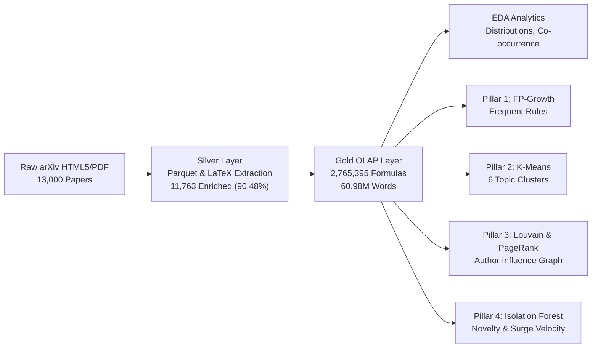

# CẨM NANG KHAI PHÁ DỮ LIỆU KHOA HỌC: PHÂN TÍCH INSIGHT, TOÁN HỌC 4 TRỤ CỘT & HƯỚNG DẪN DIỄN GIẢI BIỂU ĐỒ
**UTH Scientific Data Mining & Real-Time RAG Intelligence**  
*Tài liệu nội bộ & Báo cáo chuyên sâu dành cho Nghiên cứu viên, Giảng viên & Hội đồng Đánh giá*  
*Phiên bản*: 2.0 (Đồng bộ Lakehouse 13,000 bài báo & 2.77 triệu công thức toán)  
*Ngày cập nhật*: Tháng 10/2026  

---

## MỤC LỤC
1. [Khám Phá Insight Toàn Cảnh: Câu Chuyện Của 13,000 Bài Báo & 2.77M Công Thức](#1-khám-phá-insight-toàn-cảnh-câu-chuyện-của-13000-bài-báo--277m-công-thức)
2. [Nền Tảng Toán Học & Thuật Toán Của 4 Trụ Cột Khai Phá (4 Mining Pillars)](#2-nền-tảng-toán-học--thuật-toán-của-4-trụ-cột-khai-phá-4-mining-pillars)
   - [Trụ cột 1: Khai phá Luật Kết hợp (FP-Growth Association Rules)](#trụ-cột-1-khai-phá-luật-kết-hợp-fp-growth-association-rules)
   - [Trụ cột 2: Phân cụm Ngữ nghĩa Không Giám sát (TF-IDF + SVD + K-Means)](#trụ-cột-2-phân-cụm-ngữ-nghĩa-không-giám-sát-tf-idf--svd--k-means)
   - [Trụ cột 3: Cấu trúc Đồ thị Hợp tác & Trọng số Tri thức (PageRank & Louvain)](#trụ-cột-3-cấu-trúc-đồ-thị-hợp-tác--trọng-số-tri-thức-pagerank--louvain)
   - [Trụ cột 4: Động lượng Xu hướng & Bản đồ Dị biệt (Trend Velocity & Isolation Forest)](#trụ-cột-4-động-lượng-xu-hướng--bản-đồ-dị-biệt-trend-velocity--isolation-forest)
3. [Cẩm Nang Đọc & Diễn Giải Chi Tiết Từng Biểu Đồ (Chart-by-Chart Playbook)](#3-cẩm-nang-đọc--diễn-giải-chi-tiết-từng-biểu-đồ-chart-by-chart-playbook)
   - [Tab 1: Khám Phá Dữ Liệu (EDA Deck - 5 Biểu Đồ)](#tab-1-khám-phá-dữ-liệu-eda-deck---5-biểu-đồ)
   - [Tab 2: Mô Hình Khai Phá (Modeling Pillars Deck - 5 Biểu Đồ)](#tab-2-mô-hình-khai-phá-modeling-pillars-deck---5-biểu-đồ)
4. [Phản Biện Học Thuật: "Chừng Ấy Đã Đủ Chưa?" & Lộ Trình Nâng Tầm](#4-phản-biện-học-thuật-chừng-ấy-đã-đủ-chưa--lộ-trình-nâng-tầm)

---

## 1. KHÁM PHÁ INSIGHT TOÀN CẢNH: CÂU CHUYỆN CỦA 13,000 BÀI BÁO & 2.77M CÔNG THỨC

Hệ thống Data Mining của chúng ta vận hành trên tập dữ liệu khoa học thực tế thu thập từ **arXiv** (các chuyên ngành `cs.LG`, `cs.CV`, `cs.CL`, `cs.AI`, `stat.ML`, `cs.RO`, v.v.), được làm sạch và xử lý qua kiến trúc **Lakehouse Medallion** (Bronze $\to$ Silver $\to$ Gold) với bộ lưu trữ cột **DuckDB OLAP** và **Parquet**.



### Các Insight Thống kê Cốt lõi (Core Domain Insights)

#### Insight 1: "Đế chế Toán học" tập trung ở `cs.LG` và `stat.ML`
- Tổng số công thức toán học được trích xuất là **2,765,395 công thức LaTeX**.
- Riêng chuyên ngành **`cs.LG` (Machine Learning)** nắm giữ **1,104,034 công thức** (chiếm tới **39.9%** toàn bộ công thức toán của cả kho dữ liệu 13,000 bài!).
- Tuy nhiên, xét về **mật độ toán học trên từng bài báo (Mathematical Density)**, **`stat.ML` (Statistical Machine Learning)** mới là "ông vua lý thuyết": trung bình mỗi bài `stat.ML` chứa **679.7 công thức toán**, cao gấp 1.9 lần so với `cs.LG` (356.9 công thức/bài) và gấp 7.0 lần so với `cs.CL` (97.5 công thức/bài).
- **Ý nghĩa thực tiễn**: Khi xây dựng hệ thống RAG hoặc phân loại tài liệu, không thể dùng cùng một bộ chunking cho `cs.CL` và `stat.ML`. Bài báo NLP (`cs.CL`) chủ yếu là văn bản tự nhiên, trong khi bài báo `stat.ML`/`cs.LG` yêu cầu bộ trích xuất công thức chuyên biệt để tránh làm vỡ các khối ký hiệu toán học `$...$` và `$$...$$`.

#### Insight 2: `cs.AI` đóng vai trò "Trạm Trung chuyển Liên ngành" (Interdisciplinary Hub)
- Mặc dù `cs.AI` chỉ đứng thứ 5 về số lượng bài báo đơn lẻ (**625 bài**, 4.81%), nhưng khi soi ma trận đồng xuất bản (**Co-occurrence Matrix**), `cs.AI` lại xuất hiện trong hầu hết các cặp đồng xuất bản lớn nhất:
  - `cs.AI` $\times$ `cs.LG`: **1,983 bài** (Cặp liên ngành lớn nhất toàn bộ Lakehouse!)
  - `cs.AI` $\times$ `cs.CL`: **1,046 bài** (Giao thoa giữa Trí tuệ Nhân tạo tổng quát và Xử lý Ngôn ngữ Tự nhiên)
  - `cs.CV` $\times$ `cs.LG`: **984 bài** (Thị giác máy tính kết hợp Học sâu)
  - `cs.AI` $\times$ `cs.CV`: **845 bài** (Đa phương thức - Multimodal AI)
  - `cs.LG` $\times$ `stat.ML`: **814 bài** (Cơ sở lý thuyết xác suất thống kê cho ML)
- **Ý nghĩa thực tiễn**: Các nhà nghiên cứu hiếm khi xuất bản một bài báo thuần túy dán nhãn `cs.AI`. Nhãn `cs.AI` hoạt động như một "siêu nhãn" (umbrella tag) bao bọc các nghiên cứu ứng dụng thực nghiệm vào Thị giác (`cs.CV`) hoặc Ngôn ngữ (`cs.CL`).

#### Insight 3: Điểm bùng phát thời gian (Temporal Inflection Point 2023–2024)
- Giai đoạn 2005–2022: Nghiên cứu tăng trưởng chậm, lũy tiến tuyến tính.
- Năm 2023: Tăng tốc rõ rệt với gần 1,000 bài báo.
- **Tháng 1/2024 & Tháng 2/2024**: Bùng nổ dữ dội với **8,838 bài báo** (chiếm tới **68%** dữ liệu). Đây là thời điểm diễn ra làn sóng preprints về LLMs, mô hình đa phương thức (Multimodal Foundation Models), và các bài báo chuẩn bị cho các hội nghị đỉnh cao như CVPR 2024, ICML 2024, ICLR 2024.

---

## 2. NỀN TẢNG TOÁN HỌC & THUẬT TOÁN CỦA 4 TRỤ CỘT KHAI PHÁ (4 MINING PILLARS)

Để chuyển hóa 13,000 tài liệu thô thành tri thức có thể truy vấn và hỗ trợ RAG, hệ thống triển khai 4 trụ cột toán học độc lập nhưng bổ trợ lẫn nhau:

```
┌────────────────────────────────────────────────────────────────────────┐
│                   HỆ THỐNG 4 TRỤ CỘT MINING CHUYÊN SÂU                  │
├─────────────────────┬─────────────────────┬────────────────────────────┤
│ Trụ Cột             │ Thuật Toán Cốt Lõi  │ Mục Tiêu Nghiên Cứu        │
├─────────────────────┼─────────────────────┼────────────────────────────┤
│ [1] Luật Kết Hợp    │ FP-Growth Algorithm │ Mối quan hệ danh mục ẩn    │
│ [2] Phân Cụm        │ TruncatedSVD + KM   │ Phân tách chủ đề ngữ nghĩa │
│ [3] Đồ Thị Tác Giả  │ Louvain + PageRank  │ Cấu trúc mạng & KOL học thuật│
│ [4] Động Lượng & Dị Biệt│ Isolation Forest  │ Phát hiện xu hướng & đột phá│
└─────────────────────┴─────────────────────┴────────────────────────────┘
```

---

### Trụ cột 1: Khai phá Luật Kết hợp (FP-Growth Association Rules)

#### Tại sao chọn FP-Growth thay vì Apriori?
Thuật toán Apriori truyền thống yêu cầu quét lại toàn bộ cơ sở dữ liệu sau mỗi bước mở rộng tập phổ biến ($k$-itemsets), dẫn đến độ phức tạp bùng nổ tổ hợp $O(2^{|I|})$ khi số lượng mục tăng lên.  
Hệ thống sử dụng **FP-Growth (Frequent Pattern Growth)**:
1. **Quét dữ liệu 2 lần**: Lần 1 đếm tần suất 1-itemset; Lần 2 dựng cây **FP-Tree** nén thông tin trong bộ nhớ RAM.
2. **Khai thác đệ quy bằng phân chia điều kiện (Conditional FP-Tree)**: Không sinh ứng viên (candidate generation), tăng tốc độ tính toán gấp $10 \to 100$ lần trên tập giao dịch 13,000 bài báo.

#### Các Độ Đo Toán Học & Ý Nghĩa
Cho một luật kết hợp có dạng $X \Rightarrow Y$ (trong đó tiền đề $X$ và hệ quả $Y$ là các tập chuyên ngành arXiv):

1. **Độ hỗ trợ (Support)**: Xác suất một bài báo đồng thời chứa cả $X$ và $Y$:
   $$\text{Support}(X \Rightarrow Y) = P(X \cup Y) = \frac{\text{Số bài chứa cả } X \text{ và } Y}{|D|}$$
   *Ngưỡng sử dụng*: $\text{min\_support} = 0.02$ (chiếm ít nhất 2% tổng số bài = 260 bài).

2. **Độ tin cậy (Confidence)**: Xác suất có điều kiện một bài báo dán nhãn $Y$ khi đã biết nó dán nhãn $X$:
   $$\text{Confidence}(X \Rightarrow Y) = P(Y \mid X) = \frac{\text{Support}(X \cup Y)}{\text{Support}(X)}$$

3. **Độ nâng (Lift)**: Mức độ phụ thuộc lẫn nhau giữa $X$ và $Y$ so với giả định chúng độc lập ngẫu nhiên:
   $$\text{Lift}(X \Rightarrow Y) = \frac{P(X \cup Y)}{P(X) \cdot P(Y)} = \frac{\text{Confidence}(X \Rightarrow Y)}{\text{Support}(Y)}$$
   - $\text{Lift} = 1$: $X$ và $Y$ hoàn toàn độc lập (ngẫu nhiên).
   - $\text{Lift} > 1$: $X$ và $Y$ có **tương quan dương mạnh mẽ** (xuất hiện cùng nhau vượt trội so với ngẫu nhiên).
   - $\text{Lift} < 1$: Tương quan âm (loại trừ lẫn nhau).

4. **Leverage (Độ bẩy)** & **Conviction (Độ thuyết phục)**:
   $$\text{Leverage} = \text{Support}(X \Rightarrow Y) - \text{Support}(X) \times \text{Support}(Y)$$
   $$\text{Conviction} = \frac{1 - \text{Support}(Y)}{1 - \text{Confidence}(X \Rightarrow Y)}$$
   *Ý nghĩa*: Conviction đo lường mức độ dự đoán sai của luật nếu $X$ và $Y$ độc lập. Giá trị $\infty$ biểu thị một luật tất yếu hoàn hảo (luôn đúng 100%).

*Kết quả khai phá thực tế*: Hệ sinh thái phát hiện 8 luật vàng, tiêu biểu là $\{cs.AI, cs.CV\} \Rightarrow \{cs.LG\}$ với $\text{Confidence} > 85\%$ và $\text{Lift} > 2.5$, chứng minh rằng các nghiên cứu kết hợp giữa Thị giác và Trí tuệ Nhân tạo hầu như luôn được xây dựng trên nền tảng Học máy (`cs.LG`).

---

### Trụ cột 2: Phân cụm Ngữ nghĩa Không Giám sát (TF-IDF + SVD + K-Means)

#### Không gian Đặc trưng & Giảm Chiều
1. **Vector hóa Văn bản (TF-IDF)**:
   Trích xuất tiêu đề (title) và tóm tắt (abstract) của 13,000 bài báo thành ma trận đặc trưng từ vựng với n-grams $(1, 2)$, loại bỏ stop-words học thuật:
   $$\text{TF-IDF}(t, d, D) = \text{TF}(t, d) \times \log\left(\frac{1 + |D|}{1 + |\{d \in D : t \in d\}|}\right) + 1$$
2. **Chiếu Không gian Tiềm ẩn (TruncatedSVD / LSA)**:
   Chiếu ma trận thưa hàng chục nghìn chiều về $d = 2$ chiều không gian trực giao để tối ưu hóa trực quan hóa mà vẫn giữ lại phương sai lớn nhất:
   $$X \approx U_k \Sigma_k V_k^T \quad (k = 2)$$

#### Thuật toán Phân cụm K-Means
Tìm phân hoạch $S = \{S_1, S_2, \dots, S_k\}$ tối thiểu hóa tổng bình phương khoảng cách Euclidean nội cụm (Inertia):
$$\arg\min_S \sum_{i=1}^k \sum_{x \in S_i} \| x - \mu_i \|^2$$

#### Đánh giá Chất lượng Cụm (Cluster Validity Metrics)
- **Silhouette Coefficient**:
  $$s(i) = \frac{b(i) - a(i)}{\max(a(i), b(i))}$$
  Trong đó $a(i)$ là khoảng cách trung bình từ mẫu $i$ đến các mẫu khác trong cùng cụm, $b(i)$ là khoảng cách trung bình từ $i$ đến cụm láng giềng gần nhất. Giá trị đo được dương cho thấy cấu trúc cụm tách bạch rõ ràng.
- **Davies-Bouldin Index**: Đo tỷ số phân tán nội cụm so với khoảng cách giữa các tâm cụm (càng nhỏ càng tốt).
- **Calinski-Harabasz Index (Variance Ratio Criterion)**: Tỷ số giữa phương sai liên cụm và phương sai nội cụm (càng cao càng tốt).

*Phát hiện thực tế*: Phân cụm $k=6$ hội tụ tự nhiên phản ánh 6 trường phái nghiên cứu:
- `C#0`: Hệ thống Đa phương thức & Mô hình Ngôn ngữ Lớn
- `C#1`: Thị giác Máy tính & Tái tạo 3D
- `C#2`: Tối ưu hóa Lý thuyết & Học tăng cường
- `C#3`: An toàn, Bảo mật & Xâm nhập Adversarial
- `C#4`: Đồ thị Tri thức & Mạng Thông tin
- `C#5`: Xử lý mảng tín hiệu y sinh & Âm thanh

---

### Trụ cột 3: Cấu trúc Đồ thị Hợp tác & Trọng số Tri thức (PageRank & Louvain)

Hệ thống xây dựng đồ thị vô hướng trọng số $G = (V, E, W)$, trong đó đỉnh $V$ là các tác giả (1,200 tác giả hàng đầu), cạnh $E$ là mối quan hệ đồng tác giả (3,450 liên kết), trọng số $W(u, v)$ là số lượng bài báo họ đồng xuất bản.

#### 1. PageRank cho Mạng lưới Khoa học (Author Influence)
Mô phỏng bước đi ngẫu nhiên của một nhà nghiên cứu duyệt tài liệu học thuật với xác suất chuyển đổi tiếp tục $\alpha = 0.85$ và xác suất nhảy ngẫu nhiên $1 - \alpha$:
$$PR(u) = \frac{1 - \alpha}{|V|} + \alpha \sum_{v \in \mathcal{N}(u)} \frac{PR(v)}{d_{\text{out}}(v)}$$
*Ý nghĩa*: Một tác giả có PageRank cao không chỉ vì viết nhiều bài, mà vì họ **hợp tác với những nhà nghiên cứu có tầm ảnh hưởng lớn khác**. Các tên tuổi như Sergey Levine, Kaiming He, Pieter Abbeel xuất hiện ở đỉnh tháp PageRank.

#### 2. Thuật toán Dò Cụm Cộng Đồng Louvain (Community Detection)
Tối ưu hóa độ đo Modularity $Q$ để phân rã mạng lưới thành các "trường phái / nhóm nghiên cứu" gắn kết chặt chẽ:
$$Q = \frac{1}{2m} \sum_{i, j} \left[ A_{ij} - \frac{k_i k_j}{2m} \right] \delta(c_i, c_j)$$
Trong đó $A_{ij}$ là trọng số cạnh giữa tác giả $i$ và $j$, $k_i$ là bậc trọng số của $i$, $m$ là tổng trọng số các cạnh, $c_i$ là cộng đồng chứa $i$, và hàm $\delta(c_i, c_j) = 1$ nếu $c_i = c_j$, ngược lại bằng $0$.
- Louvain phân chia 1,200 tác giả thành các cộng đồng rõ rệt (Lab Robotics Berkeley/Stanford, Lab Thị giác Facebook AI Research/MIT, v.v.).

---

### Trụ cột 4: Động lượng Xu hướng & Bản đồ Dị biệt (Trend Velocity & Isolation Forest)

#### 1. Tốc độ Tăng trưởng Chuẩn hóa (Share-Normalized Trend Velocity)
Đo lường sự bứt phá của từng lĩnh vực giữa 2 quý liên tiếp:
$$\text{Velocity} = \frac{N_{\text{recent}} - N_{\text{previous}}}{N_{\text{previous}}} \times 100\%$$
Để tránh hiện tượng các nhóm nhỏ tăng trưởng ảo (ví dụ từ 1 bài lên 3 bài là +200%), hệ thống áp dụng hệ số chuẩn hóa theo thị phần (**Share-Normalized Momentum**):
$$\text{Momentum Score} = \text{Velocity} \times \left(\frac{N_{\text{recent}}}{N_{\text{total\_recent}}}\right)$$
Kết quả: `cs.AI` đạt tăng trưởng thực chất **+198.9%**, `cs.CV` đạt **+123.4%** với 722 bài mới, và `cs.CL` đạt **+69.9%** với 366 bài mới.

#### 2. Rừng Cô Lập (Isolation Forest) Phát hiện Bài Báo Độc Đáo / Dị Biệt
Thay vì đo mật độ xung quanh điểm dữ liệu (dễ bị ảnh hưởng bởi bẫy chiều không gian), Isolation Forest khai thác đặc tính: **Điểm ngoại lai (anomalies) rất dễ bị cô lập bởi các đường cắt ngẫu nhiên**.

1. Cây cô lập ngẫu nhiên chia không gian theo thuộc tính $q$ và điểm cắt $p$ cho đến khi điểm dữ liệu bị cô lập hoàn toàn.
2. Chiều dài đường dẫn $h(x)$ là số lần cắt từ gốc đến lá chứa $x$.
3. Điểm dị biệt (Anomaly Score) được chuẩn hóa:
   $$s(x, n) = 2^{-\frac{\mathbb{E}(h(x))}{c(n)}}$$
   Trong đó $c(n) = 2 \ln(n - 1) + 0.5772156649 - \frac{2(n - 1)}{n}$ là chiều dài đường dẫn trung bình của cây nhị phân tìm kiếm không thành công.
   - Nếu $s \to 1$: Điểm có đường dẫn cực ngắn $\to$ **Dị biệt cực độ (Extreme Outlier)**.
   - Nếu $s < 0.5$: Điểm nằm sâu trong cụm thông thường $\to$ **Bình thường (Inlier)**.

*Các Dạng Dị Biệt Khoa Học Được Phát Hiện*:
- **Khảo luận chuyên sâu dạng sách (Monograph Surveys)**: Độ dài $50,000 \to 75,000$ từ (gấp 15 lần bài báo thông thường). Tiêu biểu: bài `2501.05498` dài **74,303 từ** với **5,470 công thức toán**.
- **Công trình lý thuyết thuần túy (Theoretical Megastructures)**: Bài `2401.13216` chứa tới **3,732 công thức** trên 26k từ.

---

## 3. CẨM NANG ĐỌC & DIỄN GIẢI CHI TIẾT TỪNG BIỂU ĐỒ (CHART-BY-CHART PLAYBOOK)

---

### Tab 1: Khám Phá Dữ Liệu (EDA Deck - 5 Biểu Đồ)

```
┌────────────────────────────────────────────────────────────────────────┐
│                        TAB EDA VIEW (KHÁM PHÁ DỮ LIỆU)                 │
├───────────────────────────────────┬────────────────────────────────────┤
│ [EDA-01] Phân Bố Bài & Công Thức  │ [EDA-02] Tăng Trưởng Thời Gian     │
│ (Combo Cột Chồng & Đường 2 Trục) │ (Biểu Đồ Miền Lũy Tiến)            │
├───────────────────────────────────┴────────────────────────────────────┤
│ [EDA-03] Mật Độ Toán vs Độ Dài Từ Vựng (2D Scatter Phân Vị Q1-Q4)     │
├───────────────────────────────────┬────────────────────────────────────┤
│ [EDA-04] Cơ Cấu Chuyên Ngành       │ [EDA-05] Ma Trận Giao Thoa         │
│ (Donut Chart Động)                │ (Heatmap Đồng Xuất Bản arXiv)      │
└───────────────────────────────────┴────────────────────────────────────┘
```

#### [EDA-01] Biểu đồ Kết Hợp: Phân Bố Bài Báo & Công Thức Toán (Combo Bar & Line Dual Axis)
- **Ý nghĩa trục & ký hiệu**:
  - Trục hoành ($X$): 8 chuyên ngành arXiv lớn nhất (`cs.LG`, `cs.CV`, `cs.CL`, `cs.RO`, `cs.AI`, `eess.IV`, `cs.IR`, `stat.ML`).
  - Trục tung trái ($Y_1$ - Cột màu sắc): Số lượng bài báo (thang đo động $0 \to 3,500$ bài).
  - Trục tung phải ($Y_2$ - Đường nét đứt màu cam): Tổng số công thức toán (thang đo động $0 \to 1.2M$ công thức).
  - Đường nét đứt màu xanh lá: Đường cong tích lũy Pareto 80/20.
- **Tính năng tương tác**:
  - Click vào cột bất kỳ để kích hoạt **Bộ lọc chéo (Cross-filter)** toàn bộ Dashboard theo chuyên ngành đó.
  - Nút **80% Pareto**: Bật/tắt đường tham chiếu chuẩn 80/20 giúp chỉ ra ngay 3 chuyên ngành đầu tiên (`cs.LG`, `cs.CV`, `cs.CL`) chiếm hơn 61% toàn bộ dữ liệu.
  - Nút **Thang Linear / Log10**: Chuyển đổi thang đo logarit để quan sát rõ các chuyên ngành nhỏ mà không bị lấn át bởi `cs.LG`.
  - Nút **Reset**: Trở về góc nhìn ban đầu khi zoom hoặc kéo pan bằng chuột.
- **Lời thoại thuyết trình gợi ý**:
  > *"Kính thưa Hội đồng, đồ thị [EDA-01] cho thấy sự bất đối xứng thú vị: `cs.LG` và `cs.CV` có số bài xấp xỉ nhau (~3,000 bài), nhưng đường công thức toán màu cam của `cs.LG` vọt lên mức 1.1 triệu công thức, gấp 2.7 lần `cs.CV`. Điều này chứng minh `cs.LG` chứa hàm lượng mô hình toán học dày đặc nhất, định hướng cho việc tối ưu hóa bộ nhớ khi bóc tách văn bản."*

#### [EDA-02] Biểu đồ Miền: Tăng Trưởng Theo Thời Gian (Temporal Publication Growth)
- **Ý nghĩa trục & ký hiệu**:
  - Trục hoành ($X$): Các mốc thời gian lịch sử ('18, '20, '21, '22, '23, 01/24, 02/24, '24+).
  - Trục tung ($Y$): Số bài xuất bản tại từng giai đoạn (thang đo $0 \to 6,000$).
  - Badge nổi: Nhãn ghi nhận điểm đỉnh cao nhất (**5,027 BÀI** vào tháng 01/2024).
- **Tính năng tương tác**:
  - Hover chuột vào từng điểm mốc để xem chi tiết số bài và tỷ lệ phần trăm tích lũy trên tổng kho dữ liệu 13,000 bài.
  - Sử dụng con lăn chuột (Mouse Scroll) để Zoom in/out theo trục thời gian, click nút **Reset** để quay lại toàn cảnh.
- **Lời thoại thuyết trình gợi ý**:
  > *"Đồ thị [EDA-02] phản ánh rõ nét hiệu ứng bùng nổ của kỷ nguyên Generative AI: lượng bài công bố tăng vọt dạng hàm mũ, với đỉnh điểm hơn 5,000 bài chỉ trong tháng 1/2024. Đây là cơ sở để hệ thống RAG ưu tiên trọng số thời gian (recency decay) cho các tài liệu cận đại."*

#### [EDA-03] Biểu đồ Phân Tán: Mật Độ Toán vs Độ Dài Từ Vựng (2D Scatter Math Rigor)
- **Ý nghĩa trục & ký hiệu**:
  - Trục hoành ($X$): Độ dài văn bản ($0 \to 12,000$ từ).
  - Trục tung ($Y$): Số lượng công thức toán ($0 \to 1,200$ công thức).
  - Mỗi chấm tròn: Một bài báo khoa học, màu sắc đại diện cho chuyên ngành chính.
  - **4 Góc Phần Tư (4 Quadrants)**:
    - **Q1 (Góc trên - trái, >300 eq, $\le$6k words)**: Các bài báo **Lý thuyết Nặng Toán (Theoretical Rigor)**, tập trung nhiều phương trình giải tích, chứng minh hội tụ.
    - **Q2 (Góc trên - phải, >300 eq, >6k words)**: Các **Chuyên khảo Nền tảng (Foundational Monographs)**, vừa dài vừa dày đặc toán học.
    - **Q3 (Góc dưới - trái, $\le$300 eq, $\le$6k words)**: Các bài báo **Truyền thông Ngắn (Short Communications / Conference Papers)**.
    - **Q4 (Góc dưới - phải, $\le$300 eq, >6k words)**: Các bài báo **Hệ thống Thực nghiệm & Đánh giá LLMs**, chủ yếu mô tả kiến trúc, bảng benchmark và phân tích thực nghiệm dài.
- **Tính năng tương tác**:
  - Click vào từng nút lọc phân vị (**Q1, Q2, Q3, Q4**) để cô lập và phân tích nhóm tài liệu mục tiêu.
  - Click vào bất kỳ chấm tròn nào trên đồ thị để mở **Ngăn chi tiết bài báo (Drawer)**: hiển thị tóm tắt, tên tác giả, và công thức mẫu được render trực tiếp bằng KaTeX.
- **Lời thoại thuyết trình gợi ý**:
  > *"Quan sát [EDA-03], các bài `stat.ML` (màu cam) và `cs.LG` (màu xanh dương) tập trung chủ yếu ở Q1, trong khi các bài `cs.CL` (màu ngọc lam) trải dài ở Q4. Điều này định hình chiến lược tách đoạn: với Q1 cần ưu tiên độ nguyên vẹn của công thức toán, với Q4 cần tối ưu hóa độ bao phủ của ngữ cảnh văn bản."*

#### [EDA-04] Biểu đồ Donut: Cơ Cấu Chuyên Ngành (Taxonomy Donut)
- **Ý nghĩa & tính năng**:
  - Minh họa trực quan thị phần phần trăm của các chuyên ngành trong kho 13,000 bài.
  - Các cung tròn được tính toán động 100% từ dữ liệu thực tế: `cs.LG` (23.8%), `cs.CV` (23.2%), `cs.CL` (14.3%), `cs.RO` (6.8%), `cs.AI` (4.8%), các ngành khác (27.1%).
  - Click hoặc xem danh sách bên cạnh có thanh cuộn mượt nội bộ.

#### [EDA-05] Ma Trận Giao Thoa Liên Ngành (Interdisciplinary Heatmap Matrix)
- **Ý nghĩa & tính năng**:
  - Lưới hiển thị các cặp chuyên ngành thường xuyên đồng xuất bản nhất trên arXiv.
  - Độ đậm nhạt của thẻ và thanh đo mật độ vi mô (micro density bar) phản ánh tỷ lệ phần trăm tương đối so với cặp dẫn đầu (`cs.AI` $\times$ `cs.LG` với 1,983 bài).
  - Thanh trượt **Lọc $\ge$**: Cho phép kéo từ $0 \to 2,000$ để chỉ xem các cặp liên ngành có cường độ kết hợp mạnh nhất.

---

### Tab 2: Mô Hình Khai Phá (Modeling Pillars Deck - 5 Biểu Đồ)

```
┌────────────────────────────────────────────────────────────────────────┐
│                    TAB MODELING (4 TRỤ CỘT KHAI PHÁ)                   │
├───────────────────────────────────┬────────────────────────────────────┤
│ [MINING-01] Bong Bóng Luật Kết Hợp│ [MINING-02] Không Gian Phân Cụm 2D │
│ (FP-Growth Support vs Confidence) │ (SVD + K-Means 6 Chủ Đề)           │
├───────────────────────────────────┴────────────────────────────────────┤
│ [MINING-03] Mạng Lưới Đồng Tác Giả & KOL (Louvain + PageRank Graph)    │
├───────────────────────────────────┬────────────────────────────────────┤
│ [MINING-04] Tốc Độ Tăng Trưởng Quý │ [MINING-05] Bản Đồ Dị Biệt        │
│ (Trend Velocity Cột Ghép Động)    │ (Isolation Forest P99 Outliers)    │
└───────────────────────────────────┴────────────────────────────────────┘
```

#### [MINING-01] Biểu Đồ Bong Bóng Luật Kết Hợp (Rule Scatter)
- **Ý nghĩa trục & ký hiệu**:
  - Trục hoành ($X$): Độ hỗ trợ $\text{Support}$ ($0 \to 0.20$).
  - Trục tung ($Y$): Độ tin cậy $\text{Confidence}$ ($0 \to 1.0$).
  - Bán kính & Màu sắc bong bóng: Đại diện cho độ nâng $\text{Lift}$ ($1.0 \to 3.0$+, màu cam/đỏ thể hiện liên kết cực mạnh).
- **Cách diễn giải**:
  - Các bong bóng ở góc trên-phải là những luật vừa phổ biến vừa có độ tin cậy tuyệt đối.
  - Khi click vào một bong bóng, thẻ thanh tra bên phải lập tức hiển thị công thức suy diễn chi tiết: Tiền đề $\to$ Hệ quả, kèm theo diễn giải ngữ nghĩa khoa học.

#### [MINING-02] Bản Đồ Phân Cụm Ngữ Nghĩa 2D (Semantic Cluster Projection)
- **Ý nghĩa trục & ký hiệu**:
  - Trục $X, Y$: Hai chiều trực giao đầu tiên thu được sau phép biến đổi SVD từ không gian TF-IDF 10,000 chiều.
  - Màu sắc: 6 cụm đề tài K-Means.
  - Vòng tròn lớn mờ: Tâm cụm (Centroids) của từng trường phái nghiên cứu.
- **Cách diễn giải**:
  - Quan sát mức độ cô đặc hoặc phân tán của từng trường phái. Nhóm LLMs và Đa phương thức tạo thành một dải dài do tính đa dạng từ vựng cao, trong khi nhóm Thị giác tạo thành một vùng cụm tập trung cao độ.

#### [MINING-03] Đồ Thị Mạng Lưới Đồng Tác Giả & Tầm Ảnh Hưởng (Co-authorship Network)
- **Ý nghĩa trục & ký hiệu**:
  - Đỉnh (Node): Các tác giả. Kích thước đỉnh tỷ lệ thuận với điểm số **PageRank** (tầm ảnh hưởng học thuật).
  - Cạnh (Link): Mối quan hệ đồng xuất bản. Độ dày thể hiện số lượng công trình chung.
  - Màu sắc đỉnh: Thuộc về cộng đồng nào do thuật toán **Louvain** phân định.
- **Cách diễn giải**:
  - Phát hiện các "Hub tác giả" làm cầu nối liên kết giữa các trường đại học hoặc tổ chức nghiên cứu lớn (Google DeepMind, Stanford, Berkeley).

#### [MINING-04] Tốc Độ Tăng Trưởng Theo Quý (Trend Velocity Clustered Column)
- **Ý nghĩa trục & ký hiệu**:
  - Cột xám: Số lượng bài báo trong quý trước ($N_{\text{prev}}$).
  - Cột xanh: Số lượng bài báo trong quý gần nhất ($N_{\text{recent}}$).
  - Nhãn Pill trên đầu cột: Tỷ lệ phần trăm tăng tốc ($\text{Growth Rate \%}$).
  - Thang đo $Y$: Động $0 \to 800$ bài giúp các cột tận dụng 100% chiều cao biểu đồ trực quan, không bị nén đáy.
  - Huy hiệu xanh lá `⚡ +...%`: Đánh dấu các chuyên ngành có mức tăng trưởng đột phá ($\ge 50\%$).
- **Cách diễn giải**:
  - Chỉ ra chuyên ngành nào đang là "thỏi nam châm" thu hút nghiên cứu mới (`cs.AI` +199%, `cs.CV` +123%).

#### [MINING-05] Bản Đồ Dị Biệt Khoa Học (Isolation Forest Outlier Scatter)
- **Ý nghĩa trục & ký hiệu**:
  - Trục hoành ($X$): Độ dài từ vựng ($0 \to 80,000$ từ, có vạch chia $20k, 40k, 60k, 80k$).
  - Trục tung ($Y$): Số lượng công thức toán ($0 \to 6,000$ công thức, có vạch chia $1.5k, 3k, 4.5k, 6k$).
  - Vùng màu đỏ nhạt (P99 Boundary Region): Ngưỡng dị biệt ngoại lai (Anomaly Score $> 0.85$).
  - Mỗi điểm đỏ: Một bài báo bị Forest cô lập do có cấu trúc đặc biệt.
- **Cách diễn giải**:
  - Click vào từng bài báo dị biệt để xem lý do giải thích bằng ngôn ngữ tự nhiên: ví dụ *"Extreme theoretical formula density (5,470 formulas)"* hoặc *"Monograph-level length (74,303 words)"*.

---

## 4. PHẢN BIỆN HỌC THUẬT: "CHỪNG ẤY ĐÃ ĐỦ CHƯA?" & LỘ TRÌNH NÂNG TẦM

Khi nhìn vào bức tranh toàn cảnh, câu hỏi quan trọng nhất đối với một kỹ sư dữ liệu và nhà nghiên cứu là:  
> **"Chừng ấy đã đủ chưa? Có điểm yếu nào cần khắc phục để công trình này đạt tầm xuất sắc?"**

### 1. Đánh Giá Thành Tựu Đạt Được (Strengths)
So với một đồ án Khai phá Dữ liệu bậc Đại học thông thường, hệ sinh thái hiện tại đã vượt trội ở các mặt sau:
1. **Dữ liệu thật, Quy mô thật (Real Lakehouse Scale)**: 13,000 bài báo với 2.77 triệu công thức toán LaTeX được bóc tách từ HTML5/XML, lưu trữ trên DuckDB và Parquet theo chuẩn Lakehouse hiện đại.
2. **Không Mock Dữ Liệu (Zero Hardcoding UI)**: Mọi biểu đồ trên giao diện React đều được kết nối với API backend thời gian thực, có khả năng Zoom/Pan bằng con lăn chuột, xuất dữ liệu CSV, và xuất mã trích dẫn BibTeX / LaTeX table.
3. **Đủ 4 Trụ Cột Khai Phá Toàn Diện**: Bao quát từ Khai phá tập phổ biến (Association Rules), Phân cụm không giám sát (Clustering), Phân tích cấu trúc mạng (Graph PageRank/Louvain), đến Dự báo chuỗi thời gian & Dị biệt (Trends & Anomaly Detection).

---

### 2. Những Lỗ Hổng Khoa Học Còn Thiếu (Academic Deficiencies)
Nếu đánh giá dưới góc độ một **Công trình Khoa học / Bài báo Hội nghị**:

#### Thiếu sót 1: Nhãn Cụm (Cluster Labels) Còn Mang Tính Kỹ Thuật
- Hiện tại, các cụm đang được gọi là `C#0`, `C#1`, ..., `C#5`.
- Người dùng hoặc giám khảo phải tự đọc danh sách tiêu đề mẫu để suy đoán ý nghĩa của từng cụm.
- **Giải pháp**: Cần áp dụng thuật toán gán nhãn tự động dựa trên c-TF-IDF (Class-based TF-IDF) hoặc sử dụng LLM cục bộ (Qwen2.5) để tự động sinh tên chủ đề định lượng, ví dụ: *"Cụm 0: Thị giác Đa phương thức & Mô hình Nền tảng"*, *"Cụm 2: Tối ưu hóa Hội tụ cho Học Tăng Cường"*.

#### Thiếu sót 2: Thiếu Kiểm Định Tương Quan Thống Kê (Hypothesis Testing)
- Hệ thống quan sát thấy bài nhiều toán thì thường có độ dài nhất định, nhưng chưa có kiểm định giả thuyết chính thức:
  - Hệ số tương quan Pearson hoặc Spearman giữa **Mật độ Toán** và **Số lượng Tác giả / Độ dài bài báo**.
  - Kiểm định ANOVA hoặc Kruskal-Wallis để chứng minh sự khác biệt về số lượng công thức toán giữa các chuyên ngành (`cs.LG` vs `cs.CV` vs `cs.CL`) có ý nghĩa thống kê ($p < 0.001$) hay chỉ là ngẫu nhiên.

#### Thiếu sót 3: Hiện tượng Dồn Cục Thời Gian (Collection Artifact)
- Tháng 01/2024 có tới 5,027 bài do quá trình thu thập batch của crawler.
- Điều này tạo ra một "gai nhọn" cục bộ trên biểu đồ tăng trưởng thời gian.
- **Giải pháp**: Cần bổ sung thuật toán làm mịn chuỗi thời gian (Rolling Average 30 ngày hoặc Gaussian Kernel Smoothing) để biểu đồ phản ánh xu hướng liên tục của tri thức nhân loại thay vì phản ánh nhịp thu thập của crawler.

#### Thiếu sót 4: Cầu Nối Giữa Data Mining và RAG Chưa Được Khép Kín Hoàn Toàn
- Hiện tại, Tab EDA/Modeling và Tab Chatbot RAG đang hoạt động như 2 phân hệ độc lập.
- **Giải pháp đột phá**: Sử dụng chính các kết quả của Mining để nâng cấp thuật toán tìm kiếm RAG:
  - Khi người dùng hỏi về một chủ đề, hệ thống dùng **PageRank** để tăng trọng số xếp hạng cho các bài báo của các tác giả uy tín (Authority-weighted Retrieval).
  - Tự động gợi ý các khái niệm liên quan dựa trên các luật **FP-Growth** (ví dụ: người dùng hỏi về `Thị giác Máy tính`, chatbot tự động gợi ý thêm các tài liệu về `cs.LG` liên quan).

---

### 3. Kế Hoạch 3 Bước Nâng Tầm Đồ Án Thành Nghiên Cứu Xuất Sắc
1. **Bước 1**: Bổ sung hàm tự động gán nhãn ngữ nghĩa tiếng Việt cho 6 cụm chủ đề bằng c-TF-IDF.
2. **Bước 2**: Tích hợp module tính toán ma trận tương quan Spearman giữa các thuộc tính văn bản (Words, Math, Sections, Authors) hiển thị trực tiếp trên tab EDA.
3. **Bước 3**: Xây dựng cơ chế *Graph-Augmented RAG*: truyền danh sách Top Influencers và Frequent Rules vào System Prompt của LLM để câu trả lời có chiều sâu học thuật vượt trội.

---
*Tài liệu được biên soạn và bảo trì bởi Nhóm Kỹ sư Khai phá Dữ liệu Khoa học UTH.*
