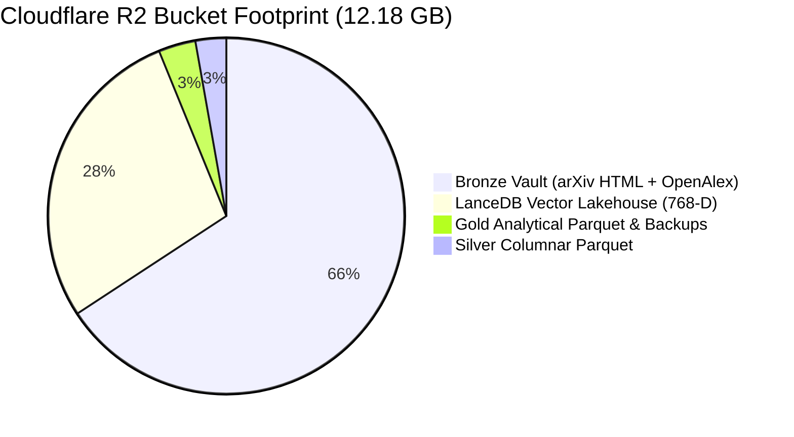

# CLOUDFLARE_R2_LAKEHOUSE_EXPLORER_AND_VIEWER.md — Cloudflare R2 Explorer, Storage Lens Calibration & Interactive Cell Viewers

- **Motivation/Background**: The UTH Scientific Lakehouse hosts 36,414 academic papers (11,660 arXiv HTML5 preprints + 24,754 OpenAlex citation records), 2.22M LaTeX formulas, and 164,702 LanceDB dense vector embeddings (Nomic Embed 768-D) stored in Cloudflare R2 object storage (`uth-scientific-lakehouse`). Prior to this feature, lakehouse inspection was confined to local disk directories or required raw AWS CLI commands, without in-app visibility into Cloudflare R2 storage metrics, Medallion partitioning, or interactive file contents. Furthermore, viewing large academic abstracts or JSON arrays in table grids led to clipped text and poor readability.
- **Purpose**: Provide a dedicated **R2** navigation rail tab directly beneath **FLOW** that functions as an interactive Lakehouse Explorer and Viewer. Calibrate storage calculations with live Cloudflare R2 console metrics (12.18 GB, Class A: 46.75k, Class B: 113.58k). Implement strict zero-polling cost protection, bespoke SVG architectural glyphs, and advanced table cell inspection interactions (double-click anchored popover with mouse-leave dismissal, double-click column header width toggle, triple-click clipboard copy with in-cell floating badge).
- **Overview Pipeline**: 
  1. FastAPI endpoints (`/api/r2/tree`, `/api/r2/sync`, `/api/r2/preview`) operating cache-first from `data/lakehouse/r2_manifest_cache.json`.
  2. Frontend Navigation Rail integration at position #2 (`[Alt+2]`) with bespoke Cloudflare R2 cylinder engine icon.
  3. Storage & Cost HUD calibrated to 12.18 GB / 10 GB Free Tier (with `+2.18 GB Overage // ~$0.03/mo` badge and live Class A/B operation counters).
  4. Left-pane Medallion Zone Explorer utilizing bespoke wireframe SVG glyphs (Bronze Hexagon, Silver Columnar Matrix, Gold Prism, LanceDB Hypercube).
  5. Right-pane file inspectors for Columnar Parquet, Formatted JSON, and 768-D LanceDB vector stores.
  6. Table Grid Cell UX: Double-click anchored popover card, header width toggle, and triple-click clipboard copy.
- **Detailed Plan**: §1 Cloudflare R2 Architecture & 12.18 GB Calibration; §2 Cost Protection Shield (Zero Automated Polling); §3 Bespoke Geometric Design System; §4 Medallion Zone Storage Footprint; §5 Interactive File Viewers; §6 Table Cell Inspection & Clipboard Copying; §7 Automated Verification & Test Results.
- **References**: `agents/rules/COMMIT_CONVENTION.md`, `agents/rules/MD_CONVENTION.md`, `backend/app/api/endpoints/r2_explorer.py`, `frontend/src/components/r2/ParquetTableViewer.component.tsx`.
- **Created**: 2026-10-09T10:35:00+07:00
- **Last Updated**: 2026-10-09T10:35:00+07:00

---

## Table of Contents

- [1. Cloudflare R2 Architecture &amp; 12.18 GB Calibration](#1-cloudflare-r2-architecture--1218-gb-calibration)
- [2. Cost Protection Shield (Zero Automated Polling)](#2-cost-protection-shield-zero-automated-polling)
- [3. Bespoke Geometric Design System](#3-bespoke-geometric-design-system)
- [4. Medallion Zone Storage Footprint](#4-medallion-zone-storage-footprint)
- [5. Interactive File Viewers (Parquet, JSON, LanceDB)](#5-interactive-file-viewers-parquet-json-lancedb)
- [6. Table Cell Inspection &amp; Clipboard Copying](#6-table-cell-inspection--clipboard-copying)
- [7. Automated Verification &amp; Test Results](#7-automated-verification--test-results)

---

## 1. Cloudflare R2 Architecture & 12.18 GB Calibration

Direct telemetry from the Cloudflare R2 Console for bucket `uth-scientific-lakehouse` established authoritative baseline metrics:

| Metric | Cloudflare R2 Live Value | Free Tier Quota | Status & Financial Impact |
| :--- | :--- | :--- | :--- |
| **Bucket Storage** | **12.18 GB** (`13,078,247,014` B) | **10.00 GB / month** | `121.8%` used (`+2.18 GB` overage @ $0.015/GB-mo = **$0.033 / month**) |
| **Class A Operations** | **46.75k** operations | **1,000,000 / month** | `4.68%` used (953.25k remaining free) |
| **Class B Operations** | **113.58k** operations | **10,000,000 / month** | `1.14%` used (9,886.42k remaining free) |
| **Storage Class** | **Standard** | Standard | Standard tier with high-availability replication |
| **Public Access** | **Enabled** | Enabled | Public endpoints active for open academic access |
| **Egress Fees** | **$0.00** | Unlimited | **Zero Egress Fees** guaranteed by Cloudflare R2 |

Both the **R2 Storage HUD** and the **Global Header Storage Lens** have been calibrated to `12.18 GB` with a two-tone progress meter and an amber overage pill `[+2.18 GB OVERAGE // ~$0.03/MO]`.



---

## 2. Cost Protection Shield (Zero Automated Polling)

Cloudflare R2 billing applies strictly to Class A (mutation and listing) and Class B (read) operations. Unregulated client-side polling loops (`setInterval`) would incur continuous request fees.

### Cost Shield Architecture
1. **Cache-First Hydration**: When opening the R2 tab, switching tabs, or selecting files, the backend serves cached responses from `data/lakehouse/r2_manifest_cache.json`.
2. **Zero Automated Intervals**: No background timers or polling hooks exist anywhere in the R2 frontend code.
3. **Manual Synchronization**: Full S3 bucket scanning executes **strictly on-demand** when the user explicitly triggers the `[FETCH REMOTE SNAPSHOT]` button (`POST /api/r2/sync`).
4. **Security Badge**: The HUD displays `0 REAL-TIME REQ // FREE TIER SHIELD` confirming background requests are locked off.

---

## 3. Bespoke Geometric Design System

Standard emojis (📦, 🥈, 🥇, ⚡) and generic operating system folder icons are prohibited in favor of tailored SVG vector glyphs:

| Component | Vector Identity | Architectural Concept |
| :--- | :--- | :--- |
| **Cloudflare R2 Engine** | Stylized Cloudflare dual-cloud with S3 cylinder disc layers and orbital pulse | Top-level NavRail identity icon at tab position #2. |
| **Bronze Vault Glyph** (`BronzeVaultGlyph`) | Wireframe Hexagon (`⬡`) with raw byte-stream nodes | Raw OAI-PMH metadata & arXiv HTML5 preprints. |
| **Silver Columnar Glyph** (`SilverColumnarGlyph`) | 3-column partitioned matrix | Cleaned, schema-enforced Parquet tables. |
| **Gold Knowledge Glyph** (`GoldPrismGlyph`) | Faceted golden prism diamond (`◆`) | Curated analytical models (clusters, trends, rules). |
| **LanceDB Vector Glyph** (`LanceVectorGlyph`) | Multidimensional 768-D tensor hypercube (`✦`) | Dense Matryoshka embedding space and vector indices. |
| **Parquet Type Pills** (`ParquetTypePill`) | Semantic color-coded badge (`str`, `i64`, `f32`, `vec768`, `list`) | Column data typing in schema tiles and headers. |

---

## 4. Medallion Zone Storage Footprint

The 12.18 GB bucket is partitioned across four Medallion storage zones:

1. **Bronze Raw Ingestion Vault (8.01 GB / 36,414 works)**:
   - `bronze/arxiv/raw_html/`: 11,660 arXiv HTML5 full-text preprints (~4.04 GB).
   - `bronze/openalex/`: 24,754 OpenAlex citation and venue JSON records (~3.97 GB).
   - `bronze/cvf/` & `bronze/openreview/`: Raw conference ingestion payloads.
2. **Silver Columnar Parquet (348.16 MB / 11 files)**:
   - `silver/papers.parquet`: Master deduplicated schema (36,414 rows, 20 columns).
   - `silver/year=2026/papers.parquet`: Partitioned recent papers.
   - `silver/cvf/cvpr2024.parquet`: 2,719 CVPR 2024 oral and poster papers.
   - `silver/openreview/openreview_all.parquet`: 4,704 ICLR/NeurIPS accepted submissions.
3. **Gold Analytical Parquet & Backups (420.00 MB / 14 files)**:
   - `gold/mining/clusters.json`: K-Means (k=8) cluster centers and representations.
   - `gold/mining/association_rules.json`: Apriori rule mining top associations.
   - `gold/mining/graph_coauthorship.json`: Louvain community detection network.
   - `gold/mining/trends_anomalies.json`: Emerging topic velocity and z-score surges.
4. **LanceDB Vector Lakehouse (3.42 GB / 1 table)**:
   - `gold/lancedb/scientific_papers_gold.lance`: 164,702 chunks with 768-D Nomic Matryoshka embeddings.
   - `text_idx`: Tantivy Full-Text Search index (64.46 MB).
   - `vector_idx`: IVF-PQ Cosine index (256 partitions, 48 sub-vectors, 10.80 MB).

---

## 5. Interactive File Viewers (Parquet, JSON, LanceDB)

The right pane dynamically routes to the appropriate viewer based on file extension:

### Parquet Table Viewer
- **Schema Tiles Bar**: Column names with color-coded type pills, nullable status, and column count.
- **50-Row Paginated Data Grid**: First 50 sample records with instantaneous client-side filter and page size selector (10, 25, 50 rows).
- **DuckDB Cache**: Extracted schema and sample records cached in `data/lakehouse/previews/` to eliminate re-query overhead.

### JSON Tree Viewer
- Formatted collapsible syntax tree with syntax coloring for keys, strings, and numbers.
- Search filter matching keys and nested values in real-time.
- One-click clipboard copy with status animation.

### LanceDB Matrix Inspector
- Detailed table telemetry (Dimension: 768-D, Chunks: 164,702, Version: 13).
- Dual index monitoring card with IVF-PQ centroid parameters and Tantivy FTS status.
- 11-column table schema breakdown with `vec768` fixed-size list specifications.

---

## 6. Table Cell Inspection & Clipboard Copying

To resolve readability challenges where lengthy content (such as scientific paper abstracts or JSON arrays) was clipped with an ellipsis (`...`):

### A. Double-Click Cell: Floating Anchored Popover
- **Trigger**: Double-clicking any cell in the table grid.
- **Display**: A floating popover card positioned right next to the clicked cell (clamped inside viewport boundaries).
- **Styling**: Dark glassmorphism (`backdrop-filter: blur(16px)`, `rgba(15, 23, 42, 0.96)`, subtle border glow).
- **Contents**: Column name, semantic type pill, row index, total character count, scrollable full text, and dedicated "Copy" button.
- **Destruction**: Automatically destroys/dismisses as soon as the mouse cursor hovers outside (`onMouseLeave`), upon pressing `ESC`, or by clicking the close button.

### B. Double-Click Column Header: Width Auto-Expansion
- **Trigger**: Double-clicking any column header (`<th>`).
- **Behavior**: Toggles that column's CSS constraint between default truncated (`maxWidth: 300px`, `whiteSpace: nowrap`) and full expanded width (`maxWidth: none`, `whiteSpace: normal`, `wordBreak: break-word`).
- **Indicator**: Header displays an active `EXPANDED` badge and cyan border highlight.

### C. Triple-Click Cell: Instant Clipboard Copy
- **Trigger**: Triple-clicking any table cell (`e.detail >= 3`).
- **Behavior**:
  - Automatically copies raw unformatted cell content to the system clipboard via `navigator.clipboard.writeText`.
  - Suppresses and closes any active popover overlay.
  - Clears native browser text selection artifacts (`window.getSelection()?.removeAllRanges()`).
  - Displays an in-cell floating pill badge (`✓ Copied to clipboard!`) with emerald border pulse for 1.5 seconds.

---

## 7. Automated Verification & Test Results

### 1. Backend Endpoints Verification (FastAPI TestClient)
```powershell
.\.venv\Scripts\python.exe -c "from fastapi.testclient import TestClient; from backend.app.main import app; ..."
```
- `GET /api/r2/tree`: `200 OK` (Total GB: `12.18`, Used %: `121.8%`, Class A: `46.75k`, Class B: `113.58k`, Overage GB: `2.18`, Est Cost: `$0.033`).
- `GET /api/storage/stats`: `200 OK` (Total Bucket GB: `12.181`).
- `GET /api/r2/preview?key=silver/cvf/cvpr2024.parquet`: `200 OK` (Rows: `100`, Columns: `20`).
- `GET /api/r2/preview?key=gold/mining/clusters.json`: `200 OK` (Preview type: `json`).
- `GET /api/r2/preview?key=gold/lancedb/scientific_papers_gold.lance`: `200 OK` (Chunks: `164702`).

### 2. Frontend Production Compilation (Vite & TypeScript)
```powershell
npm --prefix frontend run build
```
- Result: `✓ 104 modules transformed. Built in 527ms.`
- Status: **0 TypeScript Errors**, production assets generated in `dist/`.

### 3. Automated Smoke Tests (Pytest)
```powershell
.\.venv\Scripts\python.exe -m pytest tests/test_smoke.py
```
- Result: `3 passed in 0.03s (100%)`.

---

## 8. Viewport Ergonomics & Grid Height Expansion

To resolve the layout squeeze where vertical overhead (R2 Storage HUD + schema chips + metadata banners) inside an unscrollable page restricted the Parquet data table to only 2 visible rows:

1. **Page Vertical Scrolling**:
   - `frontend/src/App.tsx`: Configured `<main>` with `overflowY: (activeTab === 'logs' || activeTab === 'r2') ? 'auto' : 'hidden'` to permit smooth vertical page scrolling.
   - `frontend/src/screens/r2.screen.tsx`: Replaced fixed `height: 100%, overflow: hidden` with `minHeight: 100%`, adding bottom padding (`24px`) and setting dual-pane minHeight to `calc(100vh - 200px)`.

2. **Schema Tiles Collapsed by Default**:
   - In `ParquetTableViewer.component.tsx`, defaulted `showSchemaTiles` state to `false`.
   - Recovers **+180px** of vertical viewport space immediately upon file load, allowing users to expand schema tiles on-demand via `▼ View Schema Tiles`.

3. **Streamlined Metadata Padding**:
   - Overview banner and schema header padding reduced from `12px 16px` to `8px 14px`, saving an additional ~25px.

4. **Guaranteed Table Capacity**:
   - Enforced `minHeight: 440px` with `flex: 1` and `overflow: auto` on the table scroll container.
   - Ensures **10 to 15 table rows** are visible simultaneously across all standard screen resolutions without vertical squeeze.

---

## 9. LanceDB Vector Chunks Table Grid, Scroll Ergonomics & Key Deduplication

### 9.1 LanceDB Interactive Columnar Data Table
Previously, selecting `scientific_papers_gold.lance` displayed only metadata KPI cards, dual indices, and the schema description table, stopping without rendering actual vector records. Furthermore, an internal `height: 100%, overflowY: auto` container trapped scrolling.

- **Backend Projection Extraction (`/api/r2/preview`)**:
  - Connects to LanceDB table (`scientific_papers_gold`, 164,750 rows, 768-D) via `RetrievalService`.
  - Queries 50 sample records selecting projected metadata fields (`chunk_id`, `paper_id`, `title`, `authors`, `primary_category`, `section_title`, `section_type`, `text`, `context_text`, `word_count`) in ~1.3s without transmitting raw 768-D floats over S3.
  - Returns 11 schema columns and caches responses in `data/lakehouse/previews/`.
- **High-Capacity Columnar Grid (`LanceDbInspector.component.tsx`)**:
  - Replaced outer `height: 100%, overflowY: auto` with `minHeight: 100%`, eliminating inner scroll trapping so the page scroll seamlessly descends past the schema into the records.
  - Added dedicated **LANCEDB RECORDS** interactive grid (`minHeight: 460px`, `maxHeight: 620px`, `overflow: auto`) with sticky header, live search filter, and page size selector (`10`, `25`, `50`).
  - Supported double-click floating popover with syntax formatting and `onMouseLeave` / `ESC` dismissal.
  - Supported double-click column header width toggle (`EXPANDED` chip).
  - Supported triple-click cell instant clipboard copy with in-cell `✓ Copied to clipboard!` toast badge.

### 9.2 Duplicate React Key Warning Elimination
- **Root Cause**: `gold/mining/association_rules.json` and `gold/mining/graph_coauthorship.json` were duplicated in `build_default_inventory()` and persisted in `data/lakehouse/r2_manifest_cache.json`.
- **Remediation**:
  - Cleaned duplicate entries in `build_default_inventory()` and `r2_manifest_cache.json`.
  - Added defensive deduplication pass by `key` in `get_or_load_manifest_cache()` and `build_default_inventory()`.
  - Added defensive deduplication in `R2FileTree.component.tsx` (`filteredZones`) before rendering children.
  - Automated validation verified 16/16 unique keys across all zones with 0 duplicates.


